#  CS109A Introduction to Data Science


# Final Project -  Lending Club Investments 


**Harvard University**<br/>
**Fall 2018**<br/>

**Group #47 Team Members**:<br/> 
Danielle Crumley<br/>
Mohamed Elsalmi<br/>
Victor Chen<br/>
Hoon Kang<br/>


<hr style="height:1.5pt">

## <font color='maroon'>Data Collection</font>


```python
import requests
from IPython.core.display import HTML
styles = requests.get("https://raw.githubusercontent.com/Harvard-IACS/2018-CS109A/master/content/styles/cs109.css").text
HTML(styles)

from IPython.display import clear_output
from datetime import datetime

from sklearn.linear_model import LinearRegression
from sklearn.neighbors import KNeighborsRegressor
from sklearn.tree import DecisionTreeClassifier
from sklearn.ensemble import RandomForestClassifier
from sklearn.metrics import accuracy_score
from sklearn.model_selection import cross_val_score, train_test_split


%matplotlib inline
import numpy as np
import pandas as pd
from pandas.plotting import scatter_matrix
import matplotlib
import matplotlib.pyplot as plt
import seaborn as sns
sns.set(font_scale=1.5)
sns.set_style('ticks')

from os import listdir
from os.path import isfile, join
```


<b>Load and combine all Lending Club data in ./Lending Club Project/data/
<br> Current Data: <font color='green'>2012 to 2018Q3</font></b>


```python
'''
#Reads file names in the defined path
data_path = './data/'
files = [f for f in listdir(data_path) if isfile(join(data_path, f))]

#Read CSV and concatenate files into loan_df
df_list = []
for each in files:
    print('Reading:', each)
    df_list.append(pd.read_csv(data_path + each, header=1, skipfooter=2, engine='python'))
    clear_output(wait=True)
    
loan_df = pd.concat(df_list)

#Remove any excess rows that do not fit ('id' should always be empty)
loan_df = loan_df[loan_df['id'].isnull()]

print('Total Number of Rows:', '{:,}'.format(loan_df.shape[0]))
print('Total Number of Columns:', '{:,}'.format(loan_df.shape[1]))
loan_df.head(5)
'''
```


<b>Optional: Add Data from <font color='green'>2007-2011</font></b>


```python
'''
#Load in LoanStats_2007_2011.csv
tmp_df = pd.read_csv('./data/old/LoanStats_2007_2011.csv', header=1, engine='python')

#Remove any loans that do not meet the credit policy
tmp_df.truncate(after=tmp_df.index[tmp_df['id'] == 'Loans that do not meet the credit policy'].values[0]-1)

#Concatenate with loan_df
loan_df = pd.concat([loan_df, tmp_df])

#Remove any excess rows that do not fit ('id' should always be empty)
loan_df = loan_df[loan_df['id'].isnull()]

print('Total Number of Rows:', '{:,}'.format(loan_df.shape[0]))
print('Total Number of Columns:', '{:,}'.format(loan_df.shape[1]))
loan_df.head(5)
'''
```


```python
#Saved as Pickle for faster speed
#loan_df.to_pickle('./data/loan_df.pkl')
loan_df = pd.read_pickle('./data/loan_df.pkl')

print('Total Number of Rows:', '{:,}'.format(loan_df.shape[0]))
print('Total Number of Columns:', '{:,}'.format(loan_df.shape[1]))
loan_df.head(5)
```


    Total Number of Rows: 2,132,256
    Total Number of Columns: 145


<div>
<style scoped>
    .dataframe tbody tr th:only-of-type {
        vertical-align: middle;
    }

    .dataframe tbody tr th {
        vertical-align: top;
    }

    .dataframe thead th {
        text-align: right;
    }
</style>
<table border="1" class="dataframe">
  <thead>
    <tr style="text-align: right;">
      <th></th>
      <th>id</th>
      <th>member_id</th>
      <th>loan_amnt</th>
      <th>funded_amnt</th>
      <th>funded_amnt_inv</th>
      <th>term</th>
      <th>int_rate</th>
      <th>installment</th>
      <th>grade</th>
      <th>sub_grade</th>
      <th>...</th>
      <th>hardship_payoff_balance_amount</th>
      <th>hardship_last_payment_amount</th>
      <th>disbursement_method</th>
      <th>debt_settlement_flag</th>
      <th>debt_settlement_flag_date</th>
      <th>settlement_status</th>
      <th>settlement_date</th>
      <th>settlement_amount</th>
      <th>settlement_percentage</th>
      <th>settlement_term</th>
    </tr>
  </thead>
  <tbody>
    <tr>
      <th>0</th>
      <td>NaN</td>
      <td>NaN</td>
      <td>10000.0</td>
      <td>10000.0</td>
      <td>10000.0</td>
      <td>36 months</td>
      <td>9.67%</td>
      <td>321.13</td>
      <td>B</td>
      <td>B1</td>
      <td>...</td>
      <td>NaN</td>
      <td>NaN</td>
      <td>Cash</td>
      <td>N</td>
      <td>NaN</td>
      <td>NaN</td>
      <td>NaN</td>
      <td>NaN</td>
      <td>NaN</td>
      <td>NaN</td>
    </tr>
    <tr>
      <th>1</th>
      <td>NaN</td>
      <td>NaN</td>
      <td>12000.0</td>
      <td>12000.0</td>
      <td>12000.0</td>
      <td>36 months</td>
      <td>6.62%</td>
      <td>368.45</td>
      <td>A</td>
      <td>A2</td>
      <td>...</td>
      <td>NaN</td>
      <td>NaN</td>
      <td>Cash</td>
      <td>N</td>
      <td>NaN</td>
      <td>NaN</td>
      <td>NaN</td>
      <td>NaN</td>
      <td>NaN</td>
      <td>NaN</td>
    </tr>
    <tr>
      <th>2</th>
      <td>NaN</td>
      <td>NaN</td>
      <td>20800.0</td>
      <td>20800.0</td>
      <td>20800.0</td>
      <td>36 months</td>
      <td>13.53%</td>
      <td>706.16</td>
      <td>B</td>
      <td>B5</td>
      <td>...</td>
      <td>NaN</td>
      <td>NaN</td>
      <td>Cash</td>
      <td>N</td>
      <td>NaN</td>
      <td>NaN</td>
      <td>NaN</td>
      <td>NaN</td>
      <td>NaN</td>
      <td>NaN</td>
    </tr>
    <tr>
      <th>3</th>
      <td>NaN</td>
      <td>NaN</td>
      <td>27050.0</td>
      <td>27050.0</td>
      <td>27050.0</td>
      <td>36 months</td>
      <td>10.99%</td>
      <td>885.46</td>
      <td>B</td>
      <td>B2</td>
      <td>...</td>
      <td>NaN</td>
      <td>NaN</td>
      <td>Cash</td>
      <td>N</td>
      <td>NaN</td>
      <td>NaN</td>
      <td>NaN</td>
      <td>NaN</td>
      <td>NaN</td>
      <td>NaN</td>
    </tr>
    <tr>
      <th>4</th>
      <td>NaN</td>
      <td>NaN</td>
      <td>4800.0</td>
      <td>4800.0</td>
      <td>4800.0</td>
      <td>36 months</td>
      <td>10.99%</td>
      <td>157.13</td>
      <td>B</td>
      <td>B2</td>
      <td>...</td>
      <td>NaN</td>
      <td>NaN</td>
      <td>Cash</td>
      <td>N</td>
      <td>NaN</td>
      <td>NaN</td>
      <td>NaN</td>
      <td>NaN</td>
      <td>NaN</td>
      <td>NaN</td>
    </tr>
  </tbody>
</table>
<p>5 rows × 145 columns</p>
</div>


<hr style="height:1.5pt">
## <font color='maroon'>Generate Labels for the Response Variable</font>
<br>We'd like to use <b>loan_status</b> as the basis for our response variable.
<br>There is a very clear signal on the risk of a loan when a loan is fully paid vs. charged off. <br>We can only use loans that have been closed as any open loans may still go either way. 


```python
loan_df.groupby('loan_status')['loan_status'].agg('count').sort_values(ascending=False)
```


    loan_status
    Current                                                922081
    Fully Paid                                             920849
    Charged Off                                            229523
    Late (31-120 days)                                      22951
    Issued                                                  13621
    In Grace Period                                         12665
    Late (16-30 days)                                        6776
    Does not meet the credit policy. Status:Fully Paid       1988
    Default                                                  1041
    Does not meet the credit policy. Status:Charged Off       761
    Name: loan_status, dtype: int64


We will generate a <b>Risk</b> label where:
<br><b>0</b> - Low Risk to Fund (Fully Paid)
<br><b>1</b> - High Risk to Fund (Charged Off)


```python
# Low Risk
loan_df['Risk'] = np.where(loan_df['loan_status']=='Fully Paid',0,np.nan)

# High Risk
loan_df['Risk'] = np.where(loan_df['loan_status']=='Charged Off',1,loan_df['Risk'])
```


We see that we have very imbalanced data. When we try to improve on the baseline, we will try undersampling or oversampling to deal with it.


```python
loan_df.groupby('Risk')['Risk'].agg('count').sort_values(ascending=False)
```


    Risk
    0.0    920849
    1.0    229523
    Name: Risk, dtype: int64


<hr style="height:1.5pt">
## <font color='maroon'>EDA</font>


```python
plt.subplots(figsize=(20,10))
plt.title("The distribution of loan amounts by status").set_size(40)
sns.boxplot(x="loan_amnt", y="loan_status", data=loan_df, palette='Set2');
```


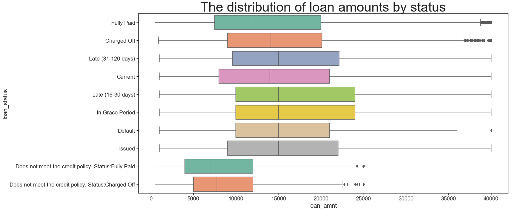


**We can see a couple of things here: **

**1. Fully Paid loans tend to be smaller. This could be due to the age of the loans**

**2. Default has the highest count among other loan status.**

**3.In Grace Period and Late(16~30 days) have the highest loan amount and mean.**

**4. We should exclude "issued", and the loans that do not meet the credit policy**


```python
#Loan amount by grade
group = loan_df.groupby("grade").mean()
avg_loan = group['loan_amnt'].reset_index()
plt.subplots(figsize=(15,9))
sns.barplot(x='grade', y='loan_amnt', data=avg_loan, palette='Set2');
```


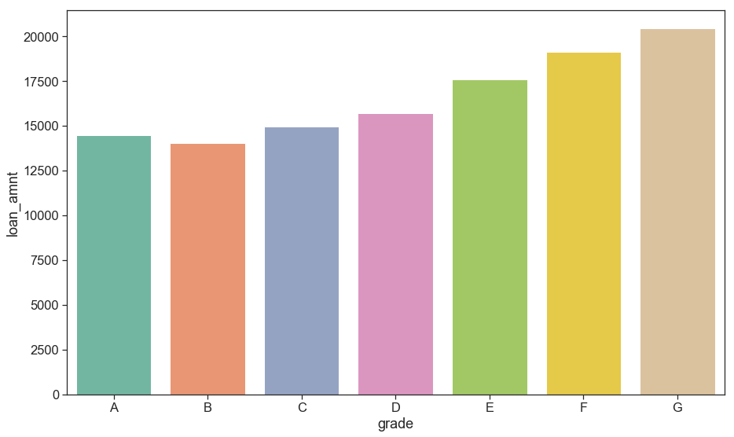


**We see here that the higher loan amount the lower the grade.**


**Doing the same for sub_grade.**


```python
#Loan amount by sub_grade
group = loan_df.groupby("sub_grade").mean()
avg_loan = group['loan_amnt'].reset_index()
plt.subplots(figsize=(15,9))
sns.barplot(x='sub_grade', y='loan_amnt', data=avg_loan, palette='Set2');
```


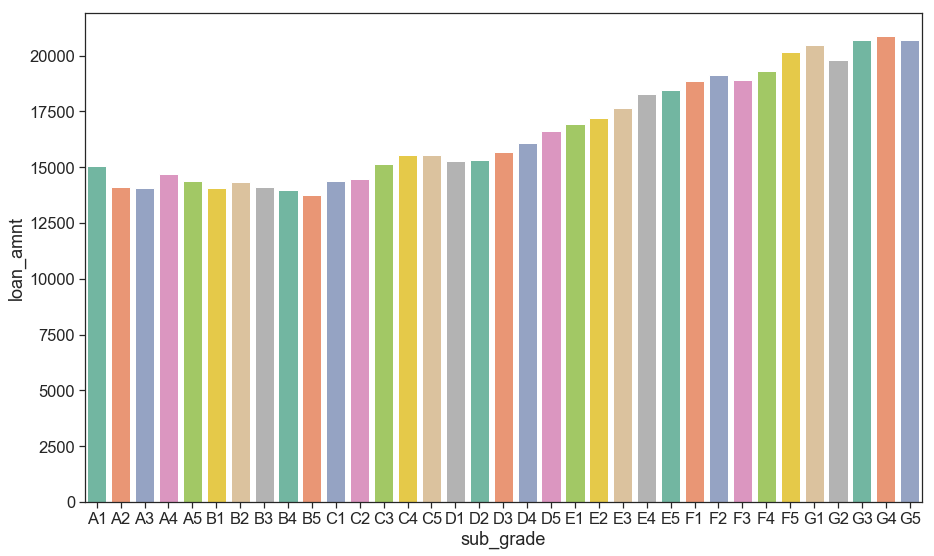


**As expected, lower the subgrade the higher the loan amount.**


```python
loan_origin=pd.DataFrame(loan_df.groupby('addr_state')['addr_state'].agg('count').sort_values(ascending=True))
loan_origin.plot(kind='bar', figsize=(15,10))
plt.tight_layout()
```


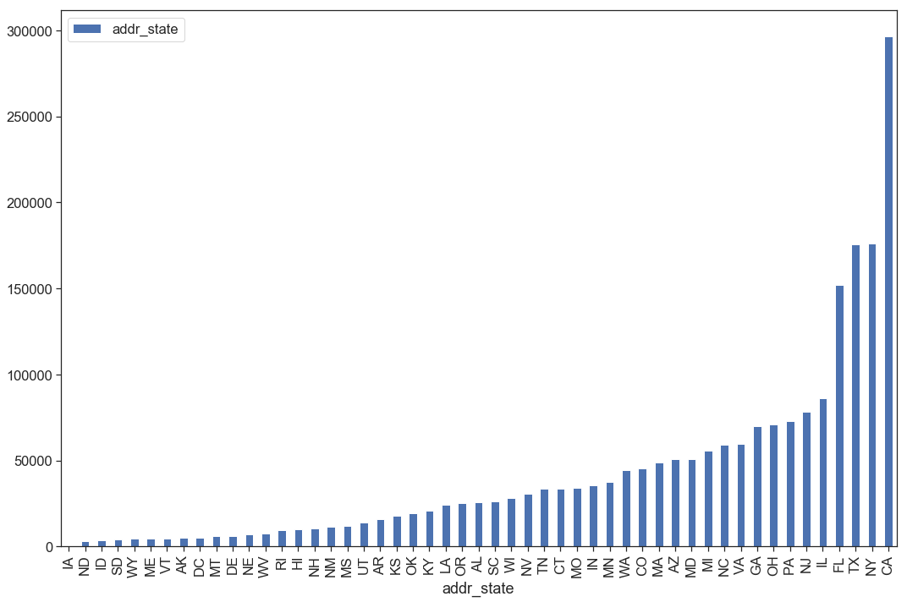


```python
adress_loan = ['addr_state', 'loan_status']
cm = sns.light_palette("green", as_cmap=True)
pd.crosstab(loan_df[adress_loan[0]], loan_df[adress_loan[1]]).style.background_gradient(cmap = cm)
```


<style  type="text/css" >
    #T_db342ff4_f379_11e8_a1ab_448a5b985e0brow0_col0 {
            background-color:  #e2fde2;
        }    #T_db342ff4_f379_11e8_a1ab_448a5b985e0brow0_col1 {
            background-color:  #e2fde2;
        }    #T_db342ff4_f379_11e8_a1ab_448a5b985e0brow0_col2 {
            background-color:  #e0fce0;
        }    #T_db342ff4_f379_11e8_a1ab_448a5b985e0brow0_col3 {
            background-color:  #e4fee4;
        }    #T_db342ff4_f379_11e8_a1ab_448a5b985e0brow0_col4 {
            background-color:  #e2fde2;
        }    #T_db342ff4_f379_11e8_a1ab_448a5b985e0brow0_col5 {
            background-color:  #e2fde2;
        }    #T_db342ff4_f379_11e8_a1ab_448a5b985e0brow0_col6 {
            background-color:  #e4fee4;
        }    #T_db342ff4_f379_11e8_a1ab_448a5b985e0brow0_col7 {
            background-color:  #e4fee4;
        }    #T_db342ff4_f379_11e8_a1ab_448a5b985e0brow0_col8 {
            background-color:  #e3fee3;
        }    #T_db342ff4_f379_11e8_a1ab_448a5b985e0brow0_col9 {
            background-color:  #e2fde2;
        }    #T_db342ff4_f379_11e8_a1ab_448a5b985e0brow1_col0 {
            background-color:  #cef2ce;
        }    #T_db342ff4_f379_11e8_a1ab_448a5b985e0brow1_col1 {
            background-color:  #d1f4d1;
        }    #T_db342ff4_f379_11e8_a1ab_448a5b985e0brow1_col2 {
            background-color:  #ccf1cc;
        }    #T_db342ff4_f379_11e8_a1ab_448a5b985e0brow1_col3 {
            background-color:  #d3f5d3;
        }    #T_db342ff4_f379_11e8_a1ab_448a5b985e0brow1_col4 {
            background-color:  #cdf2cd;
        }    #T_db342ff4_f379_11e8_a1ab_448a5b985e0brow1_col5 {
            background-color:  #d3f5d3;
        }    #T_db342ff4_f379_11e8_a1ab_448a5b985e0brow1_col6 {
            background-color:  #ccf1cc;
        }    #T_db342ff4_f379_11e8_a1ab_448a5b985e0brow1_col7 {
            background-color:  #d4f6d4;
        }    #T_db342ff4_f379_11e8_a1ab_448a5b985e0brow1_col8 {
            background-color:  #ccf1cc;
        }    #T_db342ff4_f379_11e8_a1ab_448a5b985e0brow1_col9 {
            background-color:  #d3f5d3;
        }    #T_db342ff4_f379_11e8_a1ab_448a5b985e0brow2_col0 {
            background-color:  #d8f8d8;
        }    #T_db342ff4_f379_11e8_a1ab_448a5b985e0brow2_col1 {
            background-color:  #d8f8d8;
        }    #T_db342ff4_f379_11e8_a1ab_448a5b985e0brow2_col2 {
            background-color:  #dcfadc;
        }    #T_db342ff4_f379_11e8_a1ab_448a5b985e0brow2_col3 {
            background-color:  #d8f8d8;
        }    #T_db342ff4_f379_11e8_a1ab_448a5b985e0brow2_col4 {
            background-color:  #dcfadc;
        }    #T_db342ff4_f379_11e8_a1ab_448a5b985e0brow2_col5 {
            background-color:  #dbf9db;
        }    #T_db342ff4_f379_11e8_a1ab_448a5b985e0brow2_col6 {
            background-color:  #d4f6d4;
        }    #T_db342ff4_f379_11e8_a1ab_448a5b985e0brow2_col7 {
            background-color:  #d8f8d8;
        }    #T_db342ff4_f379_11e8_a1ab_448a5b985e0brow2_col8 {
            background-color:  #d7f7d7;
        }    #T_db342ff4_f379_11e8_a1ab_448a5b985e0brow2_col9 {
            background-color:  #d7f7d7;
        }    #T_db342ff4_f379_11e8_a1ab_448a5b985e0brow3_col0 {
            background-color:  #c0eac0;
        }    #T_db342ff4_f379_11e8_a1ab_448a5b985e0brow3_col1 {
            background-color:  #bde9bd;
        }    #T_db342ff4_f379_11e8_a1ab_448a5b985e0brow3_col2 {
            background-color:  #c8efc8;
        }    #T_db342ff4_f379_11e8_a1ab_448a5b985e0brow3_col3 {
            background-color:  #bde9bd;
        }    #T_db342ff4_f379_11e8_a1ab_448a5b985e0brow3_col4 {
            background-color:  #c4edc4;
        }    #T_db342ff4_f379_11e8_a1ab_448a5b985e0brow3_col5 {
            background-color:  #c0eac0;
        }    #T_db342ff4_f379_11e8_a1ab_448a5b985e0brow3_col6 {
            background-color:  #bee9be;
        }    #T_db342ff4_f379_11e8_a1ab_448a5b985e0brow3_col7 {
            background-color:  #bbe8bb;
        }    #T_db342ff4_f379_11e8_a1ab_448a5b985e0brow3_col8 {
            background-color:  #bfeabf;
        }    #T_db342ff4_f379_11e8_a1ab_448a5b985e0brow3_col9 {
            background-color:  #bce8bc;
        }    #T_db342ff4_f379_11e8_a1ab_448a5b985e0brow4_col0 {
            background-color:  #008000;
        }    #T_db342ff4_f379_11e8_a1ab_448a5b985e0brow4_col1 {
            background-color:  #008000;
        }    #T_db342ff4_f379_11e8_a1ab_448a5b985e0brow4_col2 {
            background-color:  #008000;
        }    #T_db342ff4_f379_11e8_a1ab_448a5b985e0brow4_col3 {
            background-color:  #008000;
        }    #T_db342ff4_f379_11e8_a1ab_448a5b985e0brow4_col4 {
            background-color:  #008000;
        }    #T_db342ff4_f379_11e8_a1ab_448a5b985e0brow4_col5 {
            background-color:  #008000;
        }    #T_db342ff4_f379_11e8_a1ab_448a5b985e0brow4_col6 {
            background-color:  #008000;
        }    #T_db342ff4_f379_11e8_a1ab_448a5b985e0brow4_col7 {
            background-color:  #008000;
        }    #T_db342ff4_f379_11e8_a1ab_448a5b985e0brow4_col8 {
            background-color:  #008000;
        }    #T_db342ff4_f379_11e8_a1ab_448a5b985e0brow4_col9 {
            background-color:  #008000;
        }    #T_db342ff4_f379_11e8_a1ab_448a5b985e0brow5_col0 {
            background-color:  #caf0ca;
        }    #T_db342ff4_f379_11e8_a1ab_448a5b985e0brow5_col1 {
            background-color:  #c2ebc2;
        }    #T_db342ff4_f379_11e8_a1ab_448a5b985e0brow5_col2 {
            background-color:  #c7eec7;
        }    #T_db342ff4_f379_11e8_a1ab_448a5b985e0brow5_col3 {
            background-color:  #c9efc9;
        }    #T_db342ff4_f379_11e8_a1ab_448a5b985e0brow5_col4 {
            background-color:  #b0e2b0;
        }    #T_db342ff4_f379_11e8_a1ab_448a5b985e0brow5_col5 {
            background-color:  #c2ebc2;
        }    #T_db342ff4_f379_11e8_a1ab_448a5b985e0brow5_col6 {
            background-color:  #c2ebc2;
        }    #T_db342ff4_f379_11e8_a1ab_448a5b985e0brow5_col7 {
            background-color:  #bce8bc;
        }    #T_db342ff4_f379_11e8_a1ab_448a5b985e0brow5_col8 {
            background-color:  #c7eec7;
        }    #T_db342ff4_f379_11e8_a1ab_448a5b985e0brow5_col9 {
            background-color:  #c8efc8;
        }    #T_db342ff4_f379_11e8_a1ab_448a5b985e0brow6_col0 {
            background-color:  #d2f4d2;
        }    #T_db342ff4_f379_11e8_a1ab_448a5b985e0brow6_col1 {
            background-color:  #c7eec7;
        }    #T_db342ff4_f379_11e8_a1ab_448a5b985e0brow6_col2 {
            background-color:  #caf0ca;
        }    #T_db342ff4_f379_11e8_a1ab_448a5b985e0brow6_col3 {
            background-color:  #caf0ca;
        }    #T_db342ff4_f379_11e8_a1ab_448a5b985e0brow6_col4 {
            background-color:  #b2e3b2;
        }    #T_db342ff4_f379_11e8_a1ab_448a5b985e0brow6_col5 {
            background-color:  #cff3cf;
        }    #T_db342ff4_f379_11e8_a1ab_448a5b985e0brow6_col6 {
            background-color:  #bee9be;
        }    #T_db342ff4_f379_11e8_a1ab_448a5b985e0brow6_col7 {
            background-color:  #cbf1cb;
        }    #T_db342ff4_f379_11e8_a1ab_448a5b985e0brow6_col8 {
            background-color:  #c6eec6;
        }    #T_db342ff4_f379_11e8_a1ab_448a5b985e0brow6_col9 {
            background-color:  #cbf1cb;
        }    #T_db342ff4_f379_11e8_a1ab_448a5b985e0brow7_col0 {
            background-color:  #e3fee3;
        }    #T_db342ff4_f379_11e8_a1ab_448a5b985e0brow7_col1 {
            background-color:  #e2fde2;
        }    #T_db342ff4_f379_11e8_a1ab_448a5b985e0brow7_col2 {
            background-color:  #e5ffe5;
        }    #T_db342ff4_f379_11e8_a1ab_448a5b985e0brow7_col3 {
            background-color:  #e1fde1;
        }    #T_db342ff4_f379_11e8_a1ab_448a5b985e0brow7_col4 {
            background-color:  #ddfbdd;
        }    #T_db342ff4_f379_11e8_a1ab_448a5b985e0brow7_col5 {
            background-color:  #e2fde2;
        }    #T_db342ff4_f379_11e8_a1ab_448a5b985e0brow7_col6 {
            background-color:  #e1fde1;
        }    #T_db342ff4_f379_11e8_a1ab_448a5b985e0brow7_col7 {
            background-color:  #e3fee3;
        }    #T_db342ff4_f379_11e8_a1ab_448a5b985e0brow7_col8 {
            background-color:  #e3fee3;
        }    #T_db342ff4_f379_11e8_a1ab_448a5b985e0brow7_col9 {
            background-color:  #e4fee4;
        }    #T_db342ff4_f379_11e8_a1ab_448a5b985e0brow8_col0 {
            background-color:  #e2fde2;
        }    #T_db342ff4_f379_11e8_a1ab_448a5b985e0brow8_col1 {
            background-color:  #e1fde1;
        }    #T_db342ff4_f379_11e8_a1ab_448a5b985e0brow8_col2 {
            background-color:  #ddfbdd;
        }    #T_db342ff4_f379_11e8_a1ab_448a5b985e0brow8_col3 {
            background-color:  #dcfadc;
        }    #T_db342ff4_f379_11e8_a1ab_448a5b985e0brow8_col4 {
            background-color:  #d3f5d3;
        }    #T_db342ff4_f379_11e8_a1ab_448a5b985e0brow8_col5 {
            background-color:  #e2fde2;
        }    #T_db342ff4_f379_11e8_a1ab_448a5b985e0brow8_col6 {
            background-color:  #e2fde2;
        }    #T_db342ff4_f379_11e8_a1ab_448a5b985e0brow8_col7 {
            background-color:  #defbde;
        }    #T_db342ff4_f379_11e8_a1ab_448a5b985e0brow8_col8 {
            background-color:  #e0fce0;
        }    #T_db342ff4_f379_11e8_a1ab_448a5b985e0brow8_col9 {
            background-color:  #e1fde1;
        }    #T_db342ff4_f379_11e8_a1ab_448a5b985e0brow9_col0 {
            background-color:  #6ebd6e;
        }    #T_db342ff4_f379_11e8_a1ab_448a5b985e0brow9_col1 {
            background-color:  #66b866;
        }    #T_db342ff4_f379_11e8_a1ab_448a5b985e0brow9_col2 {
            background-color:  #6abb6a;
        }    #T_db342ff4_f379_11e8_a1ab_448a5b985e0brow9_col3 {
            background-color:  #42a442;
        }    #T_db342ff4_f379_11e8_a1ab_448a5b985e0brow9_col4 {
            background-color:  #41a441;
        }    #T_db342ff4_f379_11e8_a1ab_448a5b985e0brow9_col5 {
            background-color:  #7ac47a;
        }    #T_db342ff4_f379_11e8_a1ab_448a5b985e0brow9_col6 {
            background-color:  #4fac4f;
        }    #T_db342ff4_f379_11e8_a1ab_448a5b985e0brow9_col7 {
            background-color:  #61b661;
        }    #T_db342ff4_f379_11e8_a1ab_448a5b985e0brow9_col8 {
            background-color:  #58b158;
        }    #T_db342ff4_f379_11e8_a1ab_448a5b985e0brow9_col9 {
            background-color:  #5eb45e;
        }    #T_db342ff4_f379_11e8_a1ab_448a5b985e0brow10_col0 {
            background-color:  #b7e5b7;
        }    #T_db342ff4_f379_11e8_a1ab_448a5b985e0brow10_col1 {
            background-color:  #a9dea9;
        }    #T_db342ff4_f379_11e8_a1ab_448a5b985e0brow10_col2 {
            background-color:  #c4edc4;
        }    #T_db342ff4_f379_11e8_a1ab_448a5b985e0brow10_col3 {
            background-color:  #96d396;
        }    #T_db342ff4_f379_11e8_a1ab_448a5b985e0brow10_col4 {
            background-color:  #9ed89e;
        }    #T_db342ff4_f379_11e8_a1ab_448a5b985e0brow10_col5 {
            background-color:  #b3e3b3;
        }    #T_db342ff4_f379_11e8_a1ab_448a5b985e0brow10_col6 {
            background-color:  #9dd79d;
        }    #T_db342ff4_f379_11e8_a1ab_448a5b985e0brow10_col7 {
            background-color:  #b0e1b0;
        }    #T_db342ff4_f379_11e8_a1ab_448a5b985e0brow10_col8 {
            background-color:  #a5dba5;
        }    #T_db342ff4_f379_11e8_a1ab_448a5b985e0brow10_col9 {
            background-color:  #b1e2b1;
        }    #T_db342ff4_f379_11e8_a1ab_448a5b985e0brow11_col0 {
            background-color:  #ddfbdd;
        }    #T_db342ff4_f379_11e8_a1ab_448a5b985e0brow11_col1 {
            background-color:  #defbde;
        }    #T_db342ff4_f379_11e8_a1ab_448a5b985e0brow11_col2 {
            background-color:  #dffcdf;
        }    #T_db342ff4_f379_11e8_a1ab_448a5b985e0brow11_col3 {
            background-color:  #e1fde1;
        }    #T_db342ff4_f379_11e8_a1ab_448a5b985e0brow11_col4 {
            background-color:  #e1fde1;
        }    #T_db342ff4_f379_11e8_a1ab_448a5b985e0brow11_col5 {
            background-color:  #defbde;
        }    #T_db342ff4_f379_11e8_a1ab_448a5b985e0brow11_col6 {
            background-color:  #dcfadc;
        }    #T_db342ff4_f379_11e8_a1ab_448a5b985e0brow11_col7 {
            background-color:  #ddfbdd;
        }    #T_db342ff4_f379_11e8_a1ab_448a5b985e0brow11_col8 {
            background-color:  #defbde;
        }    #T_db342ff4_f379_11e8_a1ab_448a5b985e0brow11_col9 {
            background-color:  #ddfbdd;
        }    #T_db342ff4_f379_11e8_a1ab_448a5b985e0brow12_col0 {
            background-color:  #e5ffe5;
        }    #T_db342ff4_f379_11e8_a1ab_448a5b985e0brow12_col1 {
            background-color:  #e5ffe5;
        }    #T_db342ff4_f379_11e8_a1ab_448a5b985e0brow12_col2 {
            background-color:  #e5ffe5;
        }    #T_db342ff4_f379_11e8_a1ab_448a5b985e0brow12_col3 {
            background-color:  #e1fde1;
        }    #T_db342ff4_f379_11e8_a1ab_448a5b985e0brow12_col4 {
            background-color:  #e1fde1;
        }    #T_db342ff4_f379_11e8_a1ab_448a5b985e0brow12_col5 {
            background-color:  #e5ffe5;
        }    #T_db342ff4_f379_11e8_a1ab_448a5b985e0brow12_col6 {
            background-color:  #e5ffe5;
        }    #T_db342ff4_f379_11e8_a1ab_448a5b985e0brow12_col7 {
            background-color:  #e5ffe5;
        }    #T_db342ff4_f379_11e8_a1ab_448a5b985e0brow12_col8 {
            background-color:  #e5ffe5;
        }    #T_db342ff4_f379_11e8_a1ab_448a5b985e0brow12_col9 {
            background-color:  #e5ffe5;
        }    #T_db342ff4_f379_11e8_a1ab_448a5b985e0brow13_col0 {
            background-color:  #e5ffe5;
        }    #T_db342ff4_f379_11e8_a1ab_448a5b985e0brow13_col1 {
            background-color:  #e1fde1;
        }    #T_db342ff4_f379_11e8_a1ab_448a5b985e0brow13_col2 {
            background-color:  #e5ffe5;
        }    #T_db342ff4_f379_11e8_a1ab_448a5b985e0brow13_col3 {
            background-color:  #e5ffe5;
        }    #T_db342ff4_f379_11e8_a1ab_448a5b985e0brow13_col4 {
            background-color:  #e3fee3;
        }    #T_db342ff4_f379_11e8_a1ab_448a5b985e0brow13_col5 {
            background-color:  #e5ffe5;
        }    #T_db342ff4_f379_11e8_a1ab_448a5b985e0brow13_col6 {
            background-color:  #e3fee3;
        }    #T_db342ff4_f379_11e8_a1ab_448a5b985e0brow13_col7 {
            background-color:  #dffcdf;
        }    #T_db342ff4_f379_11e8_a1ab_448a5b985e0brow13_col8 {
            background-color:  #e2fde2;
        }    #T_db342ff4_f379_11e8_a1ab_448a5b985e0brow13_col9 {
            background-color:  #e3fee3;
        }    #T_db342ff4_f379_11e8_a1ab_448a5b985e0brow14_col0 {
            background-color:  #aee0ae;
        }    #T_db342ff4_f379_11e8_a1ab_448a5b985e0brow14_col1 {
            background-color:  #98d498;
        }    #T_db342ff4_f379_11e8_a1ab_448a5b985e0brow14_col2 {
            background-color:  #c7eec7;
        }    #T_db342ff4_f379_11e8_a1ab_448a5b985e0brow14_col3 {
            background-color:  #94d294;
        }    #T_db342ff4_f379_11e8_a1ab_448a5b985e0brow14_col4 {
            background-color:  #73c073;
        }    #T_db342ff4_f379_11e8_a1ab_448a5b985e0brow14_col5 {
            background-color:  #a9dea9;
        }    #T_db342ff4_f379_11e8_a1ab_448a5b985e0brow14_col6 {
            background-color:  #96d396;
        }    #T_db342ff4_f379_11e8_a1ab_448a5b985e0brow14_col7 {
            background-color:  #9ed79e;
        }    #T_db342ff4_f379_11e8_a1ab_448a5b985e0brow14_col8 {
            background-color:  #a0d9a0;
        }    #T_db342ff4_f379_11e8_a1ab_448a5b985e0brow14_col9 {
            background-color:  #b5e4b5;
        }    #T_db342ff4_f379_11e8_a1ab_448a5b985e0brow15_col0 {
            background-color:  #caf0ca;
        }    #T_db342ff4_f379_11e8_a1ab_448a5b985e0brow15_col1 {
            background-color:  #c7eec7;
        }    #T_db342ff4_f379_11e8_a1ab_448a5b985e0brow15_col2 {
            background-color:  #caf0ca;
        }    #T_db342ff4_f379_11e8_a1ab_448a5b985e0brow15_col3 {
            background-color:  #d6f7d6;
        }    #T_db342ff4_f379_11e8_a1ab_448a5b985e0brow15_col4 {
            background-color:  #e3fee3;
        }    #T_db342ff4_f379_11e8_a1ab_448a5b985e0brow15_col5 {
            background-color:  #cef2ce;
        }    #T_db342ff4_f379_11e8_a1ab_448a5b985e0brow15_col6 {
            background-color:  #c7eec7;
        }    #T_db342ff4_f379_11e8_a1ab_448a5b985e0brow15_col7 {
            background-color:  #c9efc9;
        }    #T_db342ff4_f379_11e8_a1ab_448a5b985e0brow15_col8 {
            background-color:  #c5edc5;
        }    #T_db342ff4_f379_11e8_a1ab_448a5b985e0brow15_col9 {
            background-color:  #c8efc8;
        }    #T_db342ff4_f379_11e8_a1ab_448a5b985e0brow16_col0 {
            background-color:  #dbf9db;
        }    #T_db342ff4_f379_11e8_a1ab_448a5b985e0brow16_col1 {
            background-color:  #d6f7d6;
        }    #T_db342ff4_f379_11e8_a1ab_448a5b985e0brow16_col2 {
            background-color:  #e2fde2;
        }    #T_db342ff4_f379_11e8_a1ab_448a5b985e0brow16_col3 {
            background-color:  #dbf9db;
        }    #T_db342ff4_f379_11e8_a1ab_448a5b985e0brow16_col4 {
            background-color:  #d0f3d0;
        }    #T_db342ff4_f379_11e8_a1ab_448a5b985e0brow16_col5 {
            background-color:  #d9f8d9;
        }    #T_db342ff4_f379_11e8_a1ab_448a5b985e0brow16_col6 {
            background-color:  #d6f7d6;
        }    #T_db342ff4_f379_11e8_a1ab_448a5b985e0brow16_col7 {
            background-color:  #d8f8d8;
        }    #T_db342ff4_f379_11e8_a1ab_448a5b985e0brow16_col8 {
            background-color:  #d9f8d9;
        }    #T_db342ff4_f379_11e8_a1ab_448a5b985e0brow16_col9 {
            background-color:  #d9f8d9;
        }    #T_db342ff4_f379_11e8_a1ab_448a5b985e0brow17_col0 {
            background-color:  #d5f6d5;
        }    #T_db342ff4_f379_11e8_a1ab_448a5b985e0brow17_col1 {
            background-color:  #d4f6d4;
        }    #T_db342ff4_f379_11e8_a1ab_448a5b985e0brow17_col2 {
            background-color:  #dcfadc;
        }    #T_db342ff4_f379_11e8_a1ab_448a5b985e0brow17_col3 {
            background-color:  #cff3cf;
        }    #T_db342ff4_f379_11e8_a1ab_448a5b985e0brow17_col4 {
            background-color:  #cff3cf;
        }    #T_db342ff4_f379_11e8_a1ab_448a5b985e0brow17_col5 {
            background-color:  #d7f7d7;
        }    #T_db342ff4_f379_11e8_a1ab_448a5b985e0brow17_col6 {
            background-color:  #d5f6d5;
        }    #T_db342ff4_f379_11e8_a1ab_448a5b985e0brow17_col7 {
            background-color:  #d4f6d4;
        }    #T_db342ff4_f379_11e8_a1ab_448a5b985e0brow17_col8 {
            background-color:  #d9f8d9;
        }    #T_db342ff4_f379_11e8_a1ab_448a5b985e0brow17_col9 {
            background-color:  #d7f7d7;
        }    #T_db342ff4_f379_11e8_a1ab_448a5b985e0brow18_col0 {
            background-color:  #d1f4d1;
        }    #T_db342ff4_f379_11e8_a1ab_448a5b985e0brow18_col1 {
            background-color:  #d2f4d2;
        }    #T_db342ff4_f379_11e8_a1ab_448a5b985e0brow18_col2 {
            background-color:  #d3f5d3;
        }    #T_db342ff4_f379_11e8_a1ab_448a5b985e0brow18_col3 {
            background-color:  #dbf9db;
        }    #T_db342ff4_f379_11e8_a1ab_448a5b985e0brow18_col4 {
            background-color:  #d2f4d2;
        }    #T_db342ff4_f379_11e8_a1ab_448a5b985e0brow18_col5 {
            background-color:  #d4f6d4;
        }    #T_db342ff4_f379_11e8_a1ab_448a5b985e0brow18_col6 {
            background-color:  #cef2ce;
        }    #T_db342ff4_f379_11e8_a1ab_448a5b985e0brow18_col7 {
            background-color:  #d3f5d3;
        }    #T_db342ff4_f379_11e8_a1ab_448a5b985e0brow18_col8 {
            background-color:  #cdf2cd;
        }    #T_db342ff4_f379_11e8_a1ab_448a5b985e0brow18_col9 {
            background-color:  #d1f4d1;
        }    #T_db342ff4_f379_11e8_a1ab_448a5b985e0brow19_col0 {
            background-color:  #c3ecc3;
        }    #T_db342ff4_f379_11e8_a1ab_448a5b985e0brow19_col1 {
            background-color:  #bde9bd;
        }    #T_db342ff4_f379_11e8_a1ab_448a5b985e0brow19_col2 {
            background-color:  #c2ecc2;
        }    #T_db342ff4_f379_11e8_a1ab_448a5b985e0brow19_col3 {
            background-color:  #b0e1b0;
        }    #T_db342ff4_f379_11e8_a1ab_448a5b985e0brow19_col4 {
            background-color:  #9ed79e;
        }    #T_db342ff4_f379_11e8_a1ab_448a5b985e0brow19_col5 {
            background-color:  #c2ebc2;
        }    #T_db342ff4_f379_11e8_a1ab_448a5b985e0brow19_col6 {
            background-color:  #b7e5b7;
        }    #T_db342ff4_f379_11e8_a1ab_448a5b985e0brow19_col7 {
            background-color:  #c3ecc3;
        }    #T_db342ff4_f379_11e8_a1ab_448a5b985e0brow19_col8 {
            background-color:  #b8e6b8;
        }    #T_db342ff4_f379_11e8_a1ab_448a5b985e0brow19_col9 {
            background-color:  #bde9bd;
        }    #T_db342ff4_f379_11e8_a1ab_448a5b985e0brow20_col0 {
            background-color:  #bfeabf;
        }    #T_db342ff4_f379_11e8_a1ab_448a5b985e0brow20_col1 {
            background-color:  #bae7ba;
        }    #T_db342ff4_f379_11e8_a1ab_448a5b985e0brow20_col2 {
            background-color:  #c2ecc2;
        }    #T_db342ff4_f379_11e8_a1ab_448a5b985e0brow20_col3 {
            background-color:  #b1e2b1;
        }    #T_db342ff4_f379_11e8_a1ab_448a5b985e0brow20_col4 {
            background-color:  #b6e5b6;
        }    #T_db342ff4_f379_11e8_a1ab_448a5b985e0brow20_col5 {
            background-color:  #c2ecc2;
        }    #T_db342ff4_f379_11e8_a1ab_448a5b985e0brow20_col6 {
            background-color:  #abdfab;
        }    #T_db342ff4_f379_11e8_a1ab_448a5b985e0brow20_col7 {
            background-color:  #bae7ba;
        }    #T_db342ff4_f379_11e8_a1ab_448a5b985e0brow20_col8 {
            background-color:  #ade0ad;
        }    #T_db342ff4_f379_11e8_a1ab_448a5b985e0brow20_col9 {
            background-color:  #b5e4b5;
        }    #T_db342ff4_f379_11e8_a1ab_448a5b985e0brow21_col0 {
            background-color:  #e5ffe5;
        }    #T_db342ff4_f379_11e8_a1ab_448a5b985e0brow21_col1 {
            background-color:  #e0fce0;
        }    #T_db342ff4_f379_11e8_a1ab_448a5b985e0brow21_col2 {
            background-color:  #e2fde2;
        }    #T_db342ff4_f379_11e8_a1ab_448a5b985e0brow21_col3 {
            background-color:  #e5ffe5;
        }    #T_db342ff4_f379_11e8_a1ab_448a5b985e0brow21_col4 {
            background-color:  #e5ffe5;
        }    #T_db342ff4_f379_11e8_a1ab_448a5b985e0brow21_col5 {
            background-color:  #e4fee4;
        }    #T_db342ff4_f379_11e8_a1ab_448a5b985e0brow21_col6 {
            background-color:  #e2fde2;
        }    #T_db342ff4_f379_11e8_a1ab_448a5b985e0brow21_col7 {
            background-color:  #e0fce0;
        }    #T_db342ff4_f379_11e8_a1ab_448a5b985e0brow21_col8 {
            background-color:  #e0fce0;
        }    #T_db342ff4_f379_11e8_a1ab_448a5b985e0brow21_col9 {
            background-color:  #e3fee3;
        }    #T_db342ff4_f379_11e8_a1ab_448a5b985e0brow22_col0 {
            background-color:  #bce8bc;
        }    #T_db342ff4_f379_11e8_a1ab_448a5b985e0brow22_col1 {
            background-color:  #b8e6b8;
        }    #T_db342ff4_f379_11e8_a1ab_448a5b985e0brow22_col2 {
            background-color:  #c1ebc1;
        }    #T_db342ff4_f379_11e8_a1ab_448a5b985e0brow22_col3 {
            background-color:  #bae7ba;
        }    #T_db342ff4_f379_11e8_a1ab_448a5b985e0brow22_col4 {
            background-color:  #ade0ad;
        }    #T_db342ff4_f379_11e8_a1ab_448a5b985e0brow22_col5 {
            background-color:  #bee9be;
        }    #T_db342ff4_f379_11e8_a1ab_448a5b985e0brow22_col6 {
            background-color:  #b6e5b6;
        }    #T_db342ff4_f379_11e8_a1ab_448a5b985e0brow22_col7 {
            background-color:  #b8e6b8;
        }    #T_db342ff4_f379_11e8_a1ab_448a5b985e0brow22_col8 {
            background-color:  #b6e5b6;
        }    #T_db342ff4_f379_11e8_a1ab_448a5b985e0brow22_col9 {
            background-color:  #b8e6b8;
        }    #T_db342ff4_f379_11e8_a1ab_448a5b985e0brow23_col0 {
            background-color:  #caf0ca;
        }    #T_db342ff4_f379_11e8_a1ab_448a5b985e0brow23_col1 {
            background-color:  #c7eec7;
        }    #T_db342ff4_f379_11e8_a1ab_448a5b985e0brow23_col2 {
            background-color:  #c5edc5;
        }    #T_db342ff4_f379_11e8_a1ab_448a5b985e0brow23_col3 {
            background-color:  #cdf2cd;
        }    #T_db342ff4_f379_11e8_a1ab_448a5b985e0brow23_col4 {
            background-color:  #ccf1cc;
        }    #T_db342ff4_f379_11e8_a1ab_448a5b985e0brow23_col5 {
            background-color:  #caf0ca;
        }    #T_db342ff4_f379_11e8_a1ab_448a5b985e0brow23_col6 {
            background-color:  #c7eec7;
        }    #T_db342ff4_f379_11e8_a1ab_448a5b985e0brow23_col7 {
            background-color:  #cbf1cb;
        }    #T_db342ff4_f379_11e8_a1ab_448a5b985e0brow23_col8 {
            background-color:  #c8efc8;
        }    #T_db342ff4_f379_11e8_a1ab_448a5b985e0brow23_col9 {
            background-color:  #ccf1cc;
        }    #T_db342ff4_f379_11e8_a1ab_448a5b985e0brow24_col0 {
            background-color:  #cbf1cb;
        }    #T_db342ff4_f379_11e8_a1ab_448a5b985e0brow24_col1 {
            background-color:  #c9efc9;
        }    #T_db342ff4_f379_11e8_a1ab_448a5b985e0brow24_col2 {
            background-color:  #d5f6d5;
        }    #T_db342ff4_f379_11e8_a1ab_448a5b985e0brow24_col3 {
            background-color:  #abdfab;
        }    #T_db342ff4_f379_11e8_a1ab_448a5b985e0brow24_col4 {
            background-color:  #b0e1b0;
        }    #T_db342ff4_f379_11e8_a1ab_448a5b985e0brow24_col5 {
            background-color:  #cef2ce;
        }    #T_db342ff4_f379_11e8_a1ab_448a5b985e0brow24_col6 {
            background-color:  #cbf1cb;
        }    #T_db342ff4_f379_11e8_a1ab_448a5b985e0brow24_col7 {
            background-color:  #caf0ca;
        }    #T_db342ff4_f379_11e8_a1ab_448a5b985e0brow24_col8 {
            background-color:  #c3ecc3;
        }    #T_db342ff4_f379_11e8_a1ab_448a5b985e0brow24_col9 {
            background-color:  #c8efc8;
        }    #T_db342ff4_f379_11e8_a1ab_448a5b985e0brow25_col0 {
            background-color:  #dcfadc;
        }    #T_db342ff4_f379_11e8_a1ab_448a5b985e0brow25_col1 {
            background-color:  #daf9da;
        }    #T_db342ff4_f379_11e8_a1ab_448a5b985e0brow25_col2 {
            background-color:  #e5ffe5;
        }    #T_db342ff4_f379_11e8_a1ab_448a5b985e0brow25_col3 {
            background-color:  #dcfadc;
        }    #T_db342ff4_f379_11e8_a1ab_448a5b985e0brow25_col4 {
            background-color:  #e3fee3;
        }    #T_db342ff4_f379_11e8_a1ab_448a5b985e0brow25_col5 {
            background-color:  #dffcdf;
        }    #T_db342ff4_f379_11e8_a1ab_448a5b985e0brow25_col6 {
            background-color:  #d3f5d3;
        }    #T_db342ff4_f379_11e8_a1ab_448a5b985e0brow25_col7 {
            background-color:  #daf9da;
        }    #T_db342ff4_f379_11e8_a1ab_448a5b985e0brow25_col8 {
            background-color:  #d3f5d3;
        }    #T_db342ff4_f379_11e8_a1ab_448a5b985e0brow25_col9 {
            background-color:  #d7f7d7;
        }    #T_db342ff4_f379_11e8_a1ab_448a5b985e0brow26_col0 {
            background-color:  #e2fde2;
        }    #T_db342ff4_f379_11e8_a1ab_448a5b985e0brow26_col1 {
            background-color:  #e1fde1;
        }    #T_db342ff4_f379_11e8_a1ab_448a5b985e0brow26_col2 {
            background-color:  #e3fee3;
        }    #T_db342ff4_f379_11e8_a1ab_448a5b985e0brow26_col3 {
            background-color:  #d8f8d8;
        }    #T_db342ff4_f379_11e8_a1ab_448a5b985e0brow26_col4 {
            background-color:  #e1fde1;
        }    #T_db342ff4_f379_11e8_a1ab_448a5b985e0brow26_col5 {
            background-color:  #e1fde1;
        }    #T_db342ff4_f379_11e8_a1ab_448a5b985e0brow26_col6 {
            background-color:  #e2fde2;
        }    #T_db342ff4_f379_11e8_a1ab_448a5b985e0brow26_col7 {
            background-color:  #e2fde2;
        }    #T_db342ff4_f379_11e8_a1ab_448a5b985e0brow26_col8 {
            background-color:  #e4fee4;
        }    #T_db342ff4_f379_11e8_a1ab_448a5b985e0brow26_col9 {
            background-color:  #e3fee3;
        }    #T_db342ff4_f379_11e8_a1ab_448a5b985e0brow27_col0 {
            background-color:  #b8e6b8;
        }    #T_db342ff4_f379_11e8_a1ab_448a5b985e0brow27_col1 {
            background-color:  #b5e4b5;
        }    #T_db342ff4_f379_11e8_a1ab_448a5b985e0brow27_col2 {
            background-color:  #caf0ca;
        }    #T_db342ff4_f379_11e8_a1ab_448a5b985e0brow27_col3 {
            background-color:  #caf0ca;
        }    #T_db342ff4_f379_11e8_a1ab_448a5b985e0brow27_col4 {
            background-color:  #c8efc8;
        }    #T_db342ff4_f379_11e8_a1ab_448a5b985e0brow27_col5 {
            background-color:  #bbe8bb;
        }    #T_db342ff4_f379_11e8_a1ab_448a5b985e0brow27_col6 {
            background-color:  #a6dca6;
        }    #T_db342ff4_f379_11e8_a1ab_448a5b985e0brow27_col7 {
            background-color:  #bce8bc;
        }    #T_db342ff4_f379_11e8_a1ab_448a5b985e0brow27_col8 {
            background-color:  #9bd69b;
        }    #T_db342ff4_f379_11e8_a1ab_448a5b985e0brow27_col9 {
            background-color:  #aee0ae;
        }    #T_db342ff4_f379_11e8_a1ab_448a5b985e0brow28_col0 {
            background-color:  #e5ffe5;
        }    #T_db342ff4_f379_11e8_a1ab_448a5b985e0brow28_col1 {
            background-color:  #e2fde2;
        }    #T_db342ff4_f379_11e8_a1ab_448a5b985e0brow28_col2 {
            background-color:  #e5ffe5;
        }    #T_db342ff4_f379_11e8_a1ab_448a5b985e0brow28_col3 {
            background-color:  #e5ffe5;
        }    #T_db342ff4_f379_11e8_a1ab_448a5b985e0brow28_col4 {
            background-color:  #e5ffe5;
        }    #T_db342ff4_f379_11e8_a1ab_448a5b985e0brow28_col5 {
            background-color:  #e5ffe5;
        }    #T_db342ff4_f379_11e8_a1ab_448a5b985e0brow28_col6 {
            background-color:  #e2fde2;
        }    #T_db342ff4_f379_11e8_a1ab_448a5b985e0brow28_col7 {
            background-color:  #e3fee3;
        }    #T_db342ff4_f379_11e8_a1ab_448a5b985e0brow28_col8 {
            background-color:  #e3fee3;
        }    #T_db342ff4_f379_11e8_a1ab_448a5b985e0brow28_col9 {
            background-color:  #e3fee3;
        }    #T_db342ff4_f379_11e8_a1ab_448a5b985e0brow29_col0 {
            background-color:  #e1fde1;
        }    #T_db342ff4_f379_11e8_a1ab_448a5b985e0brow29_col1 {
            background-color:  #ddfbdd;
        }    #T_db342ff4_f379_11e8_a1ab_448a5b985e0brow29_col2 {
            background-color:  #e0fce0;
        }    #T_db342ff4_f379_11e8_a1ab_448a5b985e0brow29_col3 {
            background-color:  #dffcdf;
        }    #T_db342ff4_f379_11e8_a1ab_448a5b985e0brow29_col4 {
            background-color:  #e3fee3;
        }    #T_db342ff4_f379_11e8_a1ab_448a5b985e0brow29_col5 {
            background-color:  #e3fee3;
        }    #T_db342ff4_f379_11e8_a1ab_448a5b985e0brow29_col6 {
            background-color:  #ddfbdd;
        }    #T_db342ff4_f379_11e8_a1ab_448a5b985e0brow29_col7 {
            background-color:  #ddfbdd;
        }    #T_db342ff4_f379_11e8_a1ab_448a5b985e0brow29_col8 {
            background-color:  #dcfadc;
        }    #T_db342ff4_f379_11e8_a1ab_448a5b985e0brow29_col9 {
            background-color:  #dcfadc;
        }    #T_db342ff4_f379_11e8_a1ab_448a5b985e0brow30_col0 {
            background-color:  #e1fde1;
        }    #T_db342ff4_f379_11e8_a1ab_448a5b985e0brow30_col1 {
            background-color:  #dcfadc;
        }    #T_db342ff4_f379_11e8_a1ab_448a5b985e0brow30_col2 {
            background-color:  #dbf9db;
        }    #T_db342ff4_f379_11e8_a1ab_448a5b985e0brow30_col3 {
            background-color:  #e1fde1;
        }    #T_db342ff4_f379_11e8_a1ab_448a5b985e0brow30_col4 {
            background-color:  #d7f7d7;
        }    #T_db342ff4_f379_11e8_a1ab_448a5b985e0brow30_col5 {
            background-color:  #defbde;
        }    #T_db342ff4_f379_11e8_a1ab_448a5b985e0brow30_col6 {
            background-color:  #dcfadc;
        }    #T_db342ff4_f379_11e8_a1ab_448a5b985e0brow30_col7 {
            background-color:  #defbde;
        }    #T_db342ff4_f379_11e8_a1ab_448a5b985e0brow30_col8 {
            background-color:  #defbde;
        }    #T_db342ff4_f379_11e8_a1ab_448a5b985e0brow30_col9 {
            background-color:  #dffcdf;
        }    #T_db342ff4_f379_11e8_a1ab_448a5b985e0brow31_col0 {
            background-color:  #a9dea9;
        }    #T_db342ff4_f379_11e8_a1ab_448a5b985e0brow31_col1 {
            background-color:  #a3daa3;
        }    #T_db342ff4_f379_11e8_a1ab_448a5b985e0brow31_col2 {
            background-color:  #b1e2b1;
        }    #T_db342ff4_f379_11e8_a1ab_448a5b985e0brow31_col3 {
            background-color:  #abdfab;
        }    #T_db342ff4_f379_11e8_a1ab_448a5b985e0brow31_col4 {
            background-color:  #78c278;
        }    #T_db342ff4_f379_11e8_a1ab_448a5b985e0brow31_col5 {
            background-color:  #b0e1b0;
        }    #T_db342ff4_f379_11e8_a1ab_448a5b985e0brow31_col6 {
            background-color:  #95d395;
        }    #T_db342ff4_f379_11e8_a1ab_448a5b985e0brow31_col7 {
            background-color:  #a8dda8;
        }    #T_db342ff4_f379_11e8_a1ab_448a5b985e0brow31_col8 {
            background-color:  #9dd79d;
        }    #T_db342ff4_f379_11e8_a1ab_448a5b985e0brow31_col9 {
            background-color:  #a0d9a0;
        }    #T_db342ff4_f379_11e8_a1ab_448a5b985e0brow32_col0 {
            background-color:  #dcfadc;
        }    #T_db342ff4_f379_11e8_a1ab_448a5b985e0brow32_col1 {
            background-color:  #dcfadc;
        }    #T_db342ff4_f379_11e8_a1ab_448a5b985e0brow32_col2 {
            background-color:  #d9f8d9;
        }    #T_db342ff4_f379_11e8_a1ab_448a5b985e0brow32_col3 {
            background-color:  #dffcdf;
        }    #T_db342ff4_f379_11e8_a1ab_448a5b985e0brow32_col4 {
            background-color:  #daf9da;
        }    #T_db342ff4_f379_11e8_a1ab_448a5b985e0brow32_col5 {
            background-color:  #ddfbdd;
        }    #T_db342ff4_f379_11e8_a1ab_448a5b985e0brow32_col6 {
            background-color:  #dcfadc;
        }    #T_db342ff4_f379_11e8_a1ab_448a5b985e0brow32_col7 {
            background-color:  #ddfbdd;
        }    #T_db342ff4_f379_11e8_a1ab_448a5b985e0brow32_col8 {
            background-color:  #dcfadc;
        }    #T_db342ff4_f379_11e8_a1ab_448a5b985e0brow32_col9 {
            background-color:  #dcfadc;
        }    #T_db342ff4_f379_11e8_a1ab_448a5b985e0brow33_col0 {
            background-color:  #cbf1cb;
        }    #T_db342ff4_f379_11e8_a1ab_448a5b985e0brow33_col1 {
            background-color:  #cef2ce;
        }    #T_db342ff4_f379_11e8_a1ab_448a5b985e0brow33_col2 {
            background-color:  #caf0ca;
        }    #T_db342ff4_f379_11e8_a1ab_448a5b985e0brow33_col3 {
            background-color:  #c2ebc2;
        }    #T_db342ff4_f379_11e8_a1ab_448a5b985e0brow33_col4 {
            background-color:  #d9f8d9;
        }    #T_db342ff4_f379_11e8_a1ab_448a5b985e0brow33_col5 {
            background-color:  #cff3cf;
        }    #T_db342ff4_f379_11e8_a1ab_448a5b985e0brow33_col6 {
            background-color:  #cbf1cb;
        }    #T_db342ff4_f379_11e8_a1ab_448a5b985e0brow33_col7 {
            background-color:  #caf0ca;
        }    #T_db342ff4_f379_11e8_a1ab_448a5b985e0brow33_col8 {
            background-color:  #cbf1cb;
        }    #T_db342ff4_f379_11e8_a1ab_448a5b985e0brow33_col9 {
            background-color:  #cdf2cd;
        }    #T_db342ff4_f379_11e8_a1ab_448a5b985e0brow34_col0 {
            background-color:  #57b057;
        }    #T_db342ff4_f379_11e8_a1ab_448a5b985e0brow34_col1 {
            background-color:  #51ad51;
        }    #T_db342ff4_f379_11e8_a1ab_448a5b985e0brow34_col2 {
            background-color:  #60b560;
        }    #T_db342ff4_f379_11e8_a1ab_448a5b985e0brow34_col3 {
            background-color:  #64b764;
        }    #T_db342ff4_f379_11e8_a1ab_448a5b985e0brow34_col4 {
            background-color:  #209220;
        }    #T_db342ff4_f379_11e8_a1ab_448a5b985e0brow34_col5 {
            background-color:  #6bbb6b;
        }    #T_db342ff4_f379_11e8_a1ab_448a5b985e0brow34_col6 {
            background-color:  #158b15;
        }    #T_db342ff4_f379_11e8_a1ab_448a5b985e0brow34_col7 {
            background-color:  #5fb55f;
        }    #T_db342ff4_f379_11e8_a1ab_448a5b985e0brow34_col8 {
            background-color:  #399f39;
        }    #T_db342ff4_f379_11e8_a1ab_448a5b985e0brow34_col9 {
            background-color:  #40a340;
        }    #T_db342ff4_f379_11e8_a1ab_448a5b985e0brow35_col0 {
            background-color:  #b0e1b0;
        }    #T_db342ff4_f379_11e8_a1ab_448a5b985e0brow35_col1 {
            background-color:  #a8dda8;
        }    #T_db342ff4_f379_11e8_a1ab_448a5b985e0brow35_col2 {
            background-color:  #b6e5b6;
        }    #T_db342ff4_f379_11e8_a1ab_448a5b985e0brow35_col3 {
            background-color:  #bde9bd;
        }    #T_db342ff4_f379_11e8_a1ab_448a5b985e0brow35_col4 {
            background-color:  #8ecf8e;
        }    #T_db342ff4_f379_11e8_a1ab_448a5b985e0brow35_col5 {
            background-color:  #b4e4b4;
        }    #T_db342ff4_f379_11e8_a1ab_448a5b985e0brow35_col6 {
            background-color:  #a9dea9;
        }    #T_db342ff4_f379_11e8_a1ab_448a5b985e0brow35_col7 {
            background-color:  #b1e2b1;
        }    #T_db342ff4_f379_11e8_a1ab_448a5b985e0brow35_col8 {
            background-color:  #b7e5b7;
        }    #T_db342ff4_f379_11e8_a1ab_448a5b985e0brow35_col9 {
            background-color:  #bbe8bb;
        }    #T_db342ff4_f379_11e8_a1ab_448a5b985e0brow36_col0 {
            background-color:  #d4f6d4;
        }    #T_db342ff4_f379_11e8_a1ab_448a5b985e0brow36_col1 {
            background-color:  #d5f6d5;
        }    #T_db342ff4_f379_11e8_a1ab_448a5b985e0brow36_col2 {
            background-color:  #d5f6d5;
        }    #T_db342ff4_f379_11e8_a1ab_448a5b985e0brow36_col3 {
            background-color:  #dffcdf;
        }    #T_db342ff4_f379_11e8_a1ab_448a5b985e0brow36_col4 {
            background-color:  #d7f7d7;
        }    #T_db342ff4_f379_11e8_a1ab_448a5b985e0brow36_col5 {
            background-color:  #d9f8d9;
        }    #T_db342ff4_f379_11e8_a1ab_448a5b985e0brow36_col6 {
            background-color:  #d3f5d3;
        }    #T_db342ff4_f379_11e8_a1ab_448a5b985e0brow36_col7 {
            background-color:  #d5f6d5;
        }    #T_db342ff4_f379_11e8_a1ab_448a5b985e0brow36_col8 {
            background-color:  #d4f6d4;
        }    #T_db342ff4_f379_11e8_a1ab_448a5b985e0brow36_col9 {
            background-color:  #d6f7d6;
        }    #T_db342ff4_f379_11e8_a1ab_448a5b985e0brow37_col0 {
            background-color:  #d8f8d8;
        }    #T_db342ff4_f379_11e8_a1ab_448a5b985e0brow37_col1 {
            background-color:  #d2f4d2;
        }    #T_db342ff4_f379_11e8_a1ab_448a5b985e0brow37_col2 {
            background-color:  #d9f8d9;
        }    #T_db342ff4_f379_11e8_a1ab_448a5b985e0brow37_col3 {
            background-color:  #d8f8d8;
        }    #T_db342ff4_f379_11e8_a1ab_448a5b985e0brow37_col4 {
            background-color:  #dbf9db;
        }    #T_db342ff4_f379_11e8_a1ab_448a5b985e0brow37_col5 {
            background-color:  #d2f4d2;
        }    #T_db342ff4_f379_11e8_a1ab_448a5b985e0brow37_col6 {
            background-color:  #d5f6d5;
        }    #T_db342ff4_f379_11e8_a1ab_448a5b985e0brow37_col7 {
            background-color:  #cff3cf;
        }    #T_db342ff4_f379_11e8_a1ab_448a5b985e0brow37_col8 {
            background-color:  #d5f6d5;
        }    #T_db342ff4_f379_11e8_a1ab_448a5b985e0brow37_col9 {
            background-color:  #d9f8d9;
        }    #T_db342ff4_f379_11e8_a1ab_448a5b985e0brow38_col0 {
            background-color:  #aee0ae;
        }    #T_db342ff4_f379_11e8_a1ab_448a5b985e0brow38_col1 {
            background-color:  #a8dda8;
        }    #T_db342ff4_f379_11e8_a1ab_448a5b985e0brow38_col2 {
            background-color:  #c0eac0;
        }    #T_db342ff4_f379_11e8_a1ab_448a5b985e0brow38_col3 {
            background-color:  #84c984;
        }    #T_db342ff4_f379_11e8_a1ab_448a5b985e0brow38_col4 {
            background-color:  #8acc8a;
        }    #T_db342ff4_f379_11e8_a1ab_448a5b985e0brow38_col5 {
            background-color:  #b2e3b2;
        }    #T_db342ff4_f379_11e8_a1ab_448a5b985e0brow38_col6 {
            background-color:  #a4dba4;
        }    #T_db342ff4_f379_11e8_a1ab_448a5b985e0brow38_col7 {
            background-color:  #b2e3b2;
        }    #T_db342ff4_f379_11e8_a1ab_448a5b985e0brow38_col8 {
            background-color:  #aadeaa;
        }    #T_db342ff4_f379_11e8_a1ab_448a5b985e0brow38_col9 {
            background-color:  #abdfab;
        }    #T_db342ff4_f379_11e8_a1ab_448a5b985e0brow39_col0 {
            background-color:  #e0fce0;
        }    #T_db342ff4_f379_11e8_a1ab_448a5b985e0brow39_col1 {
            background-color:  #ddfbdd;
        }    #T_db342ff4_f379_11e8_a1ab_448a5b985e0brow39_col2 {
            background-color:  #dbf9db;
        }    #T_db342ff4_f379_11e8_a1ab_448a5b985e0brow39_col3 {
            background-color:  #e1fde1;
        }    #T_db342ff4_f379_11e8_a1ab_448a5b985e0brow39_col4 {
            background-color:  #defbde;
        }    #T_db342ff4_f379_11e8_a1ab_448a5b985e0brow39_col5 {
            background-color:  #dffcdf;
        }    #T_db342ff4_f379_11e8_a1ab_448a5b985e0brow39_col6 {
            background-color:  #defbde;
        }    #T_db342ff4_f379_11e8_a1ab_448a5b985e0brow39_col7 {
            background-color:  #dffcdf;
        }    #T_db342ff4_f379_11e8_a1ab_448a5b985e0brow39_col8 {
            background-color:  #defbde;
        }    #T_db342ff4_f379_11e8_a1ab_448a5b985e0brow39_col9 {
            background-color:  #dffcdf;
        }    #T_db342ff4_f379_11e8_a1ab_448a5b985e0brow40_col0 {
            background-color:  #d6f7d6;
        }    #T_db342ff4_f379_11e8_a1ab_448a5b985e0brow40_col1 {
            background-color:  #cff3cf;
        }    #T_db342ff4_f379_11e8_a1ab_448a5b985e0brow40_col2 {
            background-color:  #d9f8d9;
        }    #T_db342ff4_f379_11e8_a1ab_448a5b985e0brow40_col3 {
            background-color:  #dcfadc;
        }    #T_db342ff4_f379_11e8_a1ab_448a5b985e0brow40_col4 {
            background-color:  #d9f8d9;
        }    #T_db342ff4_f379_11e8_a1ab_448a5b985e0brow40_col5 {
            background-color:  #d3f5d3;
        }    #T_db342ff4_f379_11e8_a1ab_448a5b985e0brow40_col6 {
            background-color:  #ccf1cc;
        }    #T_db342ff4_f379_11e8_a1ab_448a5b985e0brow40_col7 {
            background-color:  #d2f4d2;
        }    #T_db342ff4_f379_11e8_a1ab_448a5b985e0brow40_col8 {
            background-color:  #cef2ce;
        }    #T_db342ff4_f379_11e8_a1ab_448a5b985e0brow40_col9 {
            background-color:  #d4f6d4;
        }    #T_db342ff4_f379_11e8_a1ab_448a5b985e0brow41_col0 {
            background-color:  #e3fee3;
        }    #T_db342ff4_f379_11e8_a1ab_448a5b985e0brow41_col1 {
            background-color:  #e3fee3;
        }    #T_db342ff4_f379_11e8_a1ab_448a5b985e0brow41_col2 {
            background-color:  #e3fee3;
        }    #T_db342ff4_f379_11e8_a1ab_448a5b985e0brow41_col3 {
            background-color:  #e4fee4;
        }    #T_db342ff4_f379_11e8_a1ab_448a5b985e0brow41_col4 {
            background-color:  #e4fee4;
        }    #T_db342ff4_f379_11e8_a1ab_448a5b985e0brow41_col5 {
            background-color:  #e3fee3;
        }    #T_db342ff4_f379_11e8_a1ab_448a5b985e0brow41_col6 {
            background-color:  #e2fde2;
        }    #T_db342ff4_f379_11e8_a1ab_448a5b985e0brow41_col7 {
            background-color:  #e3fee3;
        }    #T_db342ff4_f379_11e8_a1ab_448a5b985e0brow41_col8 {
            background-color:  #e2fde2;
        }    #T_db342ff4_f379_11e8_a1ab_448a5b985e0brow41_col9 {
            background-color:  #e3fee3;
        }    #T_db342ff4_f379_11e8_a1ab_448a5b985e0brow42_col0 {
            background-color:  #ccf1cc;
        }    #T_db342ff4_f379_11e8_a1ab_448a5b985e0brow42_col1 {
            background-color:  #c9efc9;
        }    #T_db342ff4_f379_11e8_a1ab_448a5b985e0brow42_col2 {
            background-color:  #c1ebc1;
        }    #T_db342ff4_f379_11e8_a1ab_448a5b985e0brow42_col3 {
            background-color:  #dcfadc;
        }    #T_db342ff4_f379_11e8_a1ab_448a5b985e0brow42_col4 {
            background-color:  #dbf9db;
        }    #T_db342ff4_f379_11e8_a1ab_448a5b985e0brow42_col5 {
            background-color:  #cff3cf;
        }    #T_db342ff4_f379_11e8_a1ab_448a5b985e0brow42_col6 {
            background-color:  #c5edc5;
        }    #T_db342ff4_f379_11e8_a1ab_448a5b985e0brow42_col7 {
            background-color:  #caf0ca;
        }    #T_db342ff4_f379_11e8_a1ab_448a5b985e0brow42_col8 {
            background-color:  #c4edc4;
        }    #T_db342ff4_f379_11e8_a1ab_448a5b985e0brow42_col9 {
            background-color:  #c9efc9;
        }    #T_db342ff4_f379_11e8_a1ab_448a5b985e0brow43_col0 {
            background-color:  #67b967;
        }    #T_db342ff4_f379_11e8_a1ab_448a5b985e0brow43_col1 {
            background-color:  #50ac50;
        }    #T_db342ff4_f379_11e8_a1ab_448a5b985e0brow43_col2 {
            background-color:  #5bb25b;
        }    #T_db342ff4_f379_11e8_a1ab_448a5b985e0brow43_col3 {
            background-color:  #68ba68;
        }    #T_db342ff4_f379_11e8_a1ab_448a5b985e0brow43_col4 {
            background-color:  #64b764;
        }    #T_db342ff4_f379_11e8_a1ab_448a5b985e0brow43_col5 {
            background-color:  #67b967;
        }    #T_db342ff4_f379_11e8_a1ab_448a5b985e0brow43_col6 {
            background-color:  #48a848;
        }    #T_db342ff4_f379_11e8_a1ab_448a5b985e0brow43_col7 {
            background-color:  #68ba68;
        }    #T_db342ff4_f379_11e8_a1ab_448a5b985e0brow43_col8 {
            background-color:  #4eab4e;
        }    #T_db342ff4_f379_11e8_a1ab_448a5b985e0brow43_col9 {
            background-color:  #4aa94a;
        }    #T_db342ff4_f379_11e8_a1ab_448a5b985e0brow44_col0 {
            background-color:  #dcfadc;
        }    #T_db342ff4_f379_11e8_a1ab_448a5b985e0brow44_col1 {
            background-color:  #dcfadc;
        }    #T_db342ff4_f379_11e8_a1ab_448a5b985e0brow44_col2 {
            background-color:  #dffcdf;
        }    #T_db342ff4_f379_11e8_a1ab_448a5b985e0brow44_col3 {
            background-color:  #dbf9db;
        }    #T_db342ff4_f379_11e8_a1ab_448a5b985e0brow44_col4 {
            background-color:  #d7f7d7;
        }    #T_db342ff4_f379_11e8_a1ab_448a5b985e0brow44_col5 {
            background-color:  #daf9da;
        }    #T_db342ff4_f379_11e8_a1ab_448a5b985e0brow44_col6 {
            background-color:  #dcfadc;
        }    #T_db342ff4_f379_11e8_a1ab_448a5b985e0brow44_col7 {
            background-color:  #daf9da;
        }    #T_db342ff4_f379_11e8_a1ab_448a5b985e0brow44_col8 {
            background-color:  #d9f8d9;
        }    #T_db342ff4_f379_11e8_a1ab_448a5b985e0brow44_col9 {
            background-color:  #ddfbdd;
        }    #T_db342ff4_f379_11e8_a1ab_448a5b985e0brow45_col0 {
            background-color:  #b8e6b8;
        }    #T_db342ff4_f379_11e8_a1ab_448a5b985e0brow45_col1 {
            background-color:  #b5e4b5;
        }    #T_db342ff4_f379_11e8_a1ab_448a5b985e0brow45_col2 {
            background-color:  #c1ebc1;
        }    #T_db342ff4_f379_11e8_a1ab_448a5b985e0brow45_col3 {
            background-color:  #c2ebc2;
        }    #T_db342ff4_f379_11e8_a1ab_448a5b985e0brow45_col4 {
            background-color:  #a5dba5;
        }    #T_db342ff4_f379_11e8_a1ab_448a5b985e0brow45_col5 {
            background-color:  #b9e7b9;
        }    #T_db342ff4_f379_11e8_a1ab_448a5b985e0brow45_col6 {
            background-color:  #aee0ae;
        }    #T_db342ff4_f379_11e8_a1ab_448a5b985e0brow45_col7 {
            background-color:  #c0eac0;
        }    #T_db342ff4_f379_11e8_a1ab_448a5b985e0brow45_col8 {
            background-color:  #b4e4b4;
        }    #T_db342ff4_f379_11e8_a1ab_448a5b985e0brow45_col9 {
            background-color:  #b9e7b9;
        }    #T_db342ff4_f379_11e8_a1ab_448a5b985e0brow46_col0 {
            background-color:  #e4fee4;
        }    #T_db342ff4_f379_11e8_a1ab_448a5b985e0brow46_col1 {
            background-color:  #e2fde2;
        }    #T_db342ff4_f379_11e8_a1ab_448a5b985e0brow46_col2 {
            background-color:  #e0fce0;
        }    #T_db342ff4_f379_11e8_a1ab_448a5b985e0brow46_col3 {
            background-color:  #e4fee4;
        }    #T_db342ff4_f379_11e8_a1ab_448a5b985e0brow46_col4 {
            background-color:  #e4fee4;
        }    #T_db342ff4_f379_11e8_a1ab_448a5b985e0brow46_col5 {
            background-color:  #e3fee3;
        }    #T_db342ff4_f379_11e8_a1ab_448a5b985e0brow46_col6 {
            background-color:  #e3fee3;
        }    #T_db342ff4_f379_11e8_a1ab_448a5b985e0brow46_col7 {
            background-color:  #e2fde2;
        }    #T_db342ff4_f379_11e8_a1ab_448a5b985e0brow46_col8 {
            background-color:  #e3fee3;
        }    #T_db342ff4_f379_11e8_a1ab_448a5b985e0brow46_col9 {
            background-color:  #e3fee3;
        }    #T_db342ff4_f379_11e8_a1ab_448a5b985e0brow47_col0 {
            background-color:  #caf0ca;
        }    #T_db342ff4_f379_11e8_a1ab_448a5b985e0brow47_col1 {
            background-color:  #c3ecc3;
        }    #T_db342ff4_f379_11e8_a1ab_448a5b985e0brow47_col2 {
            background-color:  #d5f6d5;
        }    #T_db342ff4_f379_11e8_a1ab_448a5b985e0brow47_col3 {
            background-color:  #c2ebc2;
        }    #T_db342ff4_f379_11e8_a1ab_448a5b985e0brow47_col4 {
            background-color:  #c7eec7;
        }    #T_db342ff4_f379_11e8_a1ab_448a5b985e0brow47_col5 {
            background-color:  #c2ecc2;
        }    #T_db342ff4_f379_11e8_a1ab_448a5b985e0brow47_col6 {
            background-color:  #c3ecc3;
        }    #T_db342ff4_f379_11e8_a1ab_448a5b985e0brow47_col7 {
            background-color:  #c2ecc2;
        }    #T_db342ff4_f379_11e8_a1ab_448a5b985e0brow47_col8 {
            background-color:  #c7eec7;
        }    #T_db342ff4_f379_11e8_a1ab_448a5b985e0brow47_col9 {
            background-color:  #caf0ca;
        }    #T_db342ff4_f379_11e8_a1ab_448a5b985e0brow48_col0 {
            background-color:  #d3f5d3;
        }    #T_db342ff4_f379_11e8_a1ab_448a5b985e0brow48_col1 {
            background-color:  #cef2ce;
        }    #T_db342ff4_f379_11e8_a1ab_448a5b985e0brow48_col2 {
            background-color:  #d2f4d2;
        }    #T_db342ff4_f379_11e8_a1ab_448a5b985e0brow48_col3 {
            background-color:  #c6eec6;
        }    #T_db342ff4_f379_11e8_a1ab_448a5b985e0brow48_col4 {
            background-color:  #bae7ba;
        }    #T_db342ff4_f379_11e8_a1ab_448a5b985e0brow48_col5 {
            background-color:  #d1f4d1;
        }    #T_db342ff4_f379_11e8_a1ab_448a5b985e0brow48_col6 {
            background-color:  #d1f4d1;
        }    #T_db342ff4_f379_11e8_a1ab_448a5b985e0brow48_col7 {
            background-color:  #cdf2cd;
        }    #T_db342ff4_f379_11e8_a1ab_448a5b985e0brow48_col8 {
            background-color:  #d2f4d2;
        }    #T_db342ff4_f379_11e8_a1ab_448a5b985e0brow48_col9 {
            background-color:  #cbf1cb;
        }    #T_db342ff4_f379_11e8_a1ab_448a5b985e0brow49_col0 {
            background-color:  #e1fde1;
        }    #T_db342ff4_f379_11e8_a1ab_448a5b985e0brow49_col1 {
            background-color:  #e0fce0;
        }    #T_db342ff4_f379_11e8_a1ab_448a5b985e0brow49_col2 {
            background-color:  #e2fde2;
        }    #T_db342ff4_f379_11e8_a1ab_448a5b985e0brow49_col3 {
            background-color:  #e1fde1;
        }    #T_db342ff4_f379_11e8_a1ab_448a5b985e0brow49_col4 {
            background-color:  #ddfbdd;
        }    #T_db342ff4_f379_11e8_a1ab_448a5b985e0brow49_col5 {
            background-color:  #e0fce0;
        }    #T_db342ff4_f379_11e8_a1ab_448a5b985e0brow49_col6 {
            background-color:  #dffcdf;
        }    #T_db342ff4_f379_11e8_a1ab_448a5b985e0brow49_col7 {
            background-color:  #ddfbdd;
        }    #T_db342ff4_f379_11e8_a1ab_448a5b985e0brow49_col8 {
            background-color:  #e3fee3;
        }    #T_db342ff4_f379_11e8_a1ab_448a5b985e0brow49_col9 {
            background-color:  #e4fee4;
        }    #T_db342ff4_f379_11e8_a1ab_448a5b985e0brow50_col0 {
            background-color:  #e3fee3;
        }    #T_db342ff4_f379_11e8_a1ab_448a5b985e0brow50_col1 {
            background-color:  #e2fde2;
        }    #T_db342ff4_f379_11e8_a1ab_448a5b985e0brow50_col2 {
            background-color:  #e3fee3;
        }    #T_db342ff4_f379_11e8_a1ab_448a5b985e0brow50_col3 {
            background-color:  #e5ffe5;
        }    #T_db342ff4_f379_11e8_a1ab_448a5b985e0brow50_col4 {
            background-color:  #e2fde2;
        }    #T_db342ff4_f379_11e8_a1ab_448a5b985e0brow50_col5 {
            background-color:  #e3fee3;
        }    #T_db342ff4_f379_11e8_a1ab_448a5b985e0brow50_col6 {
            background-color:  #e4fee4;
        }    #T_db342ff4_f379_11e8_a1ab_448a5b985e0brow50_col7 {
            background-color:  #e3fee3;
        }    #T_db342ff4_f379_11e8_a1ab_448a5b985e0brow50_col8 {
            background-color:  #e3fee3;
        }    #T_db342ff4_f379_11e8_a1ab_448a5b985e0brow50_col9 {
            background-color:  #e4fee4;
        }</style>  
<table id="T_db342ff4_f379_11e8_a1ab_448a5b985e0b" > 
<thead>    <tr> 
        <th class="index_name level0" >loan_status</th> 
        <th class="col_heading level0 col0" >Charged Off</th> 
        <th class="col_heading level0 col1" >Current</th> 
        <th class="col_heading level0 col2" >Default</th> 
        <th class="col_heading level0 col3" >Does not meet the credit policy. Status:Charged Off</th> 
        <th class="col_heading level0 col4" >Does not meet the credit policy. Status:Fully Paid</th> 
        <th class="col_heading level0 col5" >Fully Paid</th> 
        <th class="col_heading level0 col6" >In Grace Period</th> 
        <th class="col_heading level0 col7" >Issued</th> 
        <th class="col_heading level0 col8" >Late (16-30 days)</th> 
        <th class="col_heading level0 col9" >Late (31-120 days)</th> 
    </tr>    <tr> 
        <th class="index_name level0" >addr_state</th> 
        <th class="blank" ></th> 
        <th class="blank" ></th> 
        <th class="blank" ></th> 
        <th class="blank" ></th> 
        <th class="blank" ></th> 
        <th class="blank" ></th> 
        <th class="blank" ></th> 
        <th class="blank" ></th> 
        <th class="blank" ></th> 
        <th class="blank" ></th> 
    </tr></thead> 
<tbody>    <tr> 
        <th id="T_db342ff4_f379_11e8_a1ab_448a5b985e0blevel0_row0" class="row_heading level0 row0" >AK</th> 
        <td id="T_db342ff4_f379_11e8_a1ab_448a5b985e0brow0_col0" class="data row0 col0" >554</td> 
        <td id="T_db342ff4_f379_11e8_a1ab_448a5b985e0brow0_col1" class="data row0 col1" >2104</td> 
        <td id="T_db342ff4_f379_11e8_a1ab_448a5b985e0brow0_col2" class="data row0 col2" >4</td> 
        <td id="T_db342ff4_f379_11e8_a1ab_448a5b985e0brow0_col3" class="data row0 col3" >1</td> 
        <td id="T_db342ff4_f379_11e8_a1ab_448a5b985e0brow0_col4" class="data row0 col4" >4</td> 
        <td id="T_db342ff4_f379_11e8_a1ab_448a5b985e0brow0_col5" class="data row0 col5" >2239</td> 
        <td id="T_db342ff4_f379_11e8_a1ab_448a5b985e0brow0_col6" class="data row0 col6" >15</td> 
        <td id="T_db342ff4_f379_11e8_a1ab_448a5b985e0brow0_col7" class="data row0 col7" >16</td> 
        <td id="T_db342ff4_f379_11e8_a1ab_448a5b985e0brow0_col8" class="data row0 col8" >10</td> 
        <td id="T_db342ff4_f379_11e8_a1ab_448a5b985e0brow0_col9" class="data row0 col9" >49</td> 
    </tr>    <tr> 
        <th id="T_db342ff4_f379_11e8_a1ab_448a5b985e0blevel0_row1" class="row_heading level0 row1" >AL</th> 
        <td id="T_db342ff4_f379_11e8_a1ab_448a5b985e0brow1_col0" class="data row1 col0" >3419</td> 
        <td id="T_db342ff4_f379_11e8_a1ab_448a5b985e0brow1_col1" class="data row1 col1" >10864</td> 
        <td id="T_db342ff4_f379_11e8_a1ab_448a5b985e0brow1_col2" class="data row1 col2" >18</td> 
        <td id="T_db342ff4_f379_11e8_a1ab_448a5b985e0brow1_col3" class="data row1 col3" >8</td> 
        <td id="T_db342ff4_f379_11e8_a1ab_448a5b985e0brow1_col4" class="data row1 col4" >24</td> 
        <td id="T_db342ff4_f379_11e8_a1ab_448a5b985e0brow1_col5" class="data row1 col5" >10879</td> 
        <td id="T_db342ff4_f379_11e8_a1ab_448a5b985e0brow1_col6" class="data row1 col6" >164</td> 
        <td id="T_db342ff4_f379_11e8_a1ab_448a5b985e0brow1_col7" class="data row1 col7" >143</td> 
        <td id="T_db342ff4_f379_11e8_a1ab_448a5b985e0brow1_col8" class="data row1 col8" >92</td> 
        <td id="T_db342ff4_f379_11e8_a1ab_448a5b985e0brow1_col9" class="data row1 col9" >257</td> 
    </tr>    <tr> 
        <th id="T_db342ff4_f379_11e8_a1ab_448a5b985e0blevel0_row2" class="row_heading level0 row2" >AR</th> 
        <td id="T_db342ff4_f379_11e8_a1ab_448a5b985e0brow2_col0" class="data row2 col0" >2060</td> 
        <td id="T_db342ff4_f379_11e8_a1ab_448a5b985e0brow2_col1" class="data row2 col1" >7036</td> 
        <td id="T_db342ff4_f379_11e8_a1ab_448a5b985e0brow2_col2" class="data row2 col2" >7</td> 
        <td id="T_db342ff4_f379_11e8_a1ab_448a5b985e0brow2_col3" class="data row2 col3" >6</td> 
        <td id="T_db342ff4_f379_11e8_a1ab_448a5b985e0brow2_col4" class="data row2 col4" >9</td> 
        <td id="T_db342ff4_f379_11e8_a1ab_448a5b985e0brow2_col5" class="data row2 col5" >6481</td> 
        <td id="T_db342ff4_f379_11e8_a1ab_448a5b985e0brow2_col6" class="data row2 col6" >115</td> 
        <td id="T_db342ff4_f379_11e8_a1ab_448a5b985e0brow2_col7" class="data row2 col7" >110</td> 
        <td id="T_db342ff4_f379_11e8_a1ab_448a5b985e0brow2_col8" class="data row2 col8" >55</td> 
        <td id="T_db342ff4_f379_11e8_a1ab_448a5b985e0brow2_col9" class="data row2 col9" >197</td> 
    </tr>    <tr> 
        <th id="T_db342ff4_f379_11e8_a1ab_448a5b985e0blevel0_row3" class="row_heading level0 row3" >AZ</th> 
        <td id="T_db342ff4_f379_11e8_a1ab_448a5b985e0brow3_col0" class="data row3 col0" >5483</td> 
        <td id="T_db342ff4_f379_11e8_a1ab_448a5b985e0brow3_col1" class="data row3 col1" >21211</td> 
        <td id="T_db342ff4_f379_11e8_a1ab_448a5b985e0brow3_col2" class="data row3 col2" >21</td> 
        <td id="T_db342ff4_f379_11e8_a1ab_448a5b985e0brow3_col3" class="data row3 col3" >18</td> 
        <td id="T_db342ff4_f379_11e8_a1ab_448a5b985e0brow3_col4" class="data row3 col4" >33</td> 
        <td id="T_db342ff4_f379_11e8_a1ab_448a5b985e0brow3_col5" class="data row3 col5" >22563</td> 
        <td id="T_db342ff4_f379_11e8_a1ab_448a5b985e0brow3_col6" class="data row3 col6" >255</td> 
        <td id="T_db342ff4_f379_11e8_a1ab_448a5b985e0brow3_col7" class="data row3 col7" >344</td> 
        <td id="T_db342ff4_f379_11e8_a1ab_448a5b985e0brow3_col8" class="data row3 col8" >141</td> 
        <td id="T_db342ff4_f379_11e8_a1ab_448a5b985e0brow3_col9" class="data row3 col9" >559</td> 
    </tr>    <tr> 
        <th id="T_db342ff4_f379_11e8_a1ab_448a5b985e0blevel0_row4" class="row_heading level0 row4" >CA</th> 
        <td id="T_db342ff4_f379_11e8_a1ab_448a5b985e0brow4_col0" class="data row4 col0" >33274</td> 
        <td id="T_db342ff4_f379_11e8_a1ab_448a5b985e0brow4_col1" class="data row4 col1" >118638</td> 
        <td id="T_db342ff4_f379_11e8_a1ab_448a5b985e0brow4_col2" class="data row4 col2" >162</td> 
        <td id="T_db342ff4_f379_11e8_a1ab_448a5b985e0brow4_col3" class="data row4 col3" >101</td> 
        <td id="T_db342ff4_f379_11e8_a1ab_448a5b985e0brow4_col4" class="data row4 col4" >223</td> 
        <td id="T_db342ff4_f379_11e8_a1ab_448a5b985e0brow4_col5" class="data row4 col5" >137011</td> 
        <td id="T_db342ff4_f379_11e8_a1ab_448a5b985e0brow4_col6" class="data row4 col6" >1474</td> 
        <td id="T_db342ff4_f379_11e8_a1ab_448a5b985e0brow4_col7" class="data row4 col7" >1863</td> 
        <td id="T_db342ff4_f379_11e8_a1ab_448a5b985e0brow4_col8" class="data row4 col8" >837</td> 
        <td id="T_db342ff4_f379_11e8_a1ab_448a5b985e0brow4_col9" class="data row4 col9" >3071</td> 
    </tr>    <tr> 
        <th id="T_db342ff4_f379_11e8_a1ab_448a5b985e0blevel0_row5" class="row_heading level0 row5" >CO</th> 
        <td id="T_db342ff4_f379_11e8_a1ab_448a5b985e0brow5_col0" class="data row5 col0" >3933</td> 
        <td id="T_db342ff4_f379_11e8_a1ab_448a5b985e0brow5_col1" class="data row5 col1" >18585</td> 
        <td id="T_db342ff4_f379_11e8_a1ab_448a5b985e0brow5_col2" class="data row5 col2" >22</td> 
        <td id="T_db342ff4_f379_11e8_a1ab_448a5b985e0brow5_col3" class="data row5 col3" >13</td> 
        <td id="T_db342ff4_f379_11e8_a1ab_448a5b985e0brow5_col4" class="data row5 col4" >52</td> 
        <td id="T_db342ff4_f379_11e8_a1ab_448a5b985e0brow5_col5" class="data row5 col5" >21633</td> 
        <td id="T_db342ff4_f379_11e8_a1ab_448a5b985e0brow5_col6" class="data row5 col6" >231</td> 
        <td id="T_db342ff4_f379_11e8_a1ab_448a5b985e0brow5_col7" class="data row5 col7" >336</td> 
        <td id="T_db342ff4_f379_11e8_a1ab_448a5b985e0brow5_col8" class="data row5 col8" >112</td> 
        <td id="T_db342ff4_f379_11e8_a1ab_448a5b985e0brow5_col9" class="data row5 col9" >405</td> 
    </tr>    <tr> 
        <th id="T_db342ff4_f379_11e8_a1ab_448a5b985e0blevel0_row6" class="row_heading level0 row6" >CT</th> 
        <td id="T_db342ff4_f379_11e8_a1ab_448a5b985e0brow6_col0" class="data row6 col0" >2891</td> 
        <td id="T_db342ff4_f379_11e8_a1ab_448a5b985e0brow6_col1" class="data row6 col1" >16087</td> 
        <td id="T_db342ff4_f379_11e8_a1ab_448a5b985e0brow6_col2" class="data row6 col2" >19</td> 
        <td id="T_db342ff4_f379_11e8_a1ab_448a5b985e0brow6_col3" class="data row6 col3" >12</td> 
        <td id="T_db342ff4_f379_11e8_a1ab_448a5b985e0brow6_col4" class="data row6 col4" >50</td> 
        <td id="T_db342ff4_f379_11e8_a1ab_448a5b985e0brow6_col5" class="data row6 col5" >13745</td> 
        <td id="T_db342ff4_f379_11e8_a1ab_448a5b985e0brow6_col6" class="data row6 col6" >256</td> 
        <td id="T_db342ff4_f379_11e8_a1ab_448a5b985e0brow6_col7" class="data row6 col7" >215</td> 
        <td id="T_db342ff4_f379_11e8_a1ab_448a5b985e0brow6_col8" class="data row6 col8" >116</td> 
        <td id="T_db342ff4_f379_11e8_a1ab_448a5b985e0brow6_col9" class="data row6 col9" >356</td> 
    </tr>    <tr> 
        <th id="T_db342ff4_f379_11e8_a1ab_448a5b985e0blevel0_row7" class="row_heading level0 row7" >DC</th> 
        <td id="T_db342ff4_f379_11e8_a1ab_448a5b985e0brow7_col0" class="data row7 col0" >394</td> 
        <td id="T_db342ff4_f379_11e8_a1ab_448a5b985e0brow7_col1" class="data row7 col1" >1957</td> 
        <td id="T_db342ff4_f379_11e8_a1ab_448a5b985e0brow7_col2" class="data row7 col2" >1</td> 
        <td id="T_db342ff4_f379_11e8_a1ab_448a5b985e0brow7_col3" class="data row7 col3" >2</td> 
        <td id="T_db342ff4_f379_11e8_a1ab_448a5b985e0brow7_col4" class="data row7 col4" >8</td> 
        <td id="T_db342ff4_f379_11e8_a1ab_448a5b985e0brow7_col5" class="data row7 col5" >2624</td> 
        <td id="T_db342ff4_f379_11e8_a1ab_448a5b985e0brow7_col6" class="data row7 col6" >30</td> 
        <td id="T_db342ff4_f379_11e8_a1ab_448a5b985e0brow7_col7" class="data row7 col7" >22</td> 
        <td id="T_db342ff4_f379_11e8_a1ab_448a5b985e0brow7_col8" class="data row7 col8" >10</td> 
        <td id="T_db342ff4_f379_11e8_a1ab_448a5b985e0brow7_col9" class="data row7 col9" >34</td> 
    </tr>    <tr> 
        <th id="T_db342ff4_f379_11e8_a1ab_448a5b985e0blevel0_row8" class="row_heading level0 row8" >DE</th> 
        <td id="T_db342ff4_f379_11e8_a1ab_448a5b985e0brow8_col0" class="data row8 col0" >647</td> 
        <td id="T_db342ff4_f379_11e8_a1ab_448a5b985e0brow8_col1" class="data row8 col1" >2673</td> 
        <td id="T_db342ff4_f379_11e8_a1ab_448a5b985e0brow8_col2" class="data row8 col2" >6</td> 
        <td id="T_db342ff4_f379_11e8_a1ab_448a5b985e0brow8_col3" class="data row8 col3" >4</td> 
        <td id="T_db342ff4_f379_11e8_a1ab_448a5b985e0brow8_col4" class="data row8 col4" >18</td> 
        <td id="T_db342ff4_f379_11e8_a1ab_448a5b985e0brow8_col5" class="data row8 col5" >2554</td> 
        <td id="T_db342ff4_f379_11e8_a1ab_448a5b985e0brow8_col6" class="data row8 col6" >28</td> 
        <td id="T_db342ff4_f379_11e8_a1ab_448a5b985e0brow8_col7" class="data row8 col7" >60</td> 
        <td id="T_db342ff4_f379_11e8_a1ab_448a5b985e0brow8_col8" class="data row8 col8" >21</td> 
        <td id="T_db342ff4_f379_11e8_a1ab_448a5b985e0brow8_col9" class="data row8 col9" >66</td> 
    </tr>    <tr> 
        <th id="T_db342ff4_f379_11e8_a1ab_448a5b985e0blevel0_row9" class="row_heading level0 row9" >FL</th> 
        <td id="T_db342ff4_f379_11e8_a1ab_448a5b985e0brow9_col0" class="data row9 col0" >17375</td> 
        <td id="T_db342ff4_f379_11e8_a1ab_448a5b985e0brow9_col1" class="data row9 col1" >66184</td> 
        <td id="T_db342ff4_f379_11e8_a1ab_448a5b985e0brow9_col2" class="data row9 col2" >87</td> 
        <td id="T_db342ff4_f379_11e8_a1ab_448a5b985e0brow9_col3" class="data row9 col3" >72</td> 
        <td id="T_db342ff4_f379_11e8_a1ab_448a5b985e0brow9_col4" class="data row9 col4" >160</td> 
        <td id="T_db342ff4_f379_11e8_a1ab_448a5b985e0brow9_col5" class="data row9 col5" >63992</td> 
        <td id="T_db342ff4_f379_11e8_a1ab_448a5b985e0brow9_col6" class="data row9 col6" >962</td> 
        <td id="T_db342ff4_f379_11e8_a1ab_448a5b985e0brow9_col7" class="data row9 col7" >1070</td> 
        <td id="T_db342ff4_f379_11e8_a1ab_448a5b985e0brow9_col8" class="data row9 col8" >516</td> 
        <td id="T_db342ff4_f379_11e8_a1ab_448a5b985e0brow9_col9" class="data row9 col9" >1815</td> 
    </tr>    <tr> 
        <th id="T_db342ff4_f379_11e8_a1ab_448a5b985e0blevel0_row10" class="row_heading level0 row10" >GA</th> 
        <td id="T_db342ff4_f379_11e8_a1ab_448a5b985e0brow10_col0" class="data row10 col0" >6778</td> 
        <td id="T_db342ff4_f379_11e8_a1ab_448a5b985e0brow10_col1" class="data row10 col1" >31052</td> 
        <td id="T_db342ff4_f379_11e8_a1ab_448a5b985e0brow10_col2" class="data row10 col2" >24</td> 
        <td id="T_db342ff4_f379_11e8_a1ab_448a5b985e0brow10_col3" class="data row10 col3" >35</td> 
        <td id="T_db342ff4_f379_11e8_a1ab_448a5b985e0brow10_col4" class="data row10 col4" >69</td> 
        <td id="T_db342ff4_f379_11e8_a1ab_448a5b985e0brow10_col5" class="data row10 col5" >30129</td> 
        <td id="T_db342ff4_f379_11e8_a1ab_448a5b985e0brow10_col6" class="data row10 col6" >470</td> 
        <td id="T_db342ff4_f379_11e8_a1ab_448a5b985e0brow10_col7" class="data row10 col7" >439</td> 
        <td id="T_db342ff4_f379_11e8_a1ab_448a5b985e0brow10_col8" class="data row10 col8" >237</td> 
        <td id="T_db342ff4_f379_11e8_a1ab_448a5b985e0brow10_col9" class="data row10 col9" >702</td> 
    </tr>    <tr> 
        <th id="T_db342ff4_f379_11e8_a1ab_448a5b985e0blevel0_row11" class="row_heading level0 row11" >HI</th> 
        <td id="T_db342ff4_f379_11e8_a1ab_448a5b985e0brow11_col0" class="data row11 col0" >1183</td> 
        <td id="T_db342ff4_f379_11e8_a1ab_448a5b985e0brow11_col1" class="data row11 col1" >3884</td> 
        <td id="T_db342ff4_f379_11e8_a1ab_448a5b985e0brow11_col2" class="data row11 col2" >5</td> 
        <td id="T_db342ff4_f379_11e8_a1ab_448a5b985e0brow11_col3" class="data row11 col3" >2</td> 
        <td id="T_db342ff4_f379_11e8_a1ab_448a5b985e0brow11_col4" class="data row11 col4" >5</td> 
        <td id="T_db342ff4_f379_11e8_a1ab_448a5b985e0brow11_col5" class="data row11 col5" >4700</td> 
        <td id="T_db342ff4_f379_11e8_a1ab_448a5b985e0brow11_col6" class="data row11 col6" >61</td> 
        <td id="T_db342ff4_f379_11e8_a1ab_448a5b985e0brow11_col7" class="data row11 col7" >72</td> 
        <td id="T_db342ff4_f379_11e8_a1ab_448a5b985e0brow11_col8" class="data row11 col8" >28</td> 
        <td id="T_db342ff4_f379_11e8_a1ab_448a5b985e0brow11_col9" class="data row11 col9" >115</td> 
    </tr>    <tr> 
        <th id="T_db342ff4_f379_11e8_a1ab_448a5b985e0blevel0_row12" class="row_heading level0 row12" >IA</th> 
        <td id="T_db342ff4_f379_11e8_a1ab_448a5b985e0brow12_col0" class="data row12 col0" >1</td> 
        <td id="T_db342ff4_f379_11e8_a1ab_448a5b985e0brow12_col1" class="data row12 col1" >0</td> 
        <td id="T_db342ff4_f379_11e8_a1ab_448a5b985e0brow12_col2" class="data row12 col2" >0</td> 
        <td id="T_db342ff4_f379_11e8_a1ab_448a5b985e0brow12_col3" class="data row12 col3" >2</td> 
        <td id="T_db342ff4_f379_11e8_a1ab_448a5b985e0brow12_col4" class="data row12 col4" >5</td> 
        <td id="T_db342ff4_f379_11e8_a1ab_448a5b985e0brow12_col5" class="data row12 col5" >6</td> 
        <td id="T_db342ff4_f379_11e8_a1ab_448a5b985e0brow12_col6" class="data row12 col6" >0</td> 
        <td id="T_db342ff4_f379_11e8_a1ab_448a5b985e0brow12_col7" class="data row12 col7" >0</td> 
        <td id="T_db342ff4_f379_11e8_a1ab_448a5b985e0brow12_col8" class="data row12 col8" >0</td> 
        <td id="T_db342ff4_f379_11e8_a1ab_448a5b985e0brow12_col9" class="data row12 col9" >0</td> 
    </tr>    <tr> 
        <th id="T_db342ff4_f379_11e8_a1ab_448a5b985e0blevel0_row13" class="row_heading level0 row13" >ID</th> 
        <td id="T_db342ff4_f379_11e8_a1ab_448a5b985e0brow13_col0" class="data row13 col0" >230</td> 
        <td id="T_db342ff4_f379_11e8_a1ab_448a5b985e0brow13_col1" class="data row13 col1" >2471</td> 
        <td id="T_db342ff4_f379_11e8_a1ab_448a5b985e0brow13_col2" class="data row13 col2" >0</td> 
        <td id="T_db342ff4_f379_11e8_a1ab_448a5b985e0brow13_col3" class="data row13 col3" >0</td> 
        <td id="T_db342ff4_f379_11e8_a1ab_448a5b985e0brow13_col4" class="data row13 col4" >3</td> 
        <td id="T_db342ff4_f379_11e8_a1ab_448a5b985e0brow13_col5" class="data row13 col5" >970</td> 
        <td id="T_db342ff4_f379_11e8_a1ab_448a5b985e0brow13_col6" class="data row13 col6" >21</td> 
        <td id="T_db342ff4_f379_11e8_a1ab_448a5b985e0brow13_col7" class="data row13 col7" >51</td> 
        <td id="T_db342ff4_f379_11e8_a1ab_448a5b985e0brow13_col8" class="data row13 col8" >15</td> 
        <td id="T_db342ff4_f379_11e8_a1ab_448a5b985e0brow13_col9" class="data row13 col9" >46</td> 
    </tr>    <tr> 
        <th id="T_db342ff4_f379_11e8_a1ab_448a5b985e0blevel0_row14" class="row_heading level0 row14" >IL</th> 
        <td id="T_db342ff4_f379_11e8_a1ab_448a5b985e0brow14_col0" class="data row14 col0" >8084</td> 
        <td id="T_db342ff4_f379_11e8_a1ab_448a5b985e0brow14_col1" class="data row14 col1" >40011</td> 
        <td id="T_db342ff4_f379_11e8_a1ab_448a5b985e0brow14_col2" class="data row14 col2" >22</td> 
        <td id="T_db342ff4_f379_11e8_a1ab_448a5b985e0brow14_col3" class="data row14 col3" >36</td> 
        <td id="T_db342ff4_f379_11e8_a1ab_448a5b985e0brow14_col4" class="data row14 col4" >111</td> 
        <td id="T_db342ff4_f379_11e8_a1ab_448a5b985e0brow14_col5" class="data row14 col5" >35945</td> 
        <td id="T_db342ff4_f379_11e8_a1ab_448a5b985e0brow14_col6" class="data row14 col6" >511</td> 
        <td id="T_db342ff4_f379_11e8_a1ab_448a5b985e0brow14_col7" class="data row14 col7" >588</td> 
        <td id="T_db342ff4_f379_11e8_a1ab_448a5b985e0brow14_col8" class="data row14 col8" >254</td> 
        <td id="T_db342ff4_f379_11e8_a1ab_448a5b985e0brow14_col9" class="data row14 col9" >648</td> 
    </tr>    <tr> 
        <th id="T_db342ff4_f379_11e8_a1ab_448a5b985e0blevel0_row15" class="row_heading level0 row15" >IN</th> 
        <td id="T_db342ff4_f379_11e8_a1ab_448a5b985e0brow15_col0" class="data row15 col0" >3958</td> 
        <td id="T_db342ff4_f379_11e8_a1ab_448a5b985e0brow15_col1" class="data row15 col1" >16115</td> 
        <td id="T_db342ff4_f379_11e8_a1ab_448a5b985e0brow15_col2" class="data row15 col2" >19</td> 
        <td id="T_db342ff4_f379_11e8_a1ab_448a5b985e0brow15_col3" class="data row15 col3" >7</td> 
        <td id="T_db342ff4_f379_11e8_a1ab_448a5b985e0brow15_col4" class="data row15 col4" >3</td> 
        <td id="T_db342ff4_f379_11e8_a1ab_448a5b985e0brow15_col5" class="data row15 col5" >14329</td> 
        <td id="T_db342ff4_f379_11e8_a1ab_448a5b985e0brow15_col6" class="data row15 col6" >199</td> 
        <td id="T_db342ff4_f379_11e8_a1ab_448a5b985e0brow15_col7" class="data row15 col7" >234</td> 
        <td id="T_db342ff4_f379_11e8_a1ab_448a5b985e0brow15_col8" class="data row15 col8" >120</td> 
        <td id="T_db342ff4_f379_11e8_a1ab_448a5b985e0brow15_col9" class="data row15 col9" >403</td> 
    </tr>    <tr> 
        <th id="T_db342ff4_f379_11e8_a1ab_448a5b985e0blevel0_row16" class="row_heading level0 row16" >KS</th> 
        <td id="T_db342ff4_f379_11e8_a1ab_448a5b985e0brow16_col0" class="data row16 col0" >1585</td> 
        <td id="T_db342ff4_f379_11e8_a1ab_448a5b985e0brow16_col1" class="data row16 col1" >8023</td> 
        <td id="T_db342ff4_f379_11e8_a1ab_448a5b985e0brow16_col2" class="data row16 col2" >3</td> 
        <td id="T_db342ff4_f379_11e8_a1ab_448a5b985e0brow16_col3" class="data row16 col3" >5</td> 
        <td id="T_db342ff4_f379_11e8_a1ab_448a5b985e0brow16_col4" class="data row16 col4" >21</td> 
        <td id="T_db342ff4_f379_11e8_a1ab_448a5b985e0brow16_col5" class="data row16 col5" >8005</td> 
        <td id="T_db342ff4_f379_11e8_a1ab_448a5b985e0brow16_col6" class="data row16 col6" >99</td> 
        <td id="T_db342ff4_f379_11e8_a1ab_448a5b985e0brow16_col7" class="data row16 col7" >112</td> 
        <td id="T_db342ff4_f379_11e8_a1ab_448a5b985e0brow16_col8" class="data row16 col8" >48</td> 
        <td id="T_db342ff4_f379_11e8_a1ab_448a5b985e0brow16_col9" class="data row16 col9" >172</td> 
    </tr>    <tr> 
        <th id="T_db342ff4_f379_11e8_a1ab_448a5b985e0blevel0_row17" class="row_heading level0 row17" >KY</th> 
        <td id="T_db342ff4_f379_11e8_a1ab_448a5b985e0brow17_col0" class="data row17 col0" >2350</td> 
        <td id="T_db342ff4_f379_11e8_a1ab_448a5b985e0brow17_col1" class="data row17 col1" >9069</td> 
        <td id="T_db342ff4_f379_11e8_a1ab_448a5b985e0brow17_col2" class="data row17 col2" >7</td> 
        <td id="T_db342ff4_f379_11e8_a1ab_448a5b985e0brow17_col3" class="data row17 col3" >10</td> 
        <td id="T_db342ff4_f379_11e8_a1ab_448a5b985e0brow17_col4" class="data row17 col4" >22</td> 
        <td id="T_db342ff4_f379_11e8_a1ab_448a5b985e0brow17_col5" class="data row17 col5" >8656</td> 
        <td id="T_db342ff4_f379_11e8_a1ab_448a5b985e0brow17_col6" class="data row17 col6" >107</td> 
        <td id="T_db342ff4_f379_11e8_a1ab_448a5b985e0brow17_col7" class="data row17 col7" >142</td> 
        <td id="T_db342ff4_f379_11e8_a1ab_448a5b985e0brow17_col8" class="data row17 col8" >48</td> 
        <td id="T_db342ff4_f379_11e8_a1ab_448a5b985e0brow17_col9" class="data row17 col9" >196</td> 
    </tr>    <tr> 
        <th id="T_db342ff4_f379_11e8_a1ab_448a5b985e0blevel0_row18" class="row_heading level0 row18" >LA</th> 
        <td id="T_db342ff4_f379_11e8_a1ab_448a5b985e0brow18_col0" class="data row18 col0" >3116</td> 
        <td id="T_db342ff4_f379_11e8_a1ab_448a5b985e0brow18_col1" class="data row18 col1" >10354</td> 
        <td id="T_db342ff4_f379_11e8_a1ab_448a5b985e0brow18_col2" class="data row18 col2" >13</td> 
        <td id="T_db342ff4_f379_11e8_a1ab_448a5b985e0brow18_col3" class="data row18 col3" >5</td> 
        <td id="T_db342ff4_f379_11e8_a1ab_448a5b985e0brow18_col4" class="data row18 col4" >20</td> 
        <td id="T_db342ff4_f379_11e8_a1ab_448a5b985e0brow18_col5" class="data row18 col5" >10244</td> 
        <td id="T_db342ff4_f379_11e8_a1ab_448a5b985e0brow18_col6" class="data row18 col6" >155</td> 
        <td id="T_db342ff4_f379_11e8_a1ab_448a5b985e0brow18_col7" class="data row18 col7" >147</td> 
        <td id="T_db342ff4_f379_11e8_a1ab_448a5b985e0brow18_col8" class="data row18 col8" >90</td> 
        <td id="T_db342ff4_f379_11e8_a1ab_448a5b985e0brow18_col9" class="data row18 col9" >287</td> 
    </tr>    <tr> 
        <th id="T_db342ff4_f379_11e8_a1ab_448a5b985e0blevel0_row19" class="row_heading level0 row19" >MA</th> 
        <td id="T_db342ff4_f379_11e8_a1ab_448a5b985e0brow19_col0" class="data row19 col0" >5018</td> 
        <td id="T_db342ff4_f379_11e8_a1ab_448a5b985e0brow19_col1" class="data row19 col1" >21068</td> 
        <td id="T_db342ff4_f379_11e8_a1ab_448a5b985e0brow19_col2" class="data row19 col2" >25</td> 
        <td id="T_db342ff4_f379_11e8_a1ab_448a5b985e0brow19_col3" class="data row19 col3" >24</td> 
        <td id="T_db342ff4_f379_11e8_a1ab_448a5b985e0brow19_col4" class="data row19 col4" >70</td> 
        <td id="T_db342ff4_f379_11e8_a1ab_448a5b985e0brow19_col5" class="data row19 col5" >21439</td> 
        <td id="T_db342ff4_f379_11e8_a1ab_448a5b985e0brow19_col6" class="data row19 col6" >301</td> 
        <td id="T_db342ff4_f379_11e8_a1ab_448a5b985e0brow19_col7" class="data row19 col7" >282</td> 
        <td id="T_db342ff4_f379_11e8_a1ab_448a5b985e0brow19_col8" class="data row19 col8" >167</td> 
        <td id="T_db342ff4_f379_11e8_a1ab_448a5b985e0brow19_col9" class="data row19 col9" >546</td> 
    </tr>    <tr> 
        <th id="T_db342ff4_f379_11e8_a1ab_448a5b985e0blevel0_row20" class="row_heading level0 row20" >MD</th> 
        <td id="T_db342ff4_f379_11e8_a1ab_448a5b985e0brow20_col0" class="data row20 col0" >5606</td> 
        <td id="T_db342ff4_f379_11e8_a1ab_448a5b985e0brow20_col1" class="data row20 col1" >22619</td> 
        <td id="T_db342ff4_f379_11e8_a1ab_448a5b985e0brow20_col2" class="data row20 col2" >25</td> 
        <td id="T_db342ff4_f379_11e8_a1ab_448a5b985e0brow20_col3" class="data row20 col3" >23</td> 
        <td id="T_db342ff4_f379_11e8_a1ab_448a5b985e0brow20_col4" class="data row20 col4" >47</td> 
        <td id="T_db342ff4_f379_11e8_a1ab_448a5b985e0brow20_col5" class="data row20 col5" >20962</td> 
        <td id="T_db342ff4_f379_11e8_a1ab_448a5b985e0brow20_col6" class="data row20 col6" >378</td> 
        <td id="T_db342ff4_f379_11e8_a1ab_448a5b985e0brow20_col7" class="data row20 col7" >350</td> 
        <td id="T_db342ff4_f379_11e8_a1ab_448a5b985e0brow20_col8" class="data row20 col8" >207</td> 
        <td id="T_db342ff4_f379_11e8_a1ab_448a5b985e0brow20_col9" class="data row20 col9" >656</td> 
    </tr>    <tr> 
        <th id="T_db342ff4_f379_11e8_a1ab_448a5b985e0blevel0_row21" class="row_heading level0 row21" >ME</th> 
        <td id="T_db342ff4_f379_11e8_a1ab_448a5b985e0brow21_col0" class="data row21 col0" >203</td> 
        <td id="T_db342ff4_f379_11e8_a1ab_448a5b985e0brow21_col1" class="data row21 col1" >3008</td> 
        <td id="T_db342ff4_f379_11e8_a1ab_448a5b985e0brow21_col2" class="data row21 col2" >3</td> 
        <td id="T_db342ff4_f379_11e8_a1ab_448a5b985e0brow21_col3" class="data row21 col3" >0</td> 
        <td id="T_db342ff4_f379_11e8_a1ab_448a5b985e0brow21_col4" class="data row21 col4" >0</td> 
        <td id="T_db342ff4_f379_11e8_a1ab_448a5b985e0brow21_col5" class="data row21 col5" >1233</td> 
        <td id="T_db342ff4_f379_11e8_a1ab_448a5b985e0brow21_col6" class="data row21 col6" >26</td> 
        <td id="T_db342ff4_f379_11e8_a1ab_448a5b985e0brow21_col7" class="data row21 col7" >50</td> 
        <td id="T_db342ff4_f379_11e8_a1ab_448a5b985e0brow21_col8" class="data row21 col8" >21</td> 
        <td id="T_db342ff4_f379_11e8_a1ab_448a5b985e0brow21_col9" class="data row21 col9" >44</td> 
    </tr>    <tr> 
        <th id="T_db342ff4_f379_11e8_a1ab_448a5b985e0blevel0_row22" class="row_heading level0 row22" >MI</th> 
        <td id="T_db342ff4_f379_11e8_a1ab_448a5b985e0brow22_col0" class="data row22 col0" >6053</td> 
        <td id="T_db342ff4_f379_11e8_a1ab_448a5b985e0brow22_col1" class="data row22 col1" >23932</td> 
        <td id="T_db342ff4_f379_11e8_a1ab_448a5b985e0brow22_col2" class="data row22 col2" >26</td> 
        <td id="T_db342ff4_f379_11e8_a1ab_448a5b985e0brow22_col3" class="data row22 col3" >19</td> 
        <td id="T_db342ff4_f379_11e8_a1ab_448a5b985e0brow22_col4" class="data row22 col4" >55</td> 
        <td id="T_db342ff4_f379_11e8_a1ab_448a5b985e0brow22_col5" class="data row22 col5" >23974</td> 
        <td id="T_db342ff4_f379_11e8_a1ab_448a5b985e0brow22_col6" class="data row22 col6" >309</td> 
        <td id="T_db342ff4_f379_11e8_a1ab_448a5b985e0brow22_col7" class="data row22 col7" >366</td> 
        <td id="T_db342ff4_f379_11e8_a1ab_448a5b985e0brow22_col8" class="data row22 col8" >175</td> 
        <td id="T_db342ff4_f379_11e8_a1ab_448a5b985e0brow22_col9" class="data row22 col9" >612</td> 
    </tr>    <tr> 
        <th id="T_db342ff4_f379_11e8_a1ab_448a5b985e0blevel0_row23" class="row_heading level0 row23" >MN</th> 
        <td id="T_db342ff4_f379_11e8_a1ab_448a5b985e0brow23_col0" class="data row23 col0" >4117</td> 
        <td id="T_db342ff4_f379_11e8_a1ab_448a5b985e0brow23_col1" class="data row23 col1" >15970</td> 
        <td id="T_db342ff4_f379_11e8_a1ab_448a5b985e0brow23_col2" class="data row23 col2" >23</td> 
        <td id="T_db342ff4_f379_11e8_a1ab_448a5b985e0brow23_col3" class="data row23 col3" >11</td> 
        <td id="T_db342ff4_f379_11e8_a1ab_448a5b985e0brow23_col4" class="data row23 col4" >25</td> 
        <td id="T_db342ff4_f379_11e8_a1ab_448a5b985e0brow23_col5" class="data row23 col5" >16433</td> 
        <td id="T_db342ff4_f379_11e8_a1ab_448a5b985e0brow23_col6" class="data row23 col6" >196</td> 
        <td id="T_db342ff4_f379_11e8_a1ab_448a5b985e0brow23_col7" class="data row23 col7" >215</td> 
        <td id="T_db342ff4_f379_11e8_a1ab_448a5b985e0brow23_col8" class="data row23 col8" >108</td> 
        <td id="T_db342ff4_f379_11e8_a1ab_448a5b985e0brow23_col9" class="data row23 col9" >341</td> 
    </tr>    <tr> 
        <th id="T_db342ff4_f379_11e8_a1ab_448a5b985e0blevel0_row24" class="row_heading level0 row24" >MO</th> 
        <td id="T_db342ff4_f379_11e8_a1ab_448a5b985e0brow24_col0" class="data row24 col0" >3813</td> 
        <td id="T_db342ff4_f379_11e8_a1ab_448a5b985e0brow24_col1" class="data row24 col1" >15014</td> 
        <td id="T_db342ff4_f379_11e8_a1ab_448a5b985e0brow24_col2" class="data row24 col2" >12</td> 
        <td id="T_db342ff4_f379_11e8_a1ab_448a5b985e0brow24_col3" class="data row24 col3" >26</td> 
        <td id="T_db342ff4_f379_11e8_a1ab_448a5b985e0brow24_col4" class="data row24 col4" >53</td> 
        <td id="T_db342ff4_f379_11e8_a1ab_448a5b985e0brow24_col5" class="data row24 col5" >14249</td> 
        <td id="T_db342ff4_f379_11e8_a1ab_448a5b985e0brow24_col6" class="data row24 col6" >170</td> 
        <td id="T_db342ff4_f379_11e8_a1ab_448a5b985e0brow24_col7" class="data row24 col7" >229</td> 
        <td id="T_db342ff4_f379_11e8_a1ab_448a5b985e0brow24_col8" class="data row24 col8" >127</td> 
        <td id="T_db342ff4_f379_11e8_a1ab_448a5b985e0brow24_col9" class="data row24 col9" >406</td> 
    </tr>    <tr> 
        <th id="T_db342ff4_f379_11e8_a1ab_448a5b985e0blevel0_row25" class="row_heading level0 row25" >MS</th> 
        <td id="T_db342ff4_f379_11e8_a1ab_448a5b985e0brow25_col0" class="data row25 col0" >1366</td> 
        <td id="T_db342ff4_f379_11e8_a1ab_448a5b985e0brow25_col1" class="data row25 col1" >6078</td> 
        <td id="T_db342ff4_f379_11e8_a1ab_448a5b985e0brow25_col2" class="data row25 col2" >1</td> 
        <td id="T_db342ff4_f379_11e8_a1ab_448a5b985e0brow25_col3" class="data row25 col3" >4</td> 
        <td id="T_db342ff4_f379_11e8_a1ab_448a5b985e0brow25_col4" class="data row25 col4" >3</td> 
        <td id="T_db342ff4_f379_11e8_a1ab_448a5b985e0brow25_col5" class="data row25 col5" >3931</td> 
        <td id="T_db342ff4_f379_11e8_a1ab_448a5b985e0brow25_col6" class="data row25 col6" >116</td> 
        <td id="T_db342ff4_f379_11e8_a1ab_448a5b985e0brow25_col7" class="data row25 col7" >97</td> 
        <td id="T_db342ff4_f379_11e8_a1ab_448a5b985e0brow25_col8" class="data row25 col8" >71</td> 
        <td id="T_db342ff4_f379_11e8_a1ab_448a5b985e0brow25_col9" class="data row25 col9" >193</td> 
    </tr>    <tr> 
        <th id="T_db342ff4_f379_11e8_a1ab_448a5b985e0blevel0_row26" class="row_heading level0 row26" >MT</th> 
        <td id="T_db342ff4_f379_11e8_a1ab_448a5b985e0brow26_col0" class="data row26 col0" >562</td> 
        <td id="T_db342ff4_f379_11e8_a1ab_448a5b985e0brow26_col1" class="data row26 col1" >2554</td> 
        <td id="T_db342ff4_f379_11e8_a1ab_448a5b985e0brow26_col2" class="data row26 col2" >2</td> 
        <td id="T_db342ff4_f379_11e8_a1ab_448a5b985e0brow26_col3" class="data row26 col3" >6</td> 
        <td id="T_db342ff4_f379_11e8_a1ab_448a5b985e0brow26_col4" class="data row26 col4" >5</td> 
        <td id="T_db342ff4_f379_11e8_a1ab_448a5b985e0brow26_col5" class="data row26 col5" >2712</td> 
        <td id="T_db342ff4_f379_11e8_a1ab_448a5b985e0brow26_col6" class="data row26 col6" >26</td> 
        <td id="T_db342ff4_f379_11e8_a1ab_448a5b985e0brow26_col7" class="data row26 col7" >34</td> 
        <td id="T_db342ff4_f379_11e8_a1ab_448a5b985e0brow26_col8" class="data row26 col8" >9</td> 
        <td id="T_db342ff4_f379_11e8_a1ab_448a5b985e0brow26_col9" class="data row26 col9" >46</td> 
    </tr>    <tr> 
        <th id="T_db342ff4_f379_11e8_a1ab_448a5b985e0blevel0_row27" class="row_heading level0 row27" >NC</th> 
        <td id="T_db342ff4_f379_11e8_a1ab_448a5b985e0brow27_col0" class="data row27 col0" >6680</td> 
        <td id="T_db342ff4_f379_11e8_a1ab_448a5b985e0brow27_col1" class="data row27 col1" >25053</td> 
        <td id="T_db342ff4_f379_11e8_a1ab_448a5b985e0brow27_col2" class="data row27 col2" >20</td> 
        <td id="T_db342ff4_f379_11e8_a1ab_448a5b985e0brow27_col3" class="data row27 col3" >12</td> 
        <td id="T_db342ff4_f379_11e8_a1ab_448a5b985e0brow27_col4" class="data row27 col4" >29</td> 
        <td id="T_db342ff4_f379_11e8_a1ab_448a5b985e0brow27_col5" class="data row27 col5" >25672</td> 
        <td id="T_db342ff4_f379_11e8_a1ab_448a5b985e0brow27_col6" class="data row27 col6" >412</td> 
        <td id="T_db342ff4_f379_11e8_a1ab_448a5b985e0brow27_col7" class="data row27 col7" >341</td> 
        <td id="T_db342ff4_f379_11e8_a1ab_448a5b985e0brow27_col8" class="data row27 col8" >273</td> 
        <td id="T_db342ff4_f379_11e8_a1ab_448a5b985e0brow27_col9" class="data row27 col9" >755</td> 
    </tr>    <tr> 
        <th id="T_db342ff4_f379_11e8_a1ab_448a5b985e0blevel0_row28" class="row_heading level0 row28" >ND</th> 
        <td id="T_db342ff4_f379_11e8_a1ab_448a5b985e0brow28_col0" class="data row28 col0" >256</td> 
        <td id="T_db342ff4_f379_11e8_a1ab_448a5b985e0brow28_col1" class="data row28 col1" >2058</td> 
        <td id="T_db342ff4_f379_11e8_a1ab_448a5b985e0brow28_col2" class="data row28 col2" >1</td> 
        <td id="T_db342ff4_f379_11e8_a1ab_448a5b985e0brow28_col3" class="data row28 col3" >0</td> 
        <td id="T_db342ff4_f379_11e8_a1ab_448a5b985e0brow28_col4" class="data row28 col4" >0</td> 
        <td id="T_db342ff4_f379_11e8_a1ab_448a5b985e0brow28_col5" class="data row28 col5" >905</td> 
        <td id="T_db342ff4_f379_11e8_a1ab_448a5b985e0brow28_col6" class="data row28 col6" >25</td> 
        <td id="T_db342ff4_f379_11e8_a1ab_448a5b985e0brow28_col7" class="data row28 col7" >22</td> 
        <td id="T_db342ff4_f379_11e8_a1ab_448a5b985e0brow28_col8" class="data row28 col8" >10</td> 
        <td id="T_db342ff4_f379_11e8_a1ab_448a5b985e0brow28_col9" class="data row28 col9" >44</td> 
    </tr>    <tr> 
        <th id="T_db342ff4_f379_11e8_a1ab_448a5b985e0blevel0_row29" class="row_heading level0 row29" >NE</th> 
        <td id="T_db342ff4_f379_11e8_a1ab_448a5b985e0brow29_col0" class="data row29 col0" >678</td> 
        <td id="T_db342ff4_f379_11e8_a1ab_448a5b985e0brow29_col1" class="data row29 col1" >4178</td> 
        <td id="T_db342ff4_f379_11e8_a1ab_448a5b985e0brow29_col2" class="data row29 col2" >4</td> 
        <td id="T_db342ff4_f379_11e8_a1ab_448a5b985e0brow29_col3" class="data row29 col3" >3</td> 
        <td id="T_db342ff4_f379_11e8_a1ab_448a5b985e0brow29_col4" class="data row29 col4" >3</td> 
        <td id="T_db342ff4_f379_11e8_a1ab_448a5b985e0brow29_col5" class="data row29 col5" >2029</td> 
        <td id="T_db342ff4_f379_11e8_a1ab_448a5b985e0brow29_col6" class="data row29 col6" >52</td> 
        <td id="T_db342ff4_f379_11e8_a1ab_448a5b985e0brow29_col7" class="data row29 col7" >71</td> 
        <td id="T_db342ff4_f379_11e8_a1ab_448a5b985e0brow29_col8" class="data row29 col8" >38</td> 
        <td id="T_db342ff4_f379_11e8_a1ab_448a5b985e0brow29_col9" class="data row29 col9" >121</td> 
    </tr>    <tr> 
        <th id="T_db342ff4_f379_11e8_a1ab_448a5b985e0blevel0_row30" class="row_heading level0 row30" >NH</th> 
        <td id="T_db342ff4_f379_11e8_a1ab_448a5b985e0brow30_col0" class="data row30 col0" >780</td> 
        <td id="T_db342ff4_f379_11e8_a1ab_448a5b985e0brow30_col1" class="data row30 col1" >4733</td> 
        <td id="T_db342ff4_f379_11e8_a1ab_448a5b985e0brow30_col2" class="data row30 col2" >8</td> 
        <td id="T_db342ff4_f379_11e8_a1ab_448a5b985e0brow30_col3" class="data row30 col3" >2</td> 
        <td id="T_db342ff4_f379_11e8_a1ab_448a5b985e0brow30_col4" class="data row30 col4" >14</td> 
        <td id="T_db342ff4_f379_11e8_a1ab_448a5b985e0brow30_col5" class="data row30 col5" >4715</td> 
        <td id="T_db342ff4_f379_11e8_a1ab_448a5b985e0brow30_col6" class="data row30 col6" >66</td> 
        <td id="T_db342ff4_f379_11e8_a1ab_448a5b985e0brow30_col7" class="data row30 col7" >60</td> 
        <td id="T_db342ff4_f379_11e8_a1ab_448a5b985e0brow30_col8" class="data row30 col8" >29</td> 
        <td id="T_db342ff4_f379_11e8_a1ab_448a5b985e0brow30_col9" class="data row30 col9" >92</td> 
    </tr>    <tr> 
        <th id="T_db342ff4_f379_11e8_a1ab_448a5b985e0blevel0_row31" class="row_heading level0 row31" >NJ</th> 
        <td id="T_db342ff4_f379_11e8_a1ab_448a5b985e0brow31_col0" class="data row31 col0" >8743</td> 
        <td id="T_db342ff4_f379_11e8_a1ab_448a5b985e0brow31_col1" class="data row31 col1" >34705</td> 
        <td id="T_db342ff4_f379_11e8_a1ab_448a5b985e0brow31_col2" class="data row31 col2" >37</td> 
        <td id="T_db342ff4_f379_11e8_a1ab_448a5b985e0brow31_col3" class="data row31 col3" >26</td> 
        <td id="T_db342ff4_f379_11e8_a1ab_448a5b985e0brow31_col4" class="data row31 col4" >107</td> 
        <td id="T_db342ff4_f379_11e8_a1ab_448a5b985e0brow31_col5" class="data row31 col5" >32593</td> 
        <td id="T_db342ff4_f379_11e8_a1ab_448a5b985e0brow31_col6" class="data row31 col6" >516</td> 
        <td id="T_db342ff4_f379_11e8_a1ab_448a5b985e0brow31_col7" class="data row31 col7" >496</td> 
        <td id="T_db342ff4_f379_11e8_a1ab_448a5b985e0brow31_col8" class="data row31 col8" >266</td> 
        <td id="T_db342ff4_f379_11e8_a1ab_448a5b985e0brow31_col9" class="data row31 col9" >932</td> 
    </tr>    <tr> 
        <th id="T_db342ff4_f379_11e8_a1ab_448a5b985e0blevel0_row32" class="row_heading level0 row32" >NM</th> 
        <td id="T_db342ff4_f379_11e8_a1ab_448a5b985e0brow32_col0" class="data row32 col0" >1355</td> 
        <td id="T_db342ff4_f379_11e8_a1ab_448a5b985e0brow32_col1" class="data row32 col1" >4638</td> 
        <td id="T_db342ff4_f379_11e8_a1ab_448a5b985e0brow32_col2" class="data row32 col2" >9</td> 
        <td id="T_db342ff4_f379_11e8_a1ab_448a5b985e0brow32_col3" class="data row32 col3" >3</td> 
        <td id="T_db342ff4_f379_11e8_a1ab_448a5b985e0brow32_col4" class="data row32 col4" >12</td> 
        <td id="T_db342ff4_f379_11e8_a1ab_448a5b985e0brow32_col5" class="data row32 col5" >5023</td> 
        <td id="T_db342ff4_f379_11e8_a1ab_448a5b985e0brow32_col6" class="data row32 col6" >58</td> 
        <td id="T_db342ff4_f379_11e8_a1ab_448a5b985e0brow32_col7" class="data row32 col7" >68</td> 
        <td id="T_db342ff4_f379_11e8_a1ab_448a5b985e0brow32_col8" class="data row32 col8" >36</td> 
        <td id="T_db342ff4_f379_11e8_a1ab_448a5b985e0brow32_col9" class="data row32 col9" >128</td> 
    </tr>    <tr> 
        <th id="T_db342ff4_f379_11e8_a1ab_448a5b985e0blevel0_row33" class="row_heading level0 row33" >NV</th> 
        <td id="T_db342ff4_f379_11e8_a1ab_448a5b985e0brow33_col0" class="data row33 col0" >3840</td> 
        <td id="T_db342ff4_f379_11e8_a1ab_448a5b985e0brow33_col1" class="data row33 col1" >12418</td> 
        <td id="T_db342ff4_f379_11e8_a1ab_448a5b985e0brow33_col2" class="data row33 col2" >20</td> 
        <td id="T_db342ff4_f379_11e8_a1ab_448a5b985e0brow33_col3" class="data row33 col3" >16</td> 
        <td id="T_db342ff4_f379_11e8_a1ab_448a5b985e0brow33_col4" class="data row33 col4" >13</td> 
        <td id="T_db342ff4_f379_11e8_a1ab_448a5b985e0brow33_col5" class="data row33 col5" >13532</td> 
        <td id="T_db342ff4_f379_11e8_a1ab_448a5b985e0brow33_col6" class="data row33 col6" >168</td> 
        <td id="T_db342ff4_f379_11e8_a1ab_448a5b985e0brow33_col7" class="data row33 col7" >222</td> 
        <td id="T_db342ff4_f379_11e8_a1ab_448a5b985e0brow33_col8" class="data row33 col8" >96</td> 
        <td id="T_db342ff4_f379_11e8_a1ab_448a5b985e0brow33_col9" class="data row33 col9" >326</td> 
    </tr>    <tr> 
        <th id="T_db342ff4_f379_11e8_a1ab_448a5b985e0blevel0_row34" class="row_heading level0 row34" >NY</th> 
        <td id="T_db342ff4_f379_11e8_a1ab_448a5b985e0brow34_col0" class="data row34 col0" >20628</td> 
        <td id="T_db342ff4_f379_11e8_a1ab_448a5b985e0brow34_col1" class="data row34 col1" >76789</td> 
        <td id="T_db342ff4_f379_11e8_a1ab_448a5b985e0brow34_col2" class="data row34 col2" >94</td> 
        <td id="T_db342ff4_f379_11e8_a1ab_448a5b985e0brow34_col3" class="data row34 col3" >57</td> 
        <td id="T_db342ff4_f379_11e8_a1ab_448a5b985e0brow34_col4" class="data row34 col4" >191</td> 
        <td id="T_db342ff4_f379_11e8_a1ab_448a5b985e0brow34_col5" class="data row34 col5" >73245</td> 
        <td id="T_db342ff4_f379_11e8_a1ab_448a5b985e0brow34_col6" class="data row34 col6" >1337</td> 
        <td id="T_db342ff4_f379_11e8_a1ab_448a5b985e0brow34_col7" class="data row34 col7" >1089</td> 
        <td id="T_db342ff4_f379_11e8_a1ab_448a5b985e0brow34_col8" class="data row34 col8" >631</td> 
        <td id="T_db342ff4_f379_11e8_a1ab_448a5b985e0brow34_col9" class="data row34 col9" >2216</td> 
    </tr>    <tr> 
        <th id="T_db342ff4_f379_11e8_a1ab_448a5b985e0blevel0_row35" class="row_heading level0 row35" >OH</th> 
        <td id="T_db342ff4_f379_11e8_a1ab_448a5b985e0brow35_col0" class="data row35 col0" >7923</td> 
        <td id="T_db342ff4_f379_11e8_a1ab_448a5b985e0brow35_col1" class="data row35 col1" >31915</td> 
        <td id="T_db342ff4_f379_11e8_a1ab_448a5b985e0brow35_col2" class="data row35 col2" >34</td> 
        <td id="T_db342ff4_f379_11e8_a1ab_448a5b985e0brow35_col3" class="data row35 col3" >18</td> 
        <td id="T_db342ff4_f379_11e8_a1ab_448a5b985e0brow35_col4" class="data row35 col4" >85</td> 
        <td id="T_db342ff4_f379_11e8_a1ab_448a5b985e0brow35_col5" class="data row35 col5" >29510</td> 
        <td id="T_db342ff4_f379_11e8_a1ab_448a5b985e0brow35_col6" class="data row35 col6" >388</td> 
        <td id="T_db342ff4_f379_11e8_a1ab_448a5b985e0brow35_col7" class="data row35 col7" >428</td> 
        <td id="T_db342ff4_f379_11e8_a1ab_448a5b985e0brow35_col8" class="data row35 col8" >173</td> 
        <td id="T_db342ff4_f379_11e8_a1ab_448a5b985e0brow35_col9" class="data row35 col9" >569</td> 
    </tr>    <tr> 
        <th id="T_db342ff4_f379_11e8_a1ab_448a5b985e0blevel0_row36" class="row_heading level0 row36" >OK</th> 
        <td id="T_db342ff4_f379_11e8_a1ab_448a5b985e0brow36_col0" class="data row36 col0" >2483</td> 
        <td id="T_db342ff4_f379_11e8_a1ab_448a5b985e0brow36_col1" class="data row36 col1" >8591</td> 
        <td id="T_db342ff4_f379_11e8_a1ab_448a5b985e0brow36_col2" class="data row36 col2" >12</td> 
        <td id="T_db342ff4_f379_11e8_a1ab_448a5b985e0brow36_col3" class="data row36 col3" >3</td> 
        <td id="T_db342ff4_f379_11e8_a1ab_448a5b985e0brow36_col4" class="data row36 col4" >14</td> 
        <td id="T_db342ff4_f379_11e8_a1ab_448a5b985e0brow36_col5" class="data row36 col5" >7925</td> 
        <td id="T_db342ff4_f379_11e8_a1ab_448a5b985e0brow36_col6" class="data row36 col6" >122</td> 
        <td id="T_db342ff4_f379_11e8_a1ab_448a5b985e0brow36_col7" class="data row36 col7" >131</td> 
        <td id="T_db342ff4_f379_11e8_a1ab_448a5b985e0brow36_col8" class="data row36 col8" >65</td> 
        <td id="T_db342ff4_f379_11e8_a1ab_448a5b985e0brow36_col9" class="data row36 col9" >213</td> 
    </tr>    <tr> 
        <th id="T_db342ff4_f379_11e8_a1ab_448a5b985e0blevel0_row37" class="row_heading level0 row37" >OR</th> 
        <td id="T_db342ff4_f379_11e8_a1ab_448a5b985e0brow37_col0" class="data row37 col0" >2060</td> 
        <td id="T_db342ff4_f379_11e8_a1ab_448a5b985e0brow37_col1" class="data row37 col1" >10436</td> 
        <td id="T_db342ff4_f379_11e8_a1ab_448a5b985e0brow37_col2" class="data row37 col2" >9</td> 
        <td id="T_db342ff4_f379_11e8_a1ab_448a5b985e0brow37_col3" class="data row37 col3" >6</td> 
        <td id="T_db342ff4_f379_11e8_a1ab_448a5b985e0brow37_col4" class="data row37 col4" >11</td> 
        <td id="T_db342ff4_f379_11e8_a1ab_448a5b985e0brow37_col5" class="data row37 col5" >12183</td> 
        <td id="T_db342ff4_f379_11e8_a1ab_448a5b985e0brow37_col6" class="data row37 col6" >106</td> 
        <td id="T_db342ff4_f379_11e8_a1ab_448a5b985e0brow37_col7" class="data row37 col7" >182</td> 
        <td id="T_db342ff4_f379_11e8_a1ab_448a5b985e0brow37_col8" class="data row37 col8" >61</td> 
        <td id="T_db342ff4_f379_11e8_a1ab_448a5b985e0brow37_col9" class="data row37 col9" >173</td> 
    </tr>    <tr> 
        <th id="T_db342ff4_f379_11e8_a1ab_448a5b985e0blevel0_row38" class="row_heading level0 row38" >PA</th> 
        <td id="T_db342ff4_f379_11e8_a1ab_448a5b985e0brow38_col0" class="data row38 col0" >8129</td> 
        <td id="T_db342ff4_f379_11e8_a1ab_448a5b985e0brow38_col1" class="data row38 col1" >31702</td> 
        <td id="T_db342ff4_f379_11e8_a1ab_448a5b985e0brow38_col2" class="data row38 col2" >27</td> 
        <td id="T_db342ff4_f379_11e8_a1ab_448a5b985e0brow38_col3" class="data row38 col3" >43</td> 
        <td id="T_db342ff4_f379_11e8_a1ab_448a5b985e0brow38_col4" class="data row38 col4" >89</td> 
        <td id="T_db342ff4_f379_11e8_a1ab_448a5b985e0brow38_col5" class="data row38 col5" >30961</td> 
        <td id="T_db342ff4_f379_11e8_a1ab_448a5b985e0brow38_col6" class="data row38 col6" >423</td> 
        <td id="T_db342ff4_f379_11e8_a1ab_448a5b985e0brow38_col7" class="data row38 col7" >419</td> 
        <td id="T_db342ff4_f379_11e8_a1ab_448a5b985e0brow38_col8" class="data row38 col8" >216</td> 
        <td id="T_db342ff4_f379_11e8_a1ab_448a5b985e0brow38_col9" class="data row38 col9" >789</td> 
    </tr>    <tr> 
        <th id="T_db342ff4_f379_11e8_a1ab_448a5b985e0blevel0_row39" class="row_heading level0 row39" >RI</th> 
        <td id="T_db342ff4_f379_11e8_a1ab_448a5b985e0brow39_col0" class="data row39 col0" >893</td> 
        <td id="T_db342ff4_f379_11e8_a1ab_448a5b985e0brow39_col1" class="data row39 col1" >4171</td> 
        <td id="T_db342ff4_f379_11e8_a1ab_448a5b985e0brow39_col2" class="data row39 col2" >8</td> 
        <td id="T_db342ff4_f379_11e8_a1ab_448a5b985e0brow39_col3" class="data row39 col3" >2</td> 
        <td id="T_db342ff4_f379_11e8_a1ab_448a5b985e0brow39_col4" class="data row39 col4" >7</td> 
        <td id="T_db342ff4_f379_11e8_a1ab_448a5b985e0brow39_col5" class="data row39 col5" >4084</td> 
        <td id="T_db342ff4_f379_11e8_a1ab_448a5b985e0brow39_col6" class="data row39 col6" >49</td> 
        <td id="T_db342ff4_f379_11e8_a1ab_448a5b985e0brow39_col7" class="data row39 col7" >56</td> 
        <td id="T_db342ff4_f379_11e8_a1ab_448a5b985e0brow39_col8" class="data row39 col8" >28</td> 
        <td id="T_db342ff4_f379_11e8_a1ab_448a5b985e0brow39_col9" class="data row39 col9" >93</td> 
    </tr>    <tr> 
        <th id="T_db342ff4_f379_11e8_a1ab_448a5b985e0blevel0_row40" class="row_heading level0 row40" >SC</th> 
        <td id="T_db342ff4_f379_11e8_a1ab_448a5b985e0brow40_col0" class="data row40 col0" >2224</td> 
        <td id="T_db342ff4_f379_11e8_a1ab_448a5b985e0brow40_col1" class="data row40 col1" >12043</td> 
        <td id="T_db342ff4_f379_11e8_a1ab_448a5b985e0brow40_col2" class="data row40 col2" >9</td> 
        <td id="T_db342ff4_f379_11e8_a1ab_448a5b985e0brow40_col3" class="data row40 col3" >4</td> 
        <td id="T_db342ff4_f379_11e8_a1ab_448a5b985e0brow40_col4" class="data row40 col4" >13</td> 
        <td id="T_db342ff4_f379_11e8_a1ab_448a5b985e0brow40_col5" class="data row40 col5" >11361</td> 
        <td id="T_db342ff4_f379_11e8_a1ab_448a5b985e0brow40_col6" class="data row40 col6" >165</td> 
        <td id="T_db342ff4_f379_11e8_a1ab_448a5b985e0brow40_col7" class="data row40 col7" >167</td> 
        <td id="T_db342ff4_f379_11e8_a1ab_448a5b985e0brow40_col8" class="data row40 col8" >88</td> 
        <td id="T_db342ff4_f379_11e8_a1ab_448a5b985e0brow40_col9" class="data row40 col9" >237</td> 
    </tr>    <tr> 
        <th id="T_db342ff4_f379_11e8_a1ab_448a5b985e0blevel0_row41" class="row_heading level0 row41" >SD</th> 
        <td id="T_db342ff4_f379_11e8_a1ab_448a5b985e0brow41_col0" class="data row41 col0" >510</td> 
        <td id="T_db342ff4_f379_11e8_a1ab_448a5b985e0brow41_col1" class="data row41 col1" >1782</td> 
        <td id="T_db342ff4_f379_11e8_a1ab_448a5b985e0brow41_col2" class="data row41 col2" >2</td> 
        <td id="T_db342ff4_f379_11e8_a1ab_448a5b985e0brow41_col3" class="data row41 col3" >1</td> 
        <td id="T_db342ff4_f379_11e8_a1ab_448a5b985e0brow41_col4" class="data row41 col4" >2</td> 
        <td id="T_db342ff4_f379_11e8_a1ab_448a5b985e0brow41_col5" class="data row41 col5" >1869</td> 
        <td id="T_db342ff4_f379_11e8_a1ab_448a5b985e0brow41_col6" class="data row41 col6" >27</td> 
        <td id="T_db342ff4_f379_11e8_a1ab_448a5b985e0brow41_col7" class="data row41 col7" >27</td> 
        <td id="T_db342ff4_f379_11e8_a1ab_448a5b985e0brow41_col8" class="data row41 col8" >15</td> 
        <td id="T_db342ff4_f379_11e8_a1ab_448a5b985e0brow41_col9" class="data row41 col9" >39</td> 
    </tr>    <tr> 
        <th id="T_db342ff4_f379_11e8_a1ab_448a5b985e0blevel0_row42" class="row_heading level0 row42" >TN</th> 
        <td id="T_db342ff4_f379_11e8_a1ab_448a5b985e0brow42_col0" class="data row42 col0" >3704</td> 
        <td id="T_db342ff4_f379_11e8_a1ab_448a5b985e0brow42_col1" class="data row42 col1" >15198</td> 
        <td id="T_db342ff4_f379_11e8_a1ab_448a5b985e0brow42_col2" class="data row42 col2" >26</td> 
        <td id="T_db342ff4_f379_11e8_a1ab_448a5b985e0brow42_col3" class="data row42 col3" >4</td> 
        <td id="T_db342ff4_f379_11e8_a1ab_448a5b985e0brow42_col4" class="data row42 col4" >11</td> 
        <td id="T_db342ff4_f379_11e8_a1ab_448a5b985e0brow42_col5" class="data row42 col5" >13484</td> 
        <td id="T_db342ff4_f379_11e8_a1ab_448a5b985e0brow42_col6" class="data row42 col6" >213</td> 
        <td id="T_db342ff4_f379_11e8_a1ab_448a5b985e0brow42_col7" class="data row42 col7" >220</td> 
        <td id="T_db342ff4_f379_11e8_a1ab_448a5b985e0brow42_col8" class="data row42 col8" >122</td> 
        <td id="T_db342ff4_f379_11e8_a1ab_448a5b985e0brow42_col9" class="data row42 col9" >392</td> 
    </tr>    <tr> 
        <th id="T_db342ff4_f379_11e8_a1ab_448a5b985e0blevel0_row43" class="row_heading level0 row43" >TX</th> 
        <td id="T_db342ff4_f379_11e8_a1ab_448a5b985e0brow43_col0" class="data row43 col0" >18420</td> 
        <td id="T_db342ff4_f379_11e8_a1ab_448a5b985e0brow43_col1" class="data row43 col1" >77176</td> 
        <td id="T_db342ff4_f379_11e8_a1ab_448a5b985e0brow43_col2" class="data row43 col2" >98</td> 
        <td id="T_db342ff4_f379_11e8_a1ab_448a5b985e0brow43_col3" class="data row43 col3" >55</td> 
        <td id="T_db342ff4_f379_11e8_a1ab_448a5b985e0brow43_col4" class="data row43 col4" >126</td> 
        <td id="T_db342ff4_f379_11e8_a1ab_448a5b985e0brow43_col5" class="data row43 col5" >75302</td> 
        <td id="T_db342ff4_f379_11e8_a1ab_448a5b985e0brow43_col6" class="data row43 col6" >1011</td> 
        <td id="T_db342ff4_f379_11e8_a1ab_448a5b985e0brow43_col7" class="data row43 col7" >1012</td> 
        <td id="T_db342ff4_f379_11e8_a1ab_448a5b985e0brow43_col8" class="data row43 col8" >550</td> 
        <td id="T_db342ff4_f379_11e8_a1ab_448a5b985e0brow43_col9" class="data row43 col9" >2077</td> 
    </tr>    <tr> 
        <th id="T_db342ff4_f379_11e8_a1ab_448a5b985e0blevel0_row44" class="row_heading level0 row44" >UT</th> 
        <td id="T_db342ff4_f379_11e8_a1ab_448a5b985e0brow44_col0" class="data row44 col0" >1513</td> 
        <td id="T_db342ff4_f379_11e8_a1ab_448a5b985e0brow44_col1" class="data row44 col1" >5025</td> 
        <td id="T_db342ff4_f379_11e8_a1ab_448a5b985e0brow44_col2" class="data row44 col2" >5</td> 
        <td id="T_db342ff4_f379_11e8_a1ab_448a5b985e0brow44_col3" class="data row44 col3" >5</td> 
        <td id="T_db342ff4_f379_11e8_a1ab_448a5b985e0brow44_col4" class="data row44 col4" >14</td> 
        <td id="T_db342ff4_f379_11e8_a1ab_448a5b985e0brow44_col5" class="data row44 col5" >7267</td> 
        <td id="T_db342ff4_f379_11e8_a1ab_448a5b985e0brow44_col6" class="data row44 col6" >60</td> 
        <td id="T_db342ff4_f379_11e8_a1ab_448a5b985e0brow44_col7" class="data row44 col7" >98</td> 
        <td id="T_db342ff4_f379_11e8_a1ab_448a5b985e0brow44_col8" class="data row44 col8" >46</td> 
        <td id="T_db342ff4_f379_11e8_a1ab_448a5b985e0brow44_col9" class="data row44 col9" >109</td> 
    </tr>    <tr> 
        <th id="T_db342ff4_f379_11e8_a1ab_448a5b985e0blevel0_row45" class="row_heading level0 row45" >VA</th> 
        <td id="T_db342ff4_f379_11e8_a1ab_448a5b985e0brow45_col0" class="data row45 col0" >6599</td> 
        <td id="T_db342ff4_f379_11e8_a1ab_448a5b985e0brow45_col1" class="data row45 col1" >25157</td> 
        <td id="T_db342ff4_f379_11e8_a1ab_448a5b985e0brow45_col2" class="data row45 col2" >26</td> 
        <td id="T_db342ff4_f379_11e8_a1ab_448a5b985e0brow45_col3" class="data row45 col3" >16</td> 
        <td id="T_db342ff4_f379_11e8_a1ab_448a5b985e0brow45_col4" class="data row45 col4" >63</td> 
        <td id="T_db342ff4_f379_11e8_a1ab_448a5b985e0brow45_col5" class="data row45 col5" >26287</td> 
        <td id="T_db342ff4_f379_11e8_a1ab_448a5b985e0brow45_col6" class="data row45 col6" >359</td> 
        <td id="T_db342ff4_f379_11e8_a1ab_448a5b985e0brow45_col7" class="data row45 col7" >308</td> 
        <td id="T_db342ff4_f379_11e8_a1ab_448a5b985e0brow45_col8" class="data row45 col8" >181</td> 
        <td id="T_db342ff4_f379_11e8_a1ab_448a5b985e0brow45_col9" class="data row45 col9" >594</td> 
    </tr>    <tr> 
        <th id="T_db342ff4_f379_11e8_a1ab_448a5b985e0blevel0_row46" class="row_heading level0 row46" >VT</th> 
        <td id="T_db342ff4_f379_11e8_a1ab_448a5b985e0brow46_col0" class="data row46 col0" >316</td> 
        <td id="T_db342ff4_f379_11e8_a1ab_448a5b985e0brow46_col1" class="data row46 col1" >2305</td> 
        <td id="T_db342ff4_f379_11e8_a1ab_448a5b985e0brow46_col2" class="data row46 col2" >4</td> 
        <td id="T_db342ff4_f379_11e8_a1ab_448a5b985e0brow46_col3" class="data row46 col3" >1</td> 
        <td id="T_db342ff4_f379_11e8_a1ab_448a5b985e0brow46_col4" class="data row46 col4" >2</td> 
        <td id="T_db342ff4_f379_11e8_a1ab_448a5b985e0brow46_col5" class="data row46 col5" >1918</td> 
        <td id="T_db342ff4_f379_11e8_a1ab_448a5b985e0brow46_col6" class="data row46 col6" >22</td> 
        <td id="T_db342ff4_f379_11e8_a1ab_448a5b985e0brow46_col7" class="data row46 col7" >36</td> 
        <td id="T_db342ff4_f379_11e8_a1ab_448a5b985e0brow46_col8" class="data row46 col8" >10</td> 
        <td id="T_db342ff4_f379_11e8_a1ab_448a5b985e0brow46_col9" class="data row46 col9" >39</td> 
    </tr>    <tr> 
        <th id="T_db342ff4_f379_11e8_a1ab_448a5b985e0blevel0_row47" class="row_heading level0 row47" >WA</th> 
        <td id="T_db342ff4_f379_11e8_a1ab_448a5b985e0brow47_col0" class="data row47 col0" >3957</td> 
        <td id="T_db342ff4_f379_11e8_a1ab_448a5b985e0brow47_col1" class="data row47 col1" >18051</td> 
        <td id="T_db342ff4_f379_11e8_a1ab_448a5b985e0brow47_col2" class="data row47 col2" >12</td> 
        <td id="T_db342ff4_f379_11e8_a1ab_448a5b985e0brow47_col3" class="data row47 col3" >16</td> 
        <td id="T_db342ff4_f379_11e8_a1ab_448a5b985e0brow47_col4" class="data row47 col4" >30</td> 
        <td id="T_db342ff4_f379_11e8_a1ab_448a5b985e0brow47_col5" class="data row47 col5" >21281</td> 
        <td id="T_db342ff4_f379_11e8_a1ab_448a5b985e0brow47_col6" class="data row47 col6" >219</td> 
        <td id="T_db342ff4_f379_11e8_a1ab_448a5b985e0brow47_col7" class="data row47 col7" >285</td> 
        <td id="T_db342ff4_f379_11e8_a1ab_448a5b985e0brow47_col8" class="data row47 col8" >112</td> 
        <td id="T_db342ff4_f379_11e8_a1ab_448a5b985e0brow47_col9" class="data row47 col9" >378</td> 
    </tr>    <tr> 
        <th id="T_db342ff4_f379_11e8_a1ab_448a5b985e0blevel0_row48" class="row_heading level0 row48" >WI</th> 
        <td id="T_db342ff4_f379_11e8_a1ab_448a5b985e0brow48_col0" class="data row48 col0" >2634</td> 
        <td id="T_db342ff4_f379_11e8_a1ab_448a5b985e0brow48_col1" class="data row48 col1" >12329</td> 
        <td id="T_db342ff4_f379_11e8_a1ab_448a5b985e0brow48_col2" class="data row48 col2" >14</td> 
        <td id="T_db342ff4_f379_11e8_a1ab_448a5b985e0brow48_col3" class="data row48 col3" >14</td> 
        <td id="T_db342ff4_f379_11e8_a1ab_448a5b985e0brow48_col4" class="data row48 col4" >42</td> 
        <td id="T_db342ff4_f379_11e8_a1ab_448a5b985e0brow48_col5" class="data row48 col5" >12358</td> 
        <td id="T_db342ff4_f379_11e8_a1ab_448a5b985e0brow48_col6" class="data row48 col6" >134</td> 
        <td id="T_db342ff4_f379_11e8_a1ab_448a5b985e0brow48_col7" class="data row48 col7" >197</td> 
        <td id="T_db342ff4_f379_11e8_a1ab_448a5b985e0brow48_col8" class="data row48 col8" >72</td> 
        <td id="T_db342ff4_f379_11e8_a1ab_448a5b985e0brow48_col9" class="data row48 col9" >354</td> 
    </tr>    <tr> 
        <th id="T_db342ff4_f379_11e8_a1ab_448a5b985e0blevel0_row49" class="row_heading level0 row49" >WV</th> 
        <td id="T_db342ff4_f379_11e8_a1ab_448a5b985e0brow49_col0" class="data row49 col0" >704</td> 
        <td id="T_db342ff4_f379_11e8_a1ab_448a5b985e0brow49_col1" class="data row49 col1" >3188</td> 
        <td id="T_db342ff4_f379_11e8_a1ab_448a5b985e0brow49_col2" class="data row49 col2" >3</td> 
        <td id="T_db342ff4_f379_11e8_a1ab_448a5b985e0brow49_col3" class="data row49 col3" >2</td> 
        <td id="T_db342ff4_f379_11e8_a1ab_448a5b985e0brow49_col4" class="data row49 col4" >8</td> 
        <td id="T_db342ff4_f379_11e8_a1ab_448a5b985e0brow49_col5" class="data row49 col5" >3606</td> 
        <td id="T_db342ff4_f379_11e8_a1ab_448a5b985e0brow49_col6" class="data row49 col6" >45</td> 
        <td id="T_db342ff4_f379_11e8_a1ab_448a5b985e0brow49_col7" class="data row49 col7" >70</td> 
        <td id="T_db342ff4_f379_11e8_a1ab_448a5b985e0brow49_col8" class="data row49 col8" >13</td> 
        <td id="T_db342ff4_f379_11e8_a1ab_448a5b985e0brow49_col9" class="data row49 col9" >31</td> 
    </tr>    <tr> 
        <th id="T_db342ff4_f379_11e8_a1ab_448a5b985e0blevel0_row50" class="row_heading level0 row50" >WY</th> 
        <td id="T_db342ff4_f379_11e8_a1ab_448a5b985e0brow50_col0" class="data row50 col0" >441</td> 
        <td id="T_db342ff4_f379_11e8_a1ab_448a5b985e0brow50_col1" class="data row50 col1" >1879</td> 
        <td id="T_db342ff4_f379_11e8_a1ab_448a5b985e0brow50_col2" class="data row50 col2" >2</td> 
        <td id="T_db342ff4_f379_11e8_a1ab_448a5b985e0brow50_col3" class="data row50 col3" >0</td> 
        <td id="T_db342ff4_f379_11e8_a1ab_448a5b985e0brow50_col4" class="data row50 col4" >4</td> 
        <td id="T_db342ff4_f379_11e8_a1ab_448a5b985e0brow50_col5" class="data row50 col5" >2101</td> 
        <td id="T_db342ff4_f379_11e8_a1ab_448a5b985e0brow50_col6" class="data row50 col6" >13</td> 
        <td id="T_db342ff4_f379_11e8_a1ab_448a5b985e0brow50_col7" class="data row50 col7" >29</td> 
        <td id="T_db342ff4_f379_11e8_a1ab_448a5b985e0brow50_col8" class="data row50 col8" >10</td> 
        <td id="T_db342ff4_f379_11e8_a1ab_448a5b985e0brow50_col9" class="data row50 col9" >28</td> 
    </tr></tbody> 
</table> 


```python
loan_df['issue_d'] = pd.to_datetime(loan_df['issue_d'])

dates = []

total_loans = []
fully_paid = []
charged_off = []

for year in range(2007,2019):
    for month in range(1,13):
        tmp = loan_df[loan_df['issue_d']==datetime(year,month,1)]
        dates.append(datetime(year,month,1))
        total_loans.append(tmp.shape[0])
        fully_paid.append(tmp[tmp['loan_status']=='Fully Paid'].shape[0])
        charged_off.append(tmp[tmp['loan_status']=='Charged Off'].shape[0])
     
```


```python
fig, ax = plt.subplots(figsize=(16,10))

plt.stackplot(dates,[charged_off,fully_paid,total_loans], 
              labels=['Charged Off','Fully Paid','Total Number of Loans'], 
              alpha=0.8,colors=['#800000', '#55a868', '#4c72b0'])


ax.set_title('Number of Loans by Date')
ax.set_xlabel('Date')
ax.set_ylabel('Number of Loans')
plt.legend(loc='upper left')

sns.despine();
```


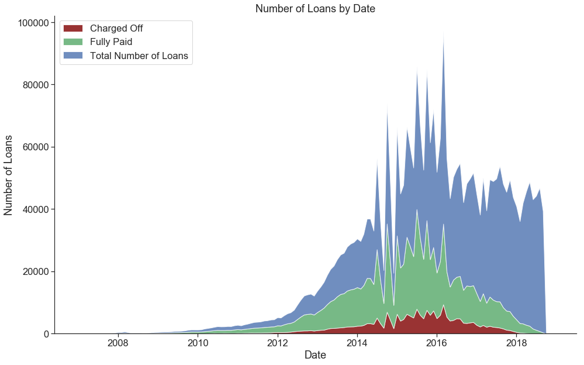


```python
#Total Loan Age = (Last Payment Date - Issue Date)/30 days 
loan_df['last_pymnt_d'] = pd.to_datetime(loan_df['last_pymnt_d'])
loan_df['Total_Loan_Age'] = loan_df['last_pymnt_d'] - loan_df['issue_d']
loan_df['Total_Loan_Age'] = loan_df['Total_Loan_Age'].apply(lambda x: x.days/30)

```


```python
fig, ax = plt.subplots(figsize=(16,10))

ages_df = loan_df[~loan_df['Total_Loan_Age'].isnull()][['loan_status','Total_Loan_Age']]

sns.distplot(ages_df[ages_df['loan_status']=='Charged Off']['Total_Loan_Age'],color='#800000',rug=False,label='Charged Off')
sns.distplot(ages_df[ages_df['loan_status']=='Fully Paid']['Total_Loan_Age'],color='#55a868',rug=False,label='Fully Paid')

#Set Term Lengths
plt.axvline(36,color='black',linestyle='--',alpha=0.75,label='Term (36 or 60 months)')
plt.axvline(60,color='black',linestyle='--',alpha=0.75)

ax.set_title('Density Distribution of Total_Loan_Age (Months)')
ax.set_xlabel('Total Loan Age in Months')
ax.set_ylabel('Density')
plt.legend(loc='upper left')

sns.despine();
```


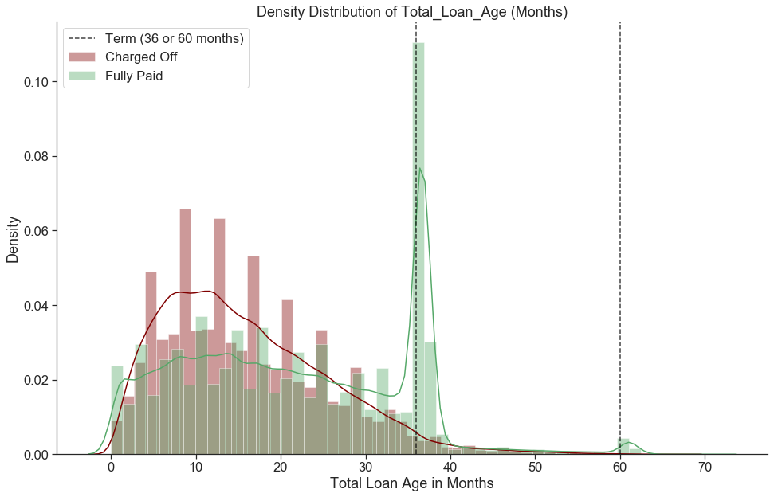


<b>From what we see from these two plots, we need to be careful when selection year ranges for our data. 
If we use loans that have not had a full 36 months or 60 months since it was issued, we may be running into selection bias as we would be selecting borrowers who pay off loans early and not borrowers who pay on schedule for the whole term.</b>


```python
fig, ax = plt.subplots(figsize=(16,10))

sns.distplot(loan_df[loan_df['annual_inc']<=400000]['annual_inc'],bins=100,kde=False,rug=False)


ax.set_title('Distribution of Annual Income')
ax.set_xlabel('Annual Income ($)')
ax.set_ylabel('Count')

sns.despine();
```


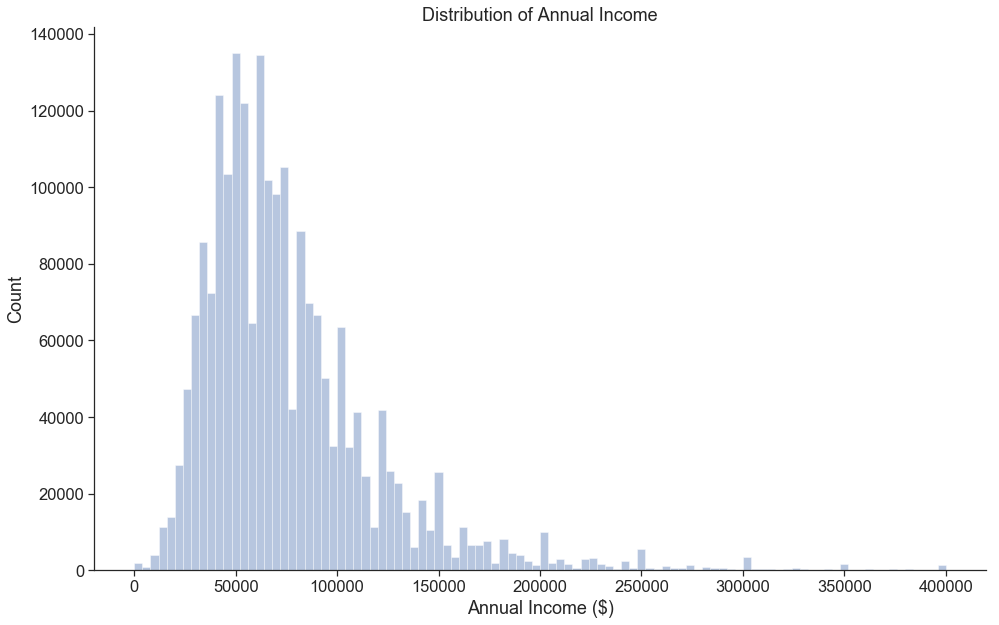


<b>Majority of loans from lenderclub have applicants with income of around 50k to 70k a year.
<br>There seems to be loans given to people with very low income including income of 0, however, this maybe due to people who recently lost their jobs, had employment change, or has a cosigner</b>


```python
loan_df['interest_rate']=loan_df['int_rate'].str.replace("%","").astype(float)/100

#Interest Rates change over time. Let's look at 2018Q2 only.
tmp_df = loan_df[(loan_df['issue_d']>=datetime(2018,4,1))|(loan_df['issue_d']<datetime(2018,7,1))]

colors=['k','g','r','b','y','m','c']
counter=0
fig, ax = plt.subplots(1, 1, figsize=(15, 10))

for grade in np.sort(tmp_df['grade'].unique()[0:-1]):
    ax.scatter(tmp_df[tmp_df['grade']==grade].dti, tmp_df[tmp_df['grade']==grade].interest_rate, 
                alpha=0.5, color=colors[counter], label='Grade '+ grade+ ' Loan')
    counter+=1

ax.set_xlabel('Debt to Income Ratio')
ax.set_ylabel('Lender Interest Rate')
ax.legend(loc='best');

```


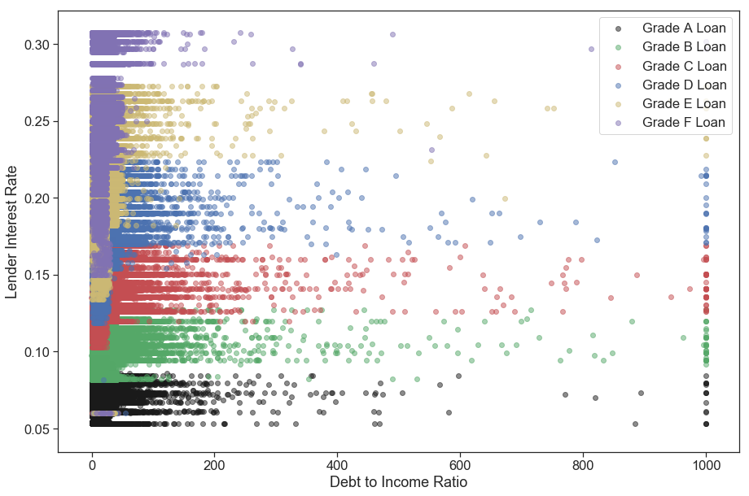


<b>Riskier loans tend to have higher interest rates (From A to G represents least to greatest risk)
<br>Riskier applicants also tend to have higher debt to income ratio
<br>These risks should be considered during the loan applicant's assessment


```python
fund_purpose=pd.DataFrame(loan_df.groupby('purpose')['purpose'].agg('count').sort_values(ascending=False))
fund_purpose.plot(kind='bar', figsize=(12,5));
```


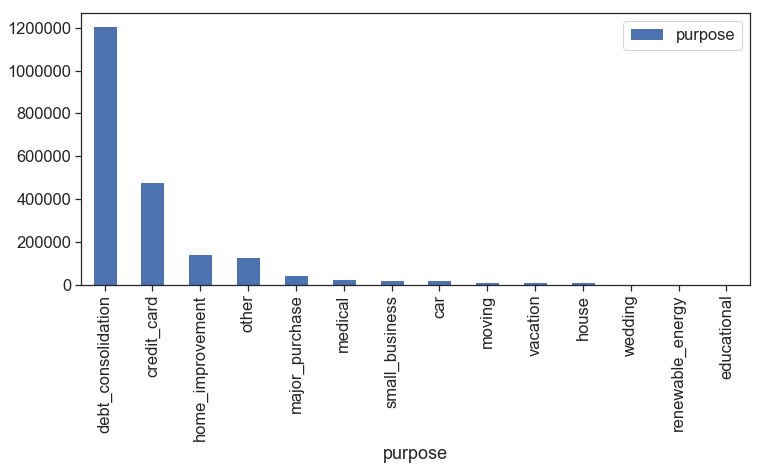


<b>Majority of loans pertain to paying off debt including consolidating debt and paying of credit_cards
<br>Based on this information along with the distribution of income, these may be individuals who are 
<br>looking get by while paying off their loans without affecting their credit, but do not have the ability to save


```python
#Drop created columns before cleaning
loan_df = loan_df.drop(['Total_Loan_Age', 'interest_rate'],1)
```


## <font color='maroon'>Data Cleaning</font>


<b>Check for and Clean Missing Data</b>
<br>A visual check at the data set shows that there are several columns with a large number of null values. Let's identify these columns.


```python
#Select rows with labels only
loan_df = loan_df[~loan_df['Risk'].isnull()]
print('Total Number of Rows:', '{:,}'.format(loan_df.shape[0]))
print('Total Number of Columns:', '{:,}'.format(loan_df.shape[1]))

#Number of null values by column
missing_values = pd.DataFrame(loan_df.isnull().sum(),columns=['Missing_Count'])
#Ratio of null values by column
missing_values['Missing_Ratio'] = missing_values['Missing_Count']/loan_df.shape[0]

#Sort by Missing_Count
missing_values = missing_values.sort_values(by='Missing_Count',ascending=False)

missing_values.head(5)
```


    Total Number of Rows: 1,150,372
    Total Number of Columns: 146


<div>
<style scoped>
    .dataframe tbody tr th:only-of-type {
        vertical-align: middle;
    }

    .dataframe tbody tr th {
        vertical-align: top;
    }

    .dataframe thead th {
        text-align: right;
    }
</style>
<table border="1" class="dataframe">
  <thead>
    <tr style="text-align: right;">
      <th></th>
      <th>Missing_Count</th>
      <th>Missing_Ratio</th>
    </tr>
  </thead>
  <tbody>
    <tr>
      <th>id</th>
      <td>1150372</td>
      <td>1.000000</td>
    </tr>
    <tr>
      <th>member_id</th>
      <td>1150372</td>
      <td>1.000000</td>
    </tr>
    <tr>
      <th>next_pymnt_d</th>
      <td>1150372</td>
      <td>1.000000</td>
    </tr>
    <tr>
      <th>url</th>
      <td>1150372</td>
      <td>1.000000</td>
    </tr>
    <tr>
      <th>orig_projected_additional_accrued_interest</th>
      <td>1148091</td>
      <td>0.998017</td>
    </tr>
  </tbody>
</table>
</div>


```python
#Plot the distribution of Ratio of missing values
fig, ax = plt.subplots(figsize=(12,8))

sns.distplot(missing_values['Missing_Ratio'], bins=10, kde=False, rug=True)
ax.set_title('Distribution of Ratio of Missing Values')
ax.set_xlabel('Missing Values Ratio')
ax.set_ylabel('Count')

sns.despine()
```


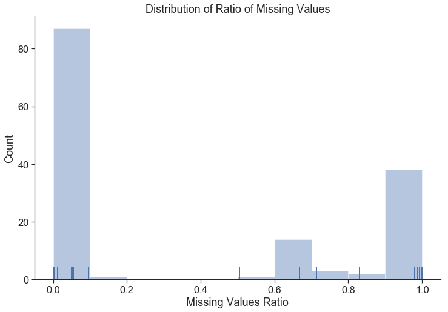


```python
print('Number of Columns with under 15% missing values:', missing_values[missing_values['Missing_Ratio']<=0.15].shape[0])
```


    Number of Columns with under 15% missing values: 88


We see that there are 88 columns (including our response variable) that are quite safe to include in our data set after some imputation as they have less than 15% missing values.

Outside of these columns, the remainder are over 50% missing values and quite risky to impute values for.


```python
#Combine current set of potential features
potential_features = missing_values[missing_values['Missing_Ratio']<=0.15].index.values

potential_features
```


    array(['mths_since_recent_inq', 'num_tl_120dpd_2m', 'mo_sin_old_il_acct',
           'emp_title', 'pct_tl_nvr_dlq', 'avg_cur_bal',
           'mo_sin_rcnt_rev_tl_op', 'mo_sin_old_rev_tl_op', 'num_rev_accts',
           'num_accts_ever_120_pd', 'num_actv_bc_tl', 'num_actv_rev_tl',
           'num_bc_tl', 'num_il_tl', 'num_tl_op_past_12m', 'mo_sin_rcnt_tl',
           'num_op_rev_tl', 'num_rev_tl_bal_gt_0', 'num_tl_30dpd',
           'total_il_high_credit_limit', 'tot_hi_cred_lim',
           'num_tl_90g_dpd_24m', 'tot_coll_amt', 'tot_cur_bal',
           'total_rev_hi_lim', 'emp_length', 'bc_util', 'percent_bc_gt_75',
           'bc_open_to_buy', 'mths_since_recent_bc', 'num_bc_sats',
           'num_sats', 'mort_acc', 'total_bal_ex_mort', 'total_bc_limit',
           'acc_open_past_24mths', 'title', 'last_pymnt_d',
           'pub_rec_bankruptcies', 'revol_util', 'dti',
           'chargeoff_within_12_mths', 'collections_12_mths_ex_med',
           'last_credit_pull_d', 'tax_liens', 'inq_last_6mths', 'out_prncp',
           'sub_grade', 'pymnt_plan', 'loan_status', 'issue_d',
           'verification_status', 'annual_inc', 'home_ownership',
           'policy_code', 'last_pymnt_amnt', 'grade', 'application_type',
           'disbursement_method', 'debt_settlement_flag', 'installment',
           'int_rate', 'term', 'funded_amnt_inv', 'funded_amnt', 'loan_amnt',
           'purpose', 'zip_code', 'delinq_amnt', 'addr_state',
           'out_prncp_inv', 'total_pymnt', 'total_pymnt_inv',
           'total_rec_prncp', 'total_rec_int', 'total_rec_late_fee',
           'initial_list_status', 'total_acc', 'acc_now_delinq', 'revol_bal',
           'pub_rec', 'open_acc', 'recoveries', 'earliest_cr_line',
           'delinq_2yrs', 'collection_recovery_fee', 'hardship_flag', 'Risk'],
          dtype=object)


Before we go on, we should look into the current column types for any string 'object' types.


```python
types_df = pd.DataFrame(loan_df[potential_features].dtypes,columns=['Types'])
types_df.head(5)
```


<div>
<style scoped>
    .dataframe tbody tr th:only-of-type {
        vertical-align: middle;
    }

    .dataframe tbody tr th {
        vertical-align: top;
    }

    .dataframe thead th {
        text-align: right;
    }
</style>
<table border="1" class="dataframe">
  <thead>
    <tr style="text-align: right;">
      <th></th>
      <th>Types</th>
    </tr>
  </thead>
  <tbody>
    <tr>
      <th>mths_since_recent_inq</th>
      <td>float64</td>
    </tr>
    <tr>
      <th>num_tl_120dpd_2m</th>
      <td>float64</td>
    </tr>
    <tr>
      <th>mo_sin_old_il_acct</th>
      <td>float64</td>
    </tr>
    <tr>
      <th>emp_title</th>
      <td>object</td>
    </tr>
    <tr>
      <th>pct_tl_nvr_dlq</th>
      <td>float64</td>
    </tr>
  </tbody>
</table>
</div>


```python
#Subset non-float64 
types_df[types_df['Types']!='float64']
```


<div>
<style scoped>
    .dataframe tbody tr th:only-of-type {
        vertical-align: middle;
    }

    .dataframe tbody tr th {
        vertical-align: top;
    }

    .dataframe thead th {
        text-align: right;
    }
</style>
<table border="1" class="dataframe">
  <thead>
    <tr style="text-align: right;">
      <th></th>
      <th>Types</th>
    </tr>
  </thead>
  <tbody>
    <tr>
      <th>emp_title</th>
      <td>object</td>
    </tr>
    <tr>
      <th>emp_length</th>
      <td>object</td>
    </tr>
    <tr>
      <th>title</th>
      <td>object</td>
    </tr>
    <tr>
      <th>last_pymnt_d</th>
      <td>datetime64[ns]</td>
    </tr>
    <tr>
      <th>revol_util</th>
      <td>object</td>
    </tr>
    <tr>
      <th>last_credit_pull_d</th>
      <td>object</td>
    </tr>
    <tr>
      <th>sub_grade</th>
      <td>object</td>
    </tr>
    <tr>
      <th>pymnt_plan</th>
      <td>object</td>
    </tr>
    <tr>
      <th>loan_status</th>
      <td>object</td>
    </tr>
    <tr>
      <th>issue_d</th>
      <td>datetime64[ns]</td>
    </tr>
    <tr>
      <th>verification_status</th>
      <td>object</td>
    </tr>
    <tr>
      <th>home_ownership</th>
      <td>object</td>
    </tr>
    <tr>
      <th>grade</th>
      <td>object</td>
    </tr>
    <tr>
      <th>application_type</th>
      <td>object</td>
    </tr>
    <tr>
      <th>disbursement_method</th>
      <td>object</td>
    </tr>
    <tr>
      <th>debt_settlement_flag</th>
      <td>object</td>
    </tr>
    <tr>
      <th>int_rate</th>
      <td>object</td>
    </tr>
    <tr>
      <th>term</th>
      <td>object</td>
    </tr>
    <tr>
      <th>purpose</th>
      <td>object</td>
    </tr>
    <tr>
      <th>zip_code</th>
      <td>object</td>
    </tr>
    <tr>
      <th>addr_state</th>
      <td>object</td>
    </tr>
    <tr>
      <th>initial_list_status</th>
      <td>object</td>
    </tr>
    <tr>
      <th>earliest_cr_line</th>
      <td>object</td>
    </tr>
    <tr>
      <th>hardship_flag</th>
      <td>object</td>
    </tr>
  </tbody>
</table>
</div>


Start creating a list of categorical variables for future one-hot encoding and remove problematic columns.
<br><br><b>emp_title</b> - The job title supplied by the Borrower when applying for the loan.
<br>Unfortunately, this is a human inputted field so the dimensionality is too high and is most likely largely covered by <b>annual_inc</b> (self-reported annual income). <br>Potentially we could combine this column into job industry bins if an online database is avaliable but the work to potential benefit ratio is questionable.


```python
#Remove 'emp_title'
print('Unique \'emp_title\' inputs: ', '{:,}'.format(loan_df['emp_title'].nunique()))
potential_features = potential_features[potential_features != 'emp_title']
```


    Unique 'emp_title' inputs:  345,433


<b>emp_length</b> - Employment length in years. Possible values are between 0 and 10 where 0 means less than one year and 10 means ten or more years.
<br>We are unable to change this to a continuous variable but we can reduce the number of categorical bins to help reduce potential overfitting and fill in any missing values. 
<br>We aim to create fewer and more even bins. We will treat any nulls as 0 years worked as they most often appear when no 'emp_title' is listed.


```python
loan_df['emp_length'].unique()
```


    array(['7 years', '10+ years', '2 years', '5 years', '3 years', '4 years',
           '6 years', '1 year', '9 years', '8 years', '< 1 year', nan],
          dtype=object)


```python
loan_df.groupby('emp_length')['emp_length'].agg('count')
```


    emp_length
    1 year        75422
    10+ years    377480
    2 years      104052
    3 years       91919
    4 years       68824
    5 years       72404
    6 years       54431
    7 years       52509
    8 years       53089
    9 years       44195
    < 1 year      91870
    Name: emp_length, dtype: int64


```python
#0-1 years inclues: null, None, < 1 year, 1 year
loan_df['emp_length'] = np.where(loan_df['emp_length'].isin([np.nan,None,'< 1 year','1 year']),
                                 '0-1 years',loan_df['emp_length'])
loan_df['emp_length'] = loan_df['emp_length'].fillna('0-1 years')

#2-4 years inclues: 2 years, 3 years, 4 years
loan_df['emp_length'] = np.where(loan_df['emp_length'].isin(['2 years','3 years','4 years']),
                                 '2-4 years',loan_df['emp_length'])

#5-9 years inclues: 5 years, 6 years, 7 years, 8 years, 9 years
loan_df['emp_length'] = np.where(loan_df['emp_length'].isin(['5 years','6 years','7 years','8 years','9 years']),
                                 '5-9 years',loan_df['emp_length'])

#10+ years includes 10+ years (no change)
```


```python
loan_df.groupby('emp_length')['emp_length'].agg('count')
```


    emp_length
    0-1 years    231469
    10+ years    377480
    2-4 years    264795
    5-9 years    276628
    Name: emp_length, dtype: int64


<b>title</b> - The loan title provided by the borrower
<br> This field is already neatly organized into set categorizes in <b>purpose</b> so we will remove this column.


```python
potential_features = potential_features[potential_features != 'title']
```


<b>last_pymnt_d</b> - Last month payment was received
<br> This column won't be avaliable before a loan is funded so we will remove it.


```python
potential_features = potential_features[potential_features != 'last_pymnt_d']
```


<b>revol_util</b> - Revolving line utilization rate, or the amount of credit the borrower is using relative to all available revolving credit.
<br> Currently a string percent (%) so it was not casted properly. Temporarily set nulls as -1 to cast the column to float.


```python
loan_df['revol_util'] = loan_df['revol_util'].fillna(-100)
loan_df['revol_util'] = loan_df['revol_util'].apply(lambda x: float(str(x).split('%')[0])/100)
loan_df['revol_util'] = np.where(loan_df['revol_util']==-1.0,np.nan,loan_df['revol_util'])
```


<b>last_credit_pull_d</b> - The most recent month LC pulled credit for this loan
<br>This column won't be avaliable before a loan is funded so we will remove this as well. 


```python
potential_features = potential_features[potential_features != 'last_credit_pull_d']
```


<b>earliest_cr_line</b> - The month the borrower's earliest reported credit line was opened
<br>This date alone won't be much use so we will generate <b>credit_line_age</b> as the number of days between <b>earliest_cr_line</b> and <b>issue_d</b> and remove this column.


```python
#Cast issue_d to datetime
loan_df['issue_d'] = pd.to_datetime(loan_df['issue_d'])

loan_df['credit_line_age'] = loan_df['issue_d'] - pd.to_datetime(loan_df['earliest_cr_line'])
loan_df['credit_line_age'] = loan_df['credit_line_age'].apply(lambda x: x.days)

potential_features = potential_features[potential_features != 'earliest_cr_line']
potential_features = np.append(potential_features,['credit_line_age'])
```


<b>zip_code</b> - The first 3 numbers of the zip code provided by the borrower in the loan application.
<br>We will remove this for now for the sake of fairness <b>???</b>


```python
potential_features = potential_features[potential_features != 'zip_code']
```


<b>verification_status</b> - Indicates if income was verified by LC, not verified, or if the income source was verified
<br>This is already neatly categorized. We will fill any nulls as 'Not Verified'


```python
loan_df['verification_status'].unique()
```


    array(['Not Verified', 'Verified', 'Source Verified'], dtype=object)


```python
loan_df['verification_status'] = loan_df['verification_status'].fillna('Not Verified')
```


<b>home_ownership</b> - The home ownership status provided by the borrower during registration or obtained from the credit report. Our values are: RENT, OWN, MORTGAGE, OTHER
<br>This is already neatly categorized with no missing values. 


```python
loan_df['home_ownership'].unique()
```


    array(['MORTGAGE', 'RENT', 'OWN', 'NONE', 'OTHER', 'ANY'], dtype=object)


<b>disbursement_method</b> - The method by which the borrower receives their loan. Possible values are: CASH, DIRECT_PAY
<br>This is already neatly categorized with no missing values. 


```python
loan_df['disbursement_method'].unique()
```


    array(['Cash', 'DirectPay'], dtype=object)


<b>sub_grade</b> - LC assigned loan subgrade
<br>This is already neatly categorized with no missing values.


```python
loan_df['sub_grade'].unique()
```


    array(['B1', 'A2', 'B5', 'B2', 'B3', 'A3', 'E4', 'A5', 'B4', 'D5', 'C3',
           'C2', 'C1', 'C5', 'C4', 'E1', 'D4', 'D3', 'A4', 'A1', 'D2', 'D1',
           'E3', 'F1', 'E5', 'E2', 'G3', 'G1', 'F2', 'F4', 'F5', 'G5', 'G4',
           'F3', 'G2'], dtype=object)


<b>grade</b> - LC assigned loan grade
<br>Since we have <b>sub_grade</b> already we will remove this.


```python
potential_features = potential_features[potential_features != 'grade']
```


<b>debt_settlement_flag</b> - Flags whether or not the borrower, who has charged-off, is working with a debt-settlement company.
<br>This won't be avaliable at the the time a loan is funded so we will remove this feature.


```python
potential_features = potential_features[potential_features != 'debt_settlement_flag']
```


<b>int_rate</b> - Interest Rate on the loan
<br>Currently a string percent (%) so it was not casted properly.


```python
 loan_df['int_rate'] = loan_df['int_rate'].apply(lambda x: float(str(x).split('%')[0])/100)
```


<b>term</b> - The number of payments on the loan. Values are in months and can be either 36 or 60.
<br>This is already neatly categorized with no missing values. 


```python
loan_df['term'].unique()
```


    array([' 36 months', ' 60 months'], dtype=object)


<b>pymnt_plan</b> - Indicates if a payment plan has been put in place for the loan.
<br>All values will be "n" for "Fully Paid" or "Charged Off" loans so we will remove this.


```python
potential_features = potential_features[potential_features != 'pymnt_plan']
```


<b>application_type</b> - Indicates whether the loan is an individual application or a joint application with two co-borrowers
<br>This is already neatly categorized with no missing values. 


```python
loan_df['application_type'].unique()
```


    array(['Individual', 'Joint App'], dtype=object)


<b>purpose</b> - A category provided by the borrower for the loan request. 
<br>This is already neatly categorized with no missing values. 


```python
loan_df['purpose'].unique()
```


    array(['debt_consolidation', 'home_improvement', 'credit_card', 'other',
           'major_purchase', 'small_business', 'house', 'moving', 'medical',
           'car', 'vacation', 'renewable_energy', 'wedding', 'educational'],
          dtype=object)


<b>initial_list_status</b> - The initial listing status of the loan. Possible values are – W, F
<br>This is already neatly categorized with no missing values. 


```python
loan_df['initial_list_status'].unique()
```


    array(['f', 'w'], dtype=object)


<b>hardship_flag</b> - Flags whether or not the borrower is on a hardship plan
<br>This is already neatly categorized with no missing values. 


```python
loan_df['hardship_flag'].unique()
```


    array(['N'], dtype=object)


<b>addr_state</b> - The state provided by the borrower in the loan application
<br>This is already neatly categorized with no missing values.


```python
loan_df['addr_state'].unique()
```


    array(['MA', 'CT', 'NY', 'MI', 'TX', 'CO', 'CA', 'FL', 'NM', 'NC', 'IN',
           'OH', 'AZ', 'SC', 'PA', 'DE', 'NJ', 'GA', 'UT', 'MO', 'WI', 'IL',
           'MD', 'WA', 'TN', 'WY', 'VA', 'KY', 'MN', 'NH', 'NV', 'KS', 'RI',
           'AL', 'WV', 'LA', 'OR', 'VT', 'AR', 'OK', 'MT', 'HI', 'AK', 'SD',
           'DC', 'NE', 'IA', 'MS', 'ID', 'ME', 'ND'], dtype=object)


<b>policy_code</b> - publicly available policy_code=1 and new products not publicly available policy_code=2
<br>All values will be "n" for "Fully Paid" or "Charged Off" loans so we will remove this.


```python
potential_features = potential_features[potential_features != 'policy_code']
```


```python
#Rerun Types
types_df = pd.DataFrame(loan_df[potential_features].dtypes,columns=['Types'])
types_df[types_df['Types']!='float64']
```


<div>
<style scoped>
    .dataframe tbody tr th:only-of-type {
        vertical-align: middle;
    }

    .dataframe tbody tr th {
        vertical-align: top;
    }

    .dataframe thead th {
        text-align: right;
    }
</style>
<table border="1" class="dataframe">
  <thead>
    <tr style="text-align: right;">
      <th></th>
      <th>Types</th>
    </tr>
  </thead>
  <tbody>
    <tr>
      <th>emp_length</th>
      <td>object</td>
    </tr>
    <tr>
      <th>sub_grade</th>
      <td>object</td>
    </tr>
    <tr>
      <th>loan_status</th>
      <td>object</td>
    </tr>
    <tr>
      <th>issue_d</th>
      <td>datetime64[ns]</td>
    </tr>
    <tr>
      <th>verification_status</th>
      <td>object</td>
    </tr>
    <tr>
      <th>home_ownership</th>
      <td>object</td>
    </tr>
    <tr>
      <th>application_type</th>
      <td>object</td>
    </tr>
    <tr>
      <th>disbursement_method</th>
      <td>object</td>
    </tr>
    <tr>
      <th>term</th>
      <td>object</td>
    </tr>
    <tr>
      <th>purpose</th>
      <td>object</td>
    </tr>
    <tr>
      <th>addr_state</th>
      <td>object</td>
    </tr>
    <tr>
      <th>initial_list_status</th>
      <td>object</td>
    </tr>
    <tr>
      <th>hardship_flag</th>
      <td>object</td>
    </tr>
    <tr>
      <th>credit_line_age</th>
      <td>int64</td>
    </tr>
  </tbody>
</table>
</div>


While we will not be using <b>issue_d</b> as a feature, we will not remove it at this point in case we need to sample or sort by date. This will be removed later before model training.


```python
categoricals = types_df[types_df['Types']=='object'].index.values
categoricals = categoricals[categoricals!='loan_status']
categoricals
```


    array(['emp_length', 'sub_grade', 'verification_status', 'home_ownership',
           'application_type', 'disbursement_method', 'term', 'purpose',
           'addr_state', 'initial_list_status', 'hardship_flag'], dtype=object)


We now need to look through our continous variables and look for features not avaliable at the time of funding and remove them. We will need to go through this by hand.


```python
types_df[types_df['Types']=='float64'].index.values
```


    array(['mths_since_recent_inq', 'num_tl_120dpd_2m', 'mo_sin_old_il_acct',
           'pct_tl_nvr_dlq', 'avg_cur_bal', 'mo_sin_rcnt_rev_tl_op',
           'mo_sin_old_rev_tl_op', 'num_rev_accts', 'num_accts_ever_120_pd',
           'num_actv_bc_tl', 'num_actv_rev_tl', 'num_bc_tl', 'num_il_tl',
           'num_tl_op_past_12m', 'mo_sin_rcnt_tl', 'num_op_rev_tl',
           'num_rev_tl_bal_gt_0', 'num_tl_30dpd',
           'total_il_high_credit_limit', 'tot_hi_cred_lim',
           'num_tl_90g_dpd_24m', 'tot_coll_amt', 'tot_cur_bal',
           'total_rev_hi_lim', 'bc_util', 'percent_bc_gt_75',
           'bc_open_to_buy', 'mths_since_recent_bc', 'num_bc_sats',
           'num_sats', 'mort_acc', 'total_bal_ex_mort', 'total_bc_limit',
           'acc_open_past_24mths', 'pub_rec_bankruptcies', 'revol_util',
           'dti', 'chargeoff_within_12_mths', 'collections_12_mths_ex_med',
           'tax_liens', 'inq_last_6mths', 'out_prncp', 'annual_inc',
           'last_pymnt_amnt', 'installment', 'int_rate', 'funded_amnt_inv',
           'funded_amnt', 'loan_amnt', 'delinq_amnt', 'out_prncp_inv',
           'total_pymnt', 'total_pymnt_inv', 'total_rec_prncp',
           'total_rec_int', 'total_rec_late_fee', 'total_acc',
           'acc_now_delinq', 'revol_bal', 'pub_rec', 'open_acc', 'recoveries',
           'delinq_2yrs', 'collection_recovery_fee', 'Risk'], dtype=object)


```python
not_at_funding = ['collection_recovery_fee',
                    'funded_amnt',
                    'funded_amnt_inv',
                    'last_pymnt_amnt',
                    'out_prncp',
                    'out_prncp_inv',
                    'recoveries',
                    'total_pymnt',
                    'total_pymnt_inv',
                    'total_rec_int',
                    'total_rec_late_fee',
                    'total_rec_prncp']

potential_features = np.setdiff1d(potential_features,not_at_funding)
```


<b>Impute Missing Values for the Remaining Continuous Variables</b>
<br>We will use linear model imputation in order of columns from the most to the least missing values. 
<br>Any nulls will temporarily filled with mean imputation until the column is filled.


```python
#Subset potential features only and update types_df 
loan_df = loan_df[potential_features]
types_df = pd.DataFrame(loan_df[potential_features].dtypes,columns=['Types'])

#Encode categoricals
loan_df = pd.get_dummies(loan_df,columns=categoricals,drop_first=True) 
```


```python
missing_columns = types_df[types_df['Types']=='float64'].index.tolist()
missing_columns = missing_values.loc[missing_columns].sort_values(by='Missing_Count',ascending=False)
missing_columns = missing_columns[missing_columns['Missing_Count'] != 0].index.tolist()

clean_df = loan_df.copy()

for column in missing_columns:
    excluded_columns = ['issue_d','loan_status','Risk']
    # Remove response variable
    impute_train = clean_df[~clean_df[column].isnull()].drop(excluded_columns,1).sample(100000,random_state=12)
    
    #Split target
    X_impute_train = impute_train.drop(column,1)
    Y_impute_train = impute_train[column]
    
    #Mean Imputation for current nulls for columns that did not get imputed yet
    X_impute_train = X_impute_train.fillna(X_impute_train.mean())

    # Train LinearRegression
    impute_ols = LinearRegression(fit_intercept=True)
    impute_ols.fit(X_impute_train,Y_impute_train)

    # Generate new temp column with model predictions
    # Only replace rows where the value is null with the K-NN predicted value 
    predictions = clean_df.drop(excluded_columns + [column],1)
    
    #Mean Imputation for current nulls for columns that did not get imputed yet
    predictions = predictions.fillna(predictions.mean())
    clean_df['temp'] = impute_ols.predict(predictions)
    
    clean_df[column] = np.where(clean_df[column].isnull(),clean_df['temp'],clean_df[column])
    clean_df = clean_df.drop('temp',1)

```


```python
#Store as pickle
clean_df.to_pickle('./data/clean_df.pkl')
```


```python
#Number of null values by column
missing_values = pd.DataFrame(clean_df.isnull().sum(),columns=['Missing_Count'])
#Ratio of null values by column
missing_values['Missing_Ratio'] = missing_values['Missing_Count']/clean_df.shape[0]

#Sort by Missing_Count
missing_values = missing_values.sort_values(by='Missing_Count',ascending=False)

missing_values.head(5)
```


<div>
<style scoped>
    .dataframe tbody tr th:only-of-type {
        vertical-align: middle;
    }

    .dataframe tbody tr th {
        vertical-align: top;
    }

    .dataframe thead th {
        text-align: right;
    }
</style>
<table border="1" class="dataframe">
  <thead>
    <tr style="text-align: right;">
      <th></th>
      <th>Missing_Count</th>
      <th>Missing_Ratio</th>
    </tr>
  </thead>
  <tbody>
    <tr>
      <th>Risk</th>
      <td>0</td>
      <td>0.0</td>
    </tr>
    <tr>
      <th>purpose_educational</th>
      <td>0</td>
      <td>0.0</td>
    </tr>
    <tr>
      <th>purpose_house</th>
      <td>0</td>
      <td>0.0</td>
    </tr>
    <tr>
      <th>purpose_major_purchase</th>
      <td>0</td>
      <td>0.0</td>
    </tr>
    <tr>
      <th>purpose_medical</th>
      <td>0</td>
      <td>0.0</td>
    </tr>
  </tbody>
</table>
</div>


<hr style="height:1.5pt">
## <font color='maroon'>Random Forest Feature Importances</font>
<br>We currently still have a large number of columns that we'd like to narrow down. 
<br>We will train a Random Forest Classifier and use the feature importances to select the top features.
<br>We specifically set max_depth=None to allow for all features to be incorporated.


```python
X_train = clean_df.drop(['issue_d','loan_status','Risk'],1)
y_train = clean_df['Risk']

#Let max_depth potentially overfit
rf_model = RandomForestClassifier(n_estimators=100, max_depth=None).fit(X_train, y_train)
```


```python
importances = pd.DataFrame({'Columns':X_train.columns,'Feature_Importances':rf_model.feature_importances_})
importances = importances.sort_values(by='Feature_Importances',ascending=False)
```


```python
importances
```


<div>
<style scoped>
    .dataframe tbody tr th:only-of-type {
        vertical-align: middle;
    }

    .dataframe tbody tr th {
        vertical-align: top;
    }

    .dataframe thead th {
        text-align: right;
    }
</style>
<table border="1" class="dataframe">
  <thead>
    <tr style="text-align: right;">
      <th></th>
      <th>Columns</th>
      <th>Feature_Importances</th>
    </tr>
  </thead>
  <tbody>
    <tr>
      <th>14</th>
      <td>int_rate</td>
      <td>4.465759e-02</td>
    </tr>
    <tr>
      <th>11</th>
      <td>dti</td>
      <td>3.094219e-02</td>
    </tr>
    <tr>
      <th>13</th>
      <td>installment</td>
      <td>2.676424e-02</td>
    </tr>
    <tr>
      <th>4</th>
      <td>bc_open_to_buy</td>
      <td>2.597622e-02</td>
    </tr>
    <tr>
      <th>47</th>
      <td>tot_hi_cred_lim</td>
      <td>2.570249e-02</td>
    </tr>
    <tr>
      <th>3</th>
      <td>avg_cur_bal</td>
      <td>2.569512e-02</td>
    </tr>
    <tr>
      <th>17</th>
      <td>mo_sin_old_rev_tl_op</td>
      <td>2.525365e-02</td>
    </tr>
    <tr>
      <th>2</th>
      <td>annual_inc</td>
      <td>2.493183e-02</td>
    </tr>
    <tr>
      <th>5</th>
      <td>bc_util</td>
      <td>2.478203e-02</td>
    </tr>
    <tr>
      <th>8</th>
      <td>credit_line_age</td>
      <td>2.475001e-02</td>
    </tr>
    <tr>
      <th>16</th>
      <td>mo_sin_old_il_acct</td>
      <td>2.468617e-02</td>
    </tr>
    <tr>
      <th>43</th>
      <td>revol_util</td>
      <td>2.466041e-02</td>
    </tr>
    <tr>
      <th>50</th>
      <td>total_bc_limit</td>
      <td>2.434883e-02</td>
    </tr>
    <tr>
      <th>46</th>
      <td>tot_cur_bal</td>
      <td>2.423732e-02</td>
    </tr>
    <tr>
      <th>52</th>
      <td>total_rev_hi_lim</td>
      <td>2.416895e-02</td>
    </tr>
    <tr>
      <th>42</th>
      <td>revol_bal</td>
      <td>2.391638e-02</td>
    </tr>
    <tr>
      <th>49</th>
      <td>total_bal_ex_mort</td>
      <td>2.338478e-02</td>
    </tr>
    <tr>
      <th>15</th>
      <td>loan_amnt</td>
      <td>2.287845e-02</td>
    </tr>
    <tr>
      <th>51</th>
      <td>total_il_high_credit_limit</td>
      <td>2.171590e-02</td>
    </tr>
    <tr>
      <th>21</th>
      <td>mths_since_recent_bc</td>
      <td>2.071140e-02</td>
    </tr>
    <tr>
      <th>48</th>
      <td>total_acc</td>
      <td>1.951162e-02</td>
    </tr>
    <tr>
      <th>22</th>
      <td>mths_since_recent_inq</td>
      <td>1.865403e-02</td>
    </tr>
    <tr>
      <th>99</th>
      <td>term_ 60 months</td>
      <td>1.831919e-02</td>
    </tr>
    <tr>
      <th>30</th>
      <td>num_rev_accts</td>
      <td>1.822200e-02</td>
    </tr>
    <tr>
      <th>18</th>
      <td>mo_sin_rcnt_rev_tl_op</td>
      <td>1.798204e-02</td>
    </tr>
    <tr>
      <th>28</th>
      <td>num_il_tl</td>
      <td>1.785583e-02</td>
    </tr>
    <tr>
      <th>1</th>
      <td>acc_open_past_24mths</td>
      <td>1.686743e-02</td>
    </tr>
    <tr>
      <th>19</th>
      <td>mo_sin_rcnt_tl</td>
      <td>1.684100e-02</td>
    </tr>
    <tr>
      <th>27</th>
      <td>num_bc_tl</td>
      <td>1.667425e-02</td>
    </tr>
    <tr>
      <th>38</th>
      <td>pct_tl_nvr_dlq</td>
      <td>1.521915e-02</td>
    </tr>
    <tr>
      <th>...</th>
      <td>...</td>
      <td>...</td>
    </tr>
    <tr>
      <th>10</th>
      <td>delinq_amnt</td>
      <td>4.681256e-04</td>
    </tr>
    <tr>
      <th>123</th>
      <td>addr_state_HI</td>
      <td>4.473971e-04</td>
    </tr>
    <tr>
      <th>151</th>
      <td>addr_state_RI</td>
      <td>4.099735e-04</td>
    </tr>
    <tr>
      <th>104</th>
      <td>purpose_house</td>
      <td>4.028494e-04</td>
    </tr>
    <tr>
      <th>84</th>
      <td>sub_grade_F5</td>
      <td>3.932811e-04</td>
    </tr>
    <tr>
      <th>0</th>
      <td>acc_now_delinq</td>
      <td>3.486488e-04</td>
    </tr>
    <tr>
      <th>142</th>
      <td>addr_state_NH</td>
      <td>3.421056e-04</td>
    </tr>
    <tr>
      <th>141</th>
      <td>addr_state_NE</td>
      <td>3.396480e-04</td>
    </tr>
    <tr>
      <th>120</th>
      <td>addr_state_DE</td>
      <td>3.210723e-04</td>
    </tr>
    <tr>
      <th>161</th>
      <td>addr_state_WV</td>
      <td>2.992446e-04</td>
    </tr>
    <tr>
      <th>138</th>
      <td>addr_state_MT</td>
      <td>2.864948e-04</td>
    </tr>
    <tr>
      <th>153</th>
      <td>addr_state_SD</td>
      <td>2.606287e-04</td>
    </tr>
    <tr>
      <th>85</th>
      <td>sub_grade_G1</td>
      <td>2.566842e-04</td>
    </tr>
    <tr>
      <th>162</th>
      <td>addr_state_WY</td>
      <td>2.391337e-04</td>
    </tr>
    <tr>
      <th>98</th>
      <td>disbursement_method_DirectPay</td>
      <td>2.302302e-04</td>
    </tr>
    <tr>
      <th>86</th>
      <td>sub_grade_G2</td>
      <td>1.932510e-04</td>
    </tr>
    <tr>
      <th>119</th>
      <td>addr_state_DC</td>
      <td>1.816343e-04</td>
    </tr>
    <tr>
      <th>158</th>
      <td>addr_state_VT</td>
      <td>1.678845e-04</td>
    </tr>
    <tr>
      <th>140</th>
      <td>addr_state_ND</td>
      <td>1.526041e-04</td>
    </tr>
    <tr>
      <th>87</th>
      <td>sub_grade_G3</td>
      <td>1.489771e-04</td>
    </tr>
    <tr>
      <th>125</th>
      <td>addr_state_ID</td>
      <td>1.420678e-04</td>
    </tr>
    <tr>
      <th>109</th>
      <td>purpose_renewable_energy</td>
      <td>1.262618e-04</td>
    </tr>
    <tr>
      <th>112</th>
      <td>purpose_wedding</td>
      <td>1.160136e-04</td>
    </tr>
    <tr>
      <th>88</th>
      <td>sub_grade_G4</td>
      <td>1.135040e-04</td>
    </tr>
    <tr>
      <th>133</th>
      <td>addr_state_ME</td>
      <td>1.120410e-04</td>
    </tr>
    <tr>
      <th>89</th>
      <td>sub_grade_G5</td>
      <td>1.109531e-04</td>
    </tr>
    <tr>
      <th>102</th>
      <td>purpose_educational</td>
      <td>3.266631e-05</td>
    </tr>
    <tr>
      <th>94</th>
      <td>home_ownership_OTHER</td>
      <td>1.459972e-05</td>
    </tr>
    <tr>
      <th>93</th>
      <td>home_ownership_NONE</td>
      <td>6.380645e-06</td>
    </tr>
    <tr>
      <th>124</th>
      <td>addr_state_IA</td>
      <td>9.508820e-07</td>
    </tr>
  </tbody>
</table>
<p>164 rows × 2 columns</p>
</div>


```python
fig, ax = plt.subplots(figsize=(12,50))

ax = sns.barplot(x=importances['Feature_Importances'], y=importances['Columns'])

sns.despine()
```


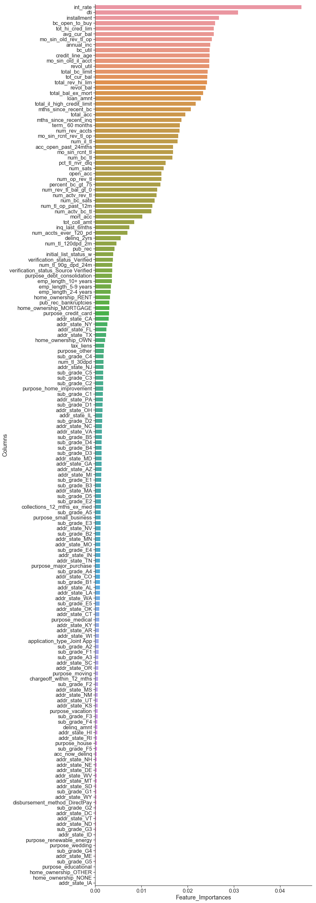


For a baseline, we will be conservative in our chosen features and slowly increase them in future tests.


```python
top_features = importances[importances['Feature_Importances']>=0.0225]['Columns'].values.tolist()
top_features
```


    ['int_rate',
     'dti',
     'installment',
     'bc_open_to_buy',
     'tot_hi_cred_lim',
     'avg_cur_bal',
     'mo_sin_old_rev_tl_op',
     'annual_inc',
     'bc_util',
     'credit_line_age',
     'mo_sin_old_il_acct',
     'revol_util',
     'total_bc_limit',
     'tot_cur_bal',
     'total_rev_hi_lim',
     'revol_bal',
     'total_bal_ex_mort',
     'loan_amnt']


<hr style="height:1.5pt">
## <font color='maroon'>Baseline Model - Decision Tree Classifier</font>


Since we have performed feature selection using Random Forest, we will use a single Decision Tree as our baseline with the top features chosen by feature importances. 
<br>We will also train a Logistic Regression for reference but we should remember that the features were chosen by a tree and may not be optimal for Logistic Regression.


```python
#Subset to Top Features
outcome='Risk'

baseline_df = clean_df[top_features + [outcome]]
```


```python
#Split Train and Test Sets
data_train, data_test = train_test_split(baseline_df, test_size=.1, stratify=baseline_df[outcome], random_state=99);

X_train = data_train.drop(columns=[outcome])
y_train = data_train[outcome]

X_test = data_test.drop(columns=[outcome])
y_test = data_test[outcome]
```


As we noted previously, the label data is imbalanced. In the baseline we will compare accuracy metrics to the accuracy that would be obtained if we generated a model that predicted all loans to be fully paid. To expand from this baseline, we will deal with the imbalance and incorporate fairness metrics to account for unpredicted biases.


```python
most_common_class = data_train['Risk'].value_counts().idxmax()

# training set baseline accuracy
baseline_accuracy = np.sum(data_train['Risk']==most_common_class)/len(data_train)

print("Classification accuracy (training set) if we predict all loans to be fully paid: {:.3f}"
      .format(baseline_accuracy))
```


    Classification accuracy (training set) if we predict all loans to be fully paid: 0.800


```python
tree_cv_scores = []
for i in range(2,20):
  clf = DecisionTreeClassifier(criterion='gini', max_depth=i)
  clf.fit(X_train, y_train)
  train_score = clf.score(X_train, y_train)
  cv_score = cross_val_score(clf, X_train, y_train, scoring='accuracy', cv=5)
  tree_cv_scores.append({'Depth': i,
                        'Train Score': train_score,
                        'CV Mean Accuracy': cv_score.mean()})
```


```python
columns=['Depth', 'Train Score','CV Mean Accuracy']
tree_scores_df = pd.DataFrame(tree_cv_scores, columns=columns)
tree_scores_df.round(4)
```


<div>
<style scoped>
    .dataframe tbody tr th:only-of-type {
        vertical-align: middle;
    }

    .dataframe tbody tr th {
        vertical-align: top;
    }

    .dataframe thead th {
        text-align: right;
    }
</style>
<table border="1" class="dataframe">
  <thead>
    <tr style="text-align: right;">
      <th></th>
      <th>Depth</th>
      <th>Train Score</th>
      <th>CV Mean Accuracy</th>
    </tr>
  </thead>
  <tbody>
    <tr>
      <th>0</th>
      <td>2</td>
      <td>0.8005</td>
      <td>0.8005</td>
    </tr>
    <tr>
      <th>1</th>
      <td>3</td>
      <td>0.8005</td>
      <td>0.8005</td>
    </tr>
    <tr>
      <th>2</th>
      <td>4</td>
      <td>0.8005</td>
      <td>0.8005</td>
    </tr>
    <tr>
      <th>3</th>
      <td>5</td>
      <td>0.8005</td>
      <td>0.8005</td>
    </tr>
    <tr>
      <th>4</th>
      <td>6</td>
      <td>0.8013</td>
      <td>0.8012</td>
    </tr>
    <tr>
      <th>5</th>
      <td>7</td>
      <td>0.8016</td>
      <td>0.8013</td>
    </tr>
    <tr>
      <th>6</th>
      <td>8</td>
      <td>0.8022</td>
      <td>0.8013</td>
    </tr>
    <tr>
      <th>7</th>
      <td>9</td>
      <td>0.8027</td>
      <td>0.8007</td>
    </tr>
    <tr>
      <th>8</th>
      <td>10</td>
      <td>0.8039</td>
      <td>0.8002</td>
    </tr>
    <tr>
      <th>9</th>
      <td>11</td>
      <td>0.8056</td>
      <td>0.7990</td>
    </tr>
    <tr>
      <th>10</th>
      <td>12</td>
      <td>0.8082</td>
      <td>0.7972</td>
    </tr>
    <tr>
      <th>11</th>
      <td>13</td>
      <td>0.8121</td>
      <td>0.7947</td>
    </tr>
    <tr>
      <th>12</th>
      <td>14</td>
      <td>0.8173</td>
      <td>0.7921</td>
    </tr>
    <tr>
      <th>13</th>
      <td>15</td>
      <td>0.8239</td>
      <td>0.7885</td>
    </tr>
    <tr>
      <th>14</th>
      <td>16</td>
      <td>0.8316</td>
      <td>0.7845</td>
    </tr>
    <tr>
      <th>15</th>
      <td>17</td>
      <td>0.8407</td>
      <td>0.7798</td>
    </tr>
    <tr>
      <th>16</th>
      <td>18</td>
      <td>0.8509</td>
      <td>0.7751</td>
    </tr>
    <tr>
      <th>17</th>
      <td>19</td>
      <td>0.8617</td>
      <td>0.7700</td>
    </tr>
  </tbody>
</table>
</div>


```python
from sklearn.linear_model import LogisticRegressionCV

#logistic regression model
lrm = LogisticRegressionCV(cv=5)

cv_scores = cross_val_score(lrm, X_train, y_train, cv=5)

print("cross_val_scores, baseline logistic regression model: \n{}"
     .format(cv_scores))
print("mean cv score:{:4.4f}\n".format(cv_scores.mean()))
```


    cross_val_scores, baseline logistic regressino model: 
    [0.79953928 0.80045589 0.79998744 0.79969672 0.79997682]
    mean cv score:0.7999
    


We can see that the baseline accuracy values are quite poor. There will be a large space to improve on going forward.
